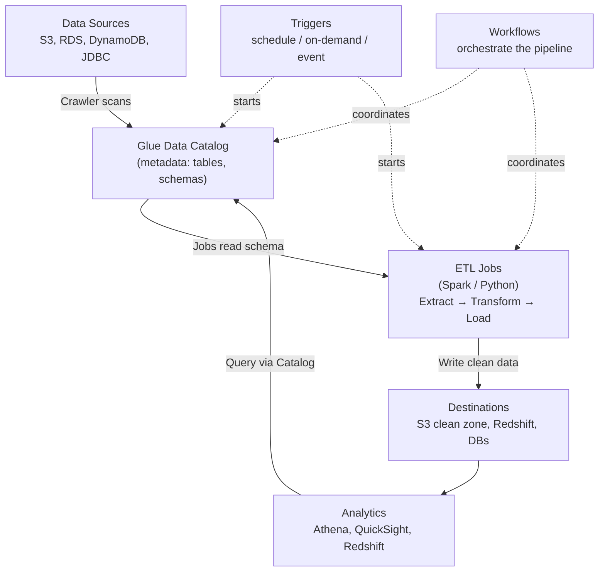
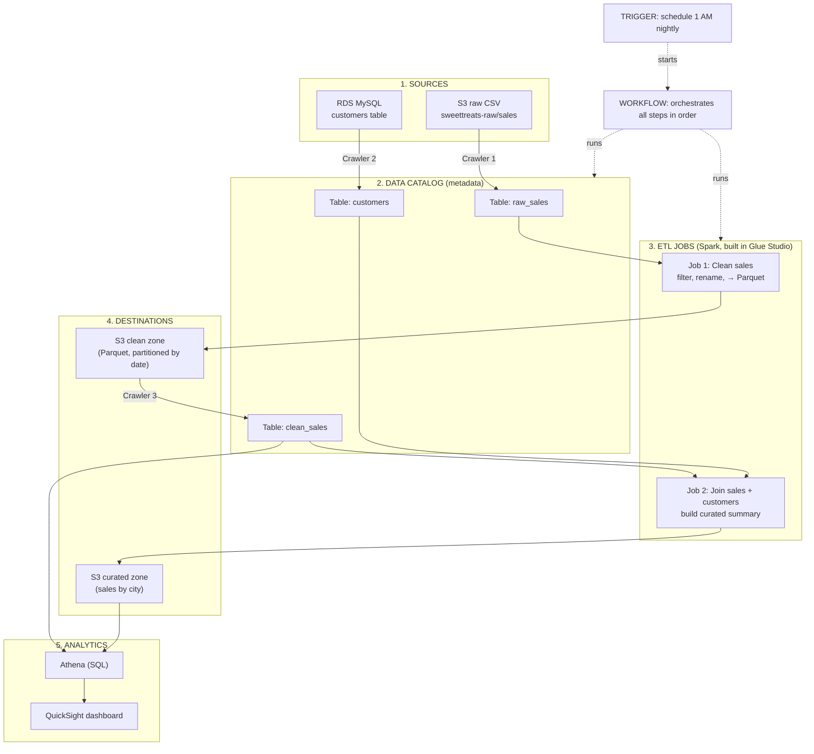

# AWS Glue — Complete Beginner-to-Advanced Notes

> A friendly, step-by-step study guide. No prior knowledge assumed.
> Read it top to bottom the first time. Later, use it like flashcards.

---

## How to use these notes

Every topic follows the same 4-part pattern so it's easy to study:

1. **Simple words** — explained like you're 10 years old.
2. **Deeper / technical** — how it actually works.
3. **Example** — a real situation (we reuse one small company throughout).
4. **Remember** — short bullet points for revision.

We'll use **one running example** through the whole guide so nothing feels disconnected:

> **"SweetTreats"** is a small online bakery. Every day, their website and app dump
> raw sales files into Amazon S3 (a cloud storage bucket). The files are messy:
> different formats, missing values, weird column names. The owner wants clean,
> organized data so they can answer questions like *"Which cake sold the most last month?"*
> We'll see how AWS Glue helps SweetTreats turn messy raw data into clean, query-ready data.

---

## Table of Contents

1. [First, the absolute basics (key words)](#1-first-the-absolute-basics-key-words)
2. [What is AWS Glue?](#2-what-is-aws-glue)
3. [Why AWS Glue? (the problems it solves)](#3-why-aws-glue-the-problems-it-solves)
4. [What is "Serverless"? (deep dive)](#4-what-is-serverless-deep-dive)
5. [AWS Glue Architecture (end to end)](#5-aws-glue-architecture-end-to-end)
6. [The Data Catalog](#6-the-data-catalog)
7. [Crawlers](#7-crawlers)
8. [ETL Jobs (Extract, Transform, Load)](#8-etl-jobs-extract-transform-load)
9. [Glue Studio (visual job builder)](#9-glue-studio-visual-job-builder)
10. [Glue vs Other Services (Athena, EMR, Redshift Spectrum)](#10-glue-vs-other-services)
11. [Integration with S3 (data lakes)](#11-integration-with-s3-data-lakes)
12. [Integration with Databases (RDS, DynamoDB, etc.)](#12-integration-with-databases)
13. [Glue Workflows (orchestration)](#13-glue-workflows-orchestration)
14. [Glue Triggers (scheduling & automation)](#14-glue-triggers-scheduling--automation)
15. [Glue Pricing (with examples)](#15-glue-pricing-with-examples)
16. [Real-World Use Cases](#16-real-world-use-cases)
17. [Putting it all together (full SweetTreats pipeline)](#17-putting-it-all-together-full-sweettreats-pipeline)
18. [Quick Revision Sheet / Glossary](#18-quick-revision-sheet--glossary)

---

## 1. First, the absolute basics (key words)

Before AWS Glue makes sense, you need a few words. Don't skip this.

| Word | Simple meaning | Everyday analogy |
|------|----------------|------------------|
| **AWS** | Amazon Web Services — a company that rents you computers, storage, and tools over the internet. | Renting tools instead of buying them. |
| **S3** | Amazon's cloud storage. You put files (CSV, JSON, images) into "buckets". | A giant online USB drive / Google Drive. |
| **Data** | Facts and numbers stored in files or tables (sales, names, prices). | Entries in a notebook. |
| **Data Lake** | One big storage place (usually S3) where you dump ALL your raw data, any format. | A big garage where you throw everything. |
| **Data Warehouse** | A cleaned, organized database built for fast analysis. | A tidy, labeled filing cabinet. |
| **ETL** | Extract (get data), Transform (clean it), Load (save the clean version). | Take dirty laundry → wash it → fold into the closet. |
| **Schema** | The "shape" of data: column names + data types (e.g., `price` is a number). | The labels and column headers on a spreadsheet. |
| **Metadata** | "Data about data" — describes where data lives and what it looks like, *not the data itself*. | The label on a box, not the stuff inside. |
| **Query** | A question you ask your data, usually in SQL. | "Show me all cakes over $20." |

> **Remember:**
> - **Data Lake = messy raw storage (S3).** **Data Warehouse = clean organized tables.**
> - **ETL is the cleaning process** that moves data from lake → warehouse.
> - **Metadata ≠ data.** Metadata is just the description (the label on the box).

---

## 2. What is AWS Glue?

### Simple words
**AWS Glue is a fully managed service that helps you find, organize, clean, and move your data** — without you having to set up or manage any servers.

Think of it as a **smart kitchen assistant for data**:
- It **looks** at your raw ingredients (data in S3 or databases).
- It **writes down** what it found in a recipe book (the Data Catalog).
- It **cleans and prepares** the ingredients (ETL jobs).
- It **delivers** the finished dish to wherever you want to eat it (a warehouse, another S3 bucket, etc.).

The name **"Glue"** is a clue: it acts like glue that **connects** your data sources, your processing, and your analytics tools together.

### Deeper / technical
AWS Glue is a collection of components that work together:

- **Glue Data Catalog** — a central place that stores metadata (table definitions, schemas, locations).
- **Crawlers** — programs that automatically scan your data and fill the catalog.
- **ETL Jobs** — code (or visual flows) that transform data. Runs on **Apache Spark** (a big-data engine) or Python.
- **Glue Studio** — a drag-and-drop visual editor to build ETL jobs without heavy coding.
- **Workflows & Triggers** — tools to schedule and chain jobs together into pipelines.
- **Glue DataBrew** (bonus) — a no-code tool to clean data visually.
- **Glue Data Quality** (bonus) — checks if your data meets rules (e.g., "price must never be negative").

It is **serverless** (explained fully in Section 4), meaning you never create or patch servers — AWS does that invisibly.

### Example (SweetTreats)
SweetTreats has raw sales CSV files in S3. With AWS Glue they can:
1. Run a **crawler** to auto-detect columns like `order_id`, `cake_name`, `price`, `date`.
2. Store that structure in the **Data Catalog**.
3. Run an **ETL job** to fix prices, remove broken rows, and convert files to a faster format.
4. Save the clean data back to S3, ready for analysis.

### Remember
- AWS Glue = **managed + serverless data integration service**.
- It **discovers, catalogs, cleans, and moves** data.
- Core parts: **Data Catalog, Crawlers, ETL Jobs, Glue Studio, Workflows/Triggers**.
- "Glue" because it **connects** sources → processing → destinations.

---

## 3. Why AWS Glue? (the problems it solves)

### Simple words
Before tools like Glue, preparing data was **painful**. Imagine doing all of this by hand:
- Buy and set up servers.
- Install big-data software.
- Write lots of code to read messy files.
- Manually track where every dataset is and what columns it has.
- Keep servers running and patched 24/7 (and pay for them even when idle).

AWS Glue **removes most of that pain**. It exists to make data preparation **faster, cheaper, and less manual**.

### The specific problems it solves

| Problem (without Glue) | How Glue solves it |
|------------------------|--------------------|
| "I have data everywhere and don't know what's in it." | **Crawlers + Data Catalog** auto-discover and document it. |
| "Setting up servers/Spark clusters is hard." | **Serverless** — no servers to manage. |
| "I pay for servers even when idle." | **Pay only while jobs run** (per-second billing). |
| "Writing ETL code from scratch takes forever." | **Glue Studio** auto-generates code from a visual flow. |
| "Scaling up for big data is complex." | Glue **auto-scales** the compute for you. |
| "Connecting many data sources is messy." | Built-in **connectors** for S3, RDS, DynamoDB, JDBC, etc. |
| "Scheduling and chaining jobs is fragile." | **Triggers + Workflows** orchestrate everything. |

### Deeper / technical
The core value is **"data integration without infrastructure management."** Traditional ETL needs a team to run Hadoop/Spark clusters. Glue gives you the same Spark power but **on demand** — it spins up workers when a job starts and tears them down when it ends. This shifts your effort from *"managing machines"* to *"describing what you want done with the data."*

### Example (SweetTreats)
SweetTreats is a **small** business — they have **no data engineering team** and don't want to babysit servers. Glue is perfect: the owner can set up a crawler and a visual ETL job in an afternoon, schedule it to run nightly, and only pay for the few minutes it runs each day.

### Remember
- Glue exists to remove the **heavy lifting** of data prep: no servers, less code, auto-scaling.
- Biggest wins: **no infrastructure to manage**, **pay-per-use**, **auto-discovery of data**.
- Great for teams (especially small ones) who want results, not server maintenance.

---

## 4. What is "Serverless"? (deep dive)

This concept is central to Glue, so let's go slow.

### Simple words
**"Serverless" does NOT mean there are no servers.** Servers still exist — but **you** don't see them, set them up, or manage them. The cloud provider (AWS) handles all of that **invisibly**.

> Analogy: **Electricity at home.** There IS a giant power plant somewhere, but you don't build or run it. You just flip a switch, use power, and pay only for what you use. "Serverless" is the same idea for computing.

Another analogy: **Riding a taxi vs. owning a car.**
- **Owning a car (servers)** = you buy it, fuel it, insure it, repair it, park it — even on days you don't drive.
- **Taxi (serverless)** = you just ride when needed and pay per trip. No maintenance, no parking, no idle cost.

### What serverless gives you
1. **No provisioning** — you don't pick server sizes or counts (Glue figures it out).
2. **Automatic scaling** — handles small or huge data by adding/removing workers automatically.
3. **Pay-per-use** — billed only while your job actually runs (Glue bills per second).
4. **No maintenance** — no OS updates, security patches, or hardware failures to worry about.
5. **High availability** — AWS spreads it across data centers so it stays reliable.

### Deeper / technical
When you run a Glue job:
1. You submit the job. AWS allocates compute capacity measured in **DPUs** (Data Processing Units — more on this in pricing).
2. AWS **starts up workers** behind the scenes (often within seconds to a couple of minutes).
3. Your job runs on those workers.
4. When the job ends, AWS **shuts the workers down** automatically.
5. You're billed only for the time used.

You never SSH into a machine, never install Spark, never resize a cluster. That's the serverless promise.

### Serverless vs. Server-based (side by side)

| Aspect | Server-based (e.g., self-managed EMR/Hadoop) | Serverless (AWS Glue) |
|--------|----------------------------------------------|------------------------|
| Setup | You configure clusters | Nothing to set up |
| Scaling | You add/remove nodes manually | Automatic |
| Cost when idle | You still pay | You pay ~nothing |
| Maintenance | You patch & manage | AWS handles it |
| Best for | Fine-grained control, long-running clusters | Quick, on-demand jobs |

### Example (SweetTreats)
SweetTreats' nightly cleanup job runs for ~10 minutes. With serverless Glue, they pay for ~10 minutes of compute per night and **nothing the other 23 hours 50 minutes**. If they owned a server, they'd pay for the full 24 hours even though it sits idle almost all day.

### Remember
- **Serverless = servers exist, but AWS manages them; you just use & pay per use.**
- Key benefits: **no setup, auto-scaling, pay-per-use, no maintenance.**
- Analogies: **electricity**, **taxi vs. owning a car.**
- Glue measures compute in **DPUs** and bills **per second** while jobs run.

---

## 5. AWS Glue Architecture (end to end)

Now let's connect every piece into one big picture.

### Simple words
AWS Glue's job is to take data from a **source**, understand it, clean it, and put it into a **destination**. Along the way it uses a **catalog** (its memory of what data exists) and **jobs** (the workers that do the cleaning), all coordinated by **triggers and workflows**.

### The end-to-end flow (text diagram)

```
        ┌──────────────────────────────────────────────────────────────┐
        │                       DATA SOURCES                            │
        │   S3 files • RDS/MySQL • DynamoDB • JDBC databases • streams  │
        └───────────────┬──────────────────────────────────────────────┘
                        │  (1) Crawler scans the source
                        ▼
        ┌──────────────────────────────────────────────────────────────┐
        │                   GLUE DATA CATALOG                           │
        │   Stores METADATA: databases, tables, schemas, locations.     │
        │   (The "card catalog / index" of all your data.)              │
        └───────────────┬──────────────────────────────────────────────┘
                        │  (2) Jobs read the catalog to know the data's shape
                        ▼
        ┌──────────────────────────────────────────────────────────────┐
        │                       ETL JOBS                                │
        │   Run on Apache Spark or Python. Extract → Transform → Load.  │
        │   Built via Glue Studio (visual) or by writing code.          │
        └───────────────┬──────────────────────────────────────────────┘
                        │  (3) Clean data written out
                        ▼
        ┌──────────────────────────────────────────────────────────────┐
        │                      DESTINATIONS                             │
        │   Clean S3 (data lake) • Redshift (warehouse) • databases     │
        └──────────────────────────────────────────────────────────────┘

   Orchestration layer (wraps around everything):
   TRIGGERS  ──►  start jobs/crawlers (on a schedule, on demand, or on an event)
   WORKFLOWS ──►  chain multiple crawlers + jobs into one pipeline
```

### Mermaid version (renders as a diagram in VS Code / GitHub)



### Walk through each step

1. **Sources** — where raw data lives (S3, databases, streams).
2. **Crawler** — scans a source, infers the schema, and writes table definitions into the Catalog.
3. **Data Catalog** — the central metadata store. Everything references it.
4. **ETL Job** — reads data (using the catalog's schema), transforms it, writes results out.
5. **Destinations** — clean data lands here, ready for analytics.
6. **Triggers** — decide *when* crawlers/jobs run.
7. **Workflows** — decide *in what order* multiple steps run.
8. **Analytics tools** (Athena, Redshift, QuickSight) — query the catalog/clean data to make dashboards and reports.

### Example (SweetTreats) end-to-end
- **Source:** raw CSVs in `s3://sweettreats-raw/sales/`
- **Crawler:** detects columns, creates table `raw_sales` in the catalog.
- **ETL Job:** cleans prices, drops bad rows, converts to Parquet, writes to `s3://sweettreats-clean/sales/`.
- **Crawler #2:** catalogs the clean data as table `clean_sales`.
- **Analytics:** Athena queries `clean_sales` → owner builds a dashboard.
- **Trigger:** a schedule runs the whole thing every night at 1 AM.
- **Workflow:** ensures crawler → job → crawler run **in order**.

### Remember
- The flow is: **Source → Crawler → Catalog → ETL Job → Destination → Analytics.**
- **Catalog is the center** — almost everything reads from or writes to it.
- **Triggers = when.** **Workflows = order.**
- Memorize the 6-box pipeline; it ties the whole service together.

---

## 6. The Data Catalog

### Simple words
The **Glue Data Catalog** is like a **library index card system** (or the table of contents of a book) for ALL your data. It doesn't store the actual data — it stores **information about the data**: what tables exist, what columns they have, what type each column is, and where the files live.

> Analogy: A **library catalog**. The catalog cards don't contain the books — they tell you the title, author, and shelf location. The Data Catalog is the same for your datasets.

### Deeper / technical
The Data Catalog is a **central metadata repository** for your AWS account (per region). Its structure:

- **Databases** — logical containers/folders for grouping tables. (e.g., a database called `bakery`.)
- **Tables** — metadata definitions. Each table has:
  - **Schema** — column names and data types.
  - **Location** — where the actual data is (e.g., an S3 path).
  - **Format** — CSV, JSON, Parquet, etc.
  - **Partitions** — how data is split (e.g., by date) for faster queries.
- **Connections** — saved credentials/settings to reach databases (RDS, etc.).

**Crucial point:** Many AWS analytics services **share** this one catalog:
- **Amazon Athena** queries S3 data using catalog tables.
- **Amazon Redshift Spectrum** reads catalog tables.
- **Amazon EMR** can use it.
- It's compatible with the **Apache Hive Metastore** (an industry standard), so open-source tools understand it too.

This sharing is powerful: define a table **once**, use it **everywhere**.

### A table definition (conceptual)

```
Database: bakery
 └─ Table: raw_sales
     ├─ Columns:
     │    order_id   : string
     │    cake_name  : string
     │    price      : double
     │    quantity   : int
     │    order_date : date
     ├─ Location: s3://sweettreats-raw/sales/
     ├─ Format:   CSV
     └─ Partitions: order_date  (one folder per day)
```

### Example (SweetTreats)
Once the catalog has the `raw_sales` table, the owner can open **Athena** and run:

```sql
SELECT cake_name, SUM(quantity) AS total_sold
FROM bakery.raw_sales
WHERE order_date >= DATE '2026-05-01'
GROUP BY cake_name
ORDER BY total_sold DESC;
```

No data was copied into a database — Athena reads the S3 files directly, using the catalog to understand them.

### Remember
- Data Catalog = **central metadata store** (the **index/table of contents**, not the data).
- Structure: **Databases → Tables → (schema, location, format, partitions)**.
- It's **shared** by Athena, Redshift Spectrum, EMR — define a table **once**, use it everywhere.
- Compatible with **Hive Metastore**.
- **Partitions** make queries faster and cheaper (you scan only the folders you need).

---

## 7. Crawlers

### Simple words
A **Crawler** is a little robot that **looks at your data and figures out its structure automatically**, then writes that structure into the Data Catalog for you. Instead of you manually typing out every column name and type, the crawler **discovers** it.

> Analogy: A **librarian** who opens each new box of donated books, reads the titles/authors, and fills out the catalog cards for you — automatically.

### Deeper / technical
A crawler does the following:
1. **Connects** to a data source (e.g., an S3 path, or a database via a connection).
2. **Reads a sample** of the data.
3. Uses **classifiers** to detect the format (CSV, JSON, Parquet, Avro, etc.) and infer the schema (column names + types).
4. **Creates or updates tables** in the Data Catalog.
5. Detects **partitions** (e.g., folders like `order_date=2026-05-01/`) and registers them.

Key settings:
- **Data source / include path** — what to scan (e.g., `s3://sweettreats-raw/sales/`).
- **IAM role** — permissions allowing the crawler to read the source.
- **Schedule** — run on demand, hourly, daily, or custom (cron).
- **Schema change policy** — what to do when columns change (update table? add new columns? ignore?).
- **Output database** — which catalog database to put the tables in.

**Custom classifiers:** if your data has an unusual format, you can define your own classifier (e.g., a Grok pattern for odd log files) so the crawler understands it.

### How a crawler infers schema (example)
Given this CSV:

```
order_id,cake_name,price,quantity,order_date
A100,Chocolate,19.99,2,2026-05-01
A101,Vanilla,15.50,1,2026-05-01
```

The crawler infers:
- `order_id` → string
- `cake_name` → string
- `price` → double (has decimals)
- `quantity` → int (whole numbers)
- `order_date` → date

…and creates the `raw_sales` table automatically.

### Example (SweetTreats)
SweetTreats adds a **new column** `discount_code` to their sales files next month. They scheduled the crawler to run nightly, so it **detects the new column** and **updates the table schema** automatically — no manual work. Their Athena queries can immediately use the new column.

### Watch out for (common beginner gotchas)
- **Mixed formats in one folder** can confuse a crawler — keep one format per folder/path.
- **Too many tiny files** slow things down — prefer fewer, larger files.
- **Inconsistent schemas** in the same path may create multiple tables or wrong types.
- Crawlers **cost money per second** they run (see pricing) — don't run them more often than needed.

### Remember
- Crawler = **robot that auto-discovers schema** and **fills the Data Catalog**.
- Steps: **connect → sample → classify → infer schema → create/update tables (+ partitions)**.
- Configure: **source path, IAM role, schedule, schema-change policy, output database**.
- You can run it **on demand or on a schedule**.
- Keep **one format per path**; avoid millions of tiny files.

---

## 8. ETL Jobs (Extract, Transform, Load)

This is the heart of AWS Glue.

### Simple words
**ETL = Extract, Transform, Load.** It's just three steps:
- **Extract** = **get** the raw data from the source.
- **Transform** = **clean/change** it (fix errors, rename columns, filter, join, reformat).
- **Load** = **save** the clean result to a destination.

> Analogy: **Cooking.** Extract = take ingredients from the fridge. Transform = wash, chop, cook. Load = plate the finished dish on the table.

A **Glue ETL Job** is the program that performs these three steps.

### Each step in detail

**Extract (E)**
- Read data from S3, a database (RDS), DynamoDB, etc.
- Glue often reads via the **Data Catalog** (so it knows the schema).

**Transform (T)** — the "cleaning". Common transforms:
- **Filter** — drop bad/unwanted rows (e.g., remove rows where price ≤ 0).
- **Map / rename** — rename columns (`cn` → `cake_name`), change types.
- **Drop fields** — remove columns you don't need.
- **Join** — combine two datasets (e.g., sales + customer info).
- **Aggregate** — group and summarize (e.g., total sales per cake).
- **Deduplicate** — remove repeated rows.
- **Change format** — e.g., CSV → **Parquet** (smaller, faster for analytics).

**Load (L)**
- Write the clean data to S3, Redshift, a database, etc.

### Deeper / technical
- Glue ETL jobs usually run on **Apache Spark** (a distributed engine that splits work across many workers to process big data fast). You can also run lightweight **Python shell** jobs for small tasks.
- Glue introduces the **DynamicFrame** — like a Spark DataFrame but more forgiving of messy/changing schemas (handy when data isn't perfectly consistent). You can convert between DynamicFrame and DataFrame freely.
- **Job languages:** **PySpark (Python)** or **Scala**.
- **Job bookmarks** — Glue can remember what data it already processed, so the next run only processes **new** data (incremental processing). Great for daily pipelines.
- **Worker types & DPUs** — you choose worker size (e.g., `G.1X`, `G.2X`); Glue runs your job across multiple workers and **auto-scales** if enabled.
- **Glue version** — newer versions use newer Spark with better performance.

### A tiny PySpark Glue job (conceptual)

```python
import sys
from awsglue.transforms import *
from awsglue.utils import getResolvedOptions
from pyspark.context import SparkContext
from awsglue.context import GlueContext
from awsglue.job import Job

# Boilerplate setup
args = getResolvedOptions(sys.argv, ['JOB_NAME'])
sc = SparkContext()
glueContext = GlueContext(sc)
spark = glueContext.spark_session
job = Job(glueContext)
job.init(args['JOB_NAME'], args)

# (E) EXTRACT: read the raw_sales table from the catalog
raw = glueContext.create_dynamic_frame.from_catalog(
    database="bakery",
    table_name="raw_sales"
)

# (T) TRANSFORM: keep only valid rows (price > 0) and rename a column
from awsglue.dynamicframe import DynamicFrame
df = raw.toDF()                      # convert to Spark DataFrame for easy filtering
df = df.filter(df["price"] > 0)      # remove broken rows
df = df.withColumnRenamed("cn", "cake_name")  # tidy a messy column name
clean = DynamicFrame.fromDF(df, glueContext, "clean")

# (L) LOAD: write clean data to S3 as fast, compact Parquet
glueContext.write_dynamic_frame.from_options(
    frame=clean,
    connection_type="s3",
    connection_options={"path": "s3://sweettreats-clean/sales/"},
    format="parquet"
)

job.commit()
```

> You don't have to write this by hand — **Glue Studio generates code like this for you** from a visual diagram (next section). But it helps to see what's under the hood.

### Example (SweetTreats)
Their nightly ETL job:
1. **Extract** `raw_sales` from the catalog.
2. **Transform**: drop rows with missing prices, rename messy columns, convert to Parquet.
3. **Load** into `s3://sweettreats-clean/sales/`.
With **job bookmarks ON**, each night it only processes **that day's new files**, saving time and money.

### Remember
- **ETL = Extract → Transform → Load** (get → clean → save).
- Glue ETL runs on **Apache Spark** (big-data engine); small tasks can use **Python shell**.
- **DynamicFrame** = Glue's flexible, messy-data-friendly table.
- **Job bookmarks** = process only **new** data (incremental).
- Common transforms: **filter, rename, drop, join, aggregate, dedupe, reformat (→ Parquet)**.
- **Parquet** is the preferred output format for analytics (compact + fast).

---

## 9. Glue Studio (visual job builder)

### Simple words
**Glue Studio** is a **drag-and-drop visual editor** for building ETL jobs **without writing much (or any) code**. You draw boxes and arrows: a **Source** box → **Transform** boxes → a **Target** box. Glue then **writes the code for you** behind the scenes.

> Analogy: Building with **LEGO** instead of carving wood. You snap together ready-made blocks (read, filter, join, write) instead of crafting each piece by hand.

### Deeper / technical
Glue Studio gives you a **node-based canvas**:
- **Source nodes** — where data comes from (S3, catalog table, RDS, etc.).
- **Transform nodes** — built-in operations: Filter, Join, Apply Mapping (rename/retype), Drop Fields, Aggregate, SQL query, custom code, and more.
- **Target nodes** — where to write results (S3, Redshift, catalog, etc.).

Other features:
- It **auto-generates PySpark/Scala code** you can view and edit (visual → code).
- **Schema preview** at each step so you see how data changes.
- **Data preview** — sample your data while building (catch mistakes early).
- A **Jobs / monitoring dashboard** to run jobs and see success/failure, run time, and DPU usage.
- **Glue DataBrew** is a sibling tool: a fully **no-code** way to profile and clean data with 250+ ready transformations (great for analysts).

### Visual job (conceptual)

```
[ Source: S3 raw_sales ]
            │
            ▼
[ Transform: Filter price > 0 ]
            │
            ▼
[ Transform: Rename columns (cn → cake_name) ]
            │
            ▼
[ Transform: Convert to Parquet ]
            │
            ▼
[ Target: S3 sweettreats-clean/sales ]
```

### Example (SweetTreats)
The bakery owner is **not a programmer**. In Glue Studio they:
1. Drag an **S3 source** node, pick the `raw_sales` table.
2. Add a **Filter** node (`price > 0`).
3. Add an **ApplyMapping** node to rename columns.
4. Add an **S3 target** node, choose **Parquet** and the clean bucket.
5. Click **Run**. Done — no code written, but Glue generated a real PySpark job underneath.

### Remember
- Glue Studio = **visual, drag-and-drop ETL builder** (Source → Transform → Target nodes).
- It **auto-generates editable code** (you can switch from visual to code).
- Offers **data/schema previews** and a **monitoring dashboard**.
- **DataBrew** = sibling **no-code** cleaning tool for analysts.
- Best for: people who want ETL **without deep coding**.

---

## 10. Glue vs Other Services

A common confusion: Glue, Athena, EMR, Redshift Spectrum all touch data. How are they different? Here's the clear breakdown.

### Simple words (one line each)
- **AWS Glue** = **prepares/cleans/moves** data (the ETL worker + catalog).
- **Amazon Athena** = **asks questions** (SQL queries) directly on S3 data — no servers.
- **Amazon EMR** = a **powerful but hands-on** big-data cluster (Spark/Hadoop) you control.
- **Redshift Spectrum** = lets the **Redshift data warehouse** query data sitting in S3.

### Side-by-side comparison

| Feature | **AWS Glue** | **Amazon Athena** | **Amazon EMR** | **Redshift Spectrum** |
|---------|--------------|-------------------|----------------|------------------------|
| Main purpose | ETL + Data Catalog | Ad-hoc SQL queries on S3 | Big-data processing cluster | Query S3 from Redshift |
| Serverless? | ✅ Yes | ✅ Yes | ❌ No (you manage clusters) | Runs as part of Redshift |
| You manage servers? | No | No | **Yes** (full control) | No (Redshift-managed) |
| Best for | Cleaning & transforming data | Quick questions / exploration | Heavy custom big-data jobs, ML | Joining warehouse + lake data |
| Language | PySpark/Scala/visual | SQL | Spark, Hadoop, Hive, etc. | SQL |
| Uses Glue Data Catalog? | It **owns** it | ✅ Yes | ✅ Can | ✅ Yes |
| Pricing model | Per DPU-second | Per TB scanned | Per cluster/instance time | Per TB scanned + Redshift |

### How they work TOGETHER (this is key!)
They're **not competitors** — they're teammates:

```
Glue Crawler  → builds the Data Catalog
Glue ETL Job  → cleans data, writes Parquet to S3
Athena        → runs SQL on that clean S3 data (using the Catalog)
Redshift Spectrum → lets Redshift join its tables with the same S3 data
EMR           → used when you need heavy custom processing beyond Glue
```

### When to choose what (decision helper)
- **"I need to clean/transform/move data."** → **Glue**
- **"I just want to run SQL on files in S3 quickly."** → **Athena**
- **"I need full control over a big Spark/Hadoop cluster, custom libraries, long-running jobs."** → **EMR**
- **"I have a Redshift warehouse and want to query S3 data without loading it in."** → **Redshift Spectrum**

### Example (SweetTreats)
- Use **Glue** to clean nightly sales files.
- Use **Athena** for quick questions ("top cake last week?").
- They **don't need EMR** (too heavy for a small bakery).
- If they later buy **Redshift** for dashboards, **Spectrum** lets Redshift read the same S3 clean data without copying it.

### Remember
- **Glue = prepare data. Athena = query S3 with SQL. EMR = DIY big-data cluster. Spectrum = Redshift querying S3.**
- Glue is **serverless ETL**; EMR is **server-based, full-control**.
- They **share the Glue Data Catalog** and are designed to work **together**.
- Small/simple needs → **Glue + Athena**. Heavy/custom → **EMR**. Warehouse + lake → **Redshift Spectrum**.

---

## 11. Integration with S3 (data lakes)

### Simple words
**S3 is where the data lives; Glue is the worker that organizes it.** S3 is the most common partner for Glue. Together they form a **data lake**: dump raw data into S3, then use Glue to catalog and clean it.

> Analogy: **S3 = the warehouse building. Glue = the staff** who inventory the shelves (crawler/catalog) and repackage goods (ETL).

### Deeper / technical: the "zones" pattern
A best-practice data lake on S3 uses **zones** (just folders/buckets):

```
s3://sweettreats-raw/      ← RAW zone:    messy original data (CSV/JSON), untouched
s3://sweettreats-clean/    ← CLEAN zone:  validated, typed, Parquet (a.k.a. "silver")
s3://sweettreats-curated/  ← CURATED zone: business-ready aggregates ("gold")
```

Glue moves data **rightward**: Raw → Clean → Curated. Each step is an ETL job.

**Important S3 + Glue tips:**
- **File format matters:** convert CSV/JSON → **Parquet** (columnar). It's smaller and makes Athena/Redshift queries **much faster and cheaper** (you scan less data).
- **Partitioning:** organize folders like `order_date=2026-05-01/`. Queries that filter by date then scan only the needed folders (huge cost savings).
- **Compression:** Parquet compresses well; less data scanned = lower cost.
- **Avoid tiny files:** combine many small files into fewer larger ones for performance.

### Partitioning illustrated

```
s3://sweettreats-clean/sales/
   ├─ order_date=2026-05-01/  part-0000.parquet
   ├─ order_date=2026-05-02/  part-0000.parquet
   └─ order_date=2026-05-03/  part-0000.parquet
```

A query for May 2nd only reads the `2026-05-02` folder — not the whole dataset.

### Example (SweetTreats)
1. Website drops raw CSVs into `s3://sweettreats-raw/sales/`.
2. Glue crawler catalogs the raw data.
3. Glue ETL cleans + converts to Parquet, partitioned by `order_date`, into `s3://sweettreats-clean/sales/`.
4. Athena queries the clean, partitioned data — fast and cheap.

### Remember
- **S3 = storage (the data lake). Glue = catalog + cleaning.**
- Use **zones**: **Raw → Clean → Curated** (a.k.a. bronze/silver/gold).
- **Convert to Parquet** and **partition** (e.g., by date) for speed + lower cost.
- **Avoid millions of tiny files.**

---

## 12. Integration with Databases

Glue isn't limited to S3 — it connects to many databases too.

### Simple words
Glue can **read from and write to databases** like Amazon RDS (MySQL/PostgreSQL), DynamoDB, Redshift, and any database that speaks **JDBC**. So you can pull data **out** of a database, clean it, and put it into S3 — or the reverse.

> Analogy: Glue is a **universal adapter/translator** that can plug into many different data outlets.

### What it connects to
- **Amazon RDS** (MySQL, PostgreSQL, SQL Server, Oracle, MariaDB).
- **Amazon Aurora** (high-performance MySQL/PostgreSQL).
- **Amazon DynamoDB** (NoSQL key-value/document store).
- **Amazon Redshift** (data warehouse).
- **Any JDBC-compatible database** (on-prem or other clouds).
- **MongoDB**, **Kafka/Kinesis** (streaming), and more via connectors.

### Deeper / technical
- **Glue Connections** store the connection details (endpoint, credentials, VPC/network info) so jobs and crawlers can reach a database securely.
- **Crawlers can crawl databases too**, not just S3 — they read table schemas and register them in the catalog.
- **Networking:** databases often live in a **VPC** (a private network). Glue needs proper VPC settings, subnets, and security groups to reach them. (Common beginner stumbling block.)
- **Secrets:** store DB passwords in **AWS Secrets Manager**, not in plain text.
- **DynamoDB:** Glue has a native connector to read/write DynamoDB tables (handy for exporting NoSQL data into a data lake for analytics).

### Common integration patterns
1. **Database → S3 (offload for analytics):** Pull RDS tables nightly, write Parquet to S3, query with Athena. Keeps heavy analytics **off** your production database.
2. **S3 → Database/Warehouse:** Clean files in S3, then load into Redshift/RDS for dashboards.
3. **DynamoDB → S3:** Export NoSQL data to the lake so you can run SQL analytics on it.

### Example (SweetTreats)
SweetTreats stores **customer profiles** in an **RDS MySQL** database and **sales** as files in S3. With Glue they:
1. Use a **connection** to read the `customers` table from RDS.
2. **Join** it with the cleaned `sales` data in an ETL job.
3. Produce a combined dataset: *"sales by customer city"* → written to S3.
Now they can analyze geography without overloading the production MySQL database.

### Remember
- Glue connects to **RDS, Aurora, DynamoDB, Redshift, and any JDBC database**.
- **Glue Connections** store secure access details; use **Secrets Manager** for passwords.
- **Crawlers work on databases too** (not just S3).
- Mind the **VPC/networking** setup for private databases (common gotcha).
- Classic pattern: **offload DB → S3** for analytics so production stays fast.

---

## 13. Glue Workflows (orchestration)

### Simple words
Real pipelines have **many steps** that must run **in the right order**. A **Workflow** lets you **chain crawlers and jobs together** into one coordinated pipeline — like a flowchart that runs itself.

> Analogy: A **recipe with steps in order**: boil water → add pasta → drain → add sauce. You can't add sauce before boiling. A workflow enforces the order.

### Deeper / technical
A **Glue Workflow** is a container that links multiple **crawlers**, **jobs**, and **triggers** into a single, visual, manageable unit. It:
- Runs steps **in sequence or in parallel**.
- Passes state between steps (you can see the whole run as one picture).
- Shows a **visual graph** of the pipeline and its run history.
- Handles **dependencies**: "Step B starts only after Step A succeeds."

Inside a workflow, **triggers** are the connectors between steps (e.g., "when job A finishes successfully, start crawler B").

### A workflow (conceptual)

```
[Start trigger: schedule 1 AM]
        │
        ▼
[Crawler: catalog raw_sales]
        │ (on success)
        ▼
[ETL Job: clean & convert to Parquet]
        │ (on success)
        ▼
[Crawler: catalog clean_sales]
        │ (on success)
        ▼
[ETL Job: build daily summary / curated table]
```

If the ETL job **fails**, the workflow **stops** there (downstream steps don't run), and you get visibility into exactly where it broke.

### Beyond Glue Workflows (good to know)
For very complex orchestration across **many AWS services** (not just Glue), people often use **AWS Step Functions** or **Managed Apache Airflow (MWAA)**. But for **Glue-only** pipelines, **Glue Workflows** are the simplest choice.

### Example (SweetTreats)
SweetTreats' nightly pipeline is exactly the workflow above: crawl raw → clean → crawl clean → build a daily summary table. One workflow runs all four steps in order, every night, and shows a green/red status so the owner knows it worked.

### Remember
- **Workflow = chains crawlers + jobs + triggers into one ordered pipeline** (handles dependencies).
- Steps run **in sequence or parallel**; failure **stops** downstream steps.
- Gives a **visual graph + run history**.
- For cross-service or very complex flows → **Step Functions / Airflow (MWAA)**; for Glue-only → **Glue Workflows**.

---

## 14. Glue Triggers (scheduling & automation)

### Simple words
A **Trigger** answers the question: **"WHEN should this job/crawler run?"** Triggers start your jobs and crawlers automatically so you don't click "Run" by hand.

> Analogy: An **alarm clock** (time-based) or a **motion sensor light** (event-based). Something happens → it starts the next thing.

### The three types of triggers

| Trigger type | Fires when… | Example |
|--------------|-------------|---------|
| **Scheduled** | A time/cron schedule hits | "Run every night at 1 AM." |
| **On-demand** | You (or an API/console) manually start it | "Run now because I just uploaded a file." |
| **Event-based (conditional)** | Another job/crawler finishes (success/failure) | "When the clean job succeeds, start the next crawler." |

### Deeper / technical
- **Scheduled triggers** use **cron expressions** (e.g., `cron(0 1 * * ? *)` = 1 AM daily). Good for predictable, repeating pipelines.
- **Conditional (event) triggers** watch the status of one or more jobs/crawlers and start the next step based on **AND/OR** conditions (e.g., "start job C when A **and** B both succeed").
- **On-demand triggers** are started manually or via the **AWS CLI/SDK/API**, often from another system.
- **EventBridge integration:** you can react to AWS events too — e.g., **"a new file landed in S3 → start a Glue job"** (event-driven pipelines, not just time-driven).
- Triggers are the **glue between steps** inside a Workflow (see previous section).

### Scheduling examples (cron)

```
cron(0 1 * * ? *)     → every day at 01:00 UTC
cron(0 */6 * * ? *)   → every 6 hours
cron(0 8 ? * MON *)   → every Monday at 08:00 UTC
```

### Example (SweetTreats)
- A **scheduled** trigger kicks off the workflow at **1 AM** nightly.
- Inside the workflow, **conditional** triggers move from step to step (crawl → clean → crawl → summarize) only when each prior step **succeeds**.
- If the owner uploads a special batch mid-day, they use an **on-demand** trigger to process it immediately.
- Later, they add an **EventBridge** rule: *the moment a file lands in S3*, processing starts — no waiting for 1 AM.

### Remember
- **Trigger = WHEN something runs.** Three types: **Scheduled, On-demand, Event-based (conditional).**
- Scheduled triggers use **cron**; conditional triggers chain steps by **success/failure** (AND/OR).
- **EventBridge** enables **event-driven** ("file arrives → run") pipelines.
- Triggers are what connect steps inside **Workflows**.

---

## 15. Glue Pricing (with examples)

> Pricing changes over time and varies by region. The **numbers below are illustrative examples** to teach the *model* — always check the official AWS Glue pricing page for current rates.

### Simple words
You mostly pay for **how long things run** and **how much compute** they use. No upfront cost, no idle charges (that's the serverless benefit). The main unit is the **DPU**.

### What's a DPU?
- **DPU = Data Processing Unit** = a bundle of compute power (roughly **4 vCPUs + 16 GB memory**).
- More DPUs = more parallel power = faster (but more cost per second).
- You're billed **per second** (with a small minimum per run).

### What you pay for

| Component | Billed on | Illustrative rate* |
|-----------|-----------|--------------------|
| **ETL jobs (Spark)** | DPU-hours, per second (min ~1 min) | ~$0.44 per DPU-hour |
| **Python shell jobs** | Fractional DPU (e.g., 0.0625 or 1 DPU) | Cheaper for tiny tasks |
| **Crawlers** | DPU-hours, per second (min ~10 min) | ~$0.44 per DPU-hour |
| **Data Catalog storage** | Number of objects stored | First 1M objects/month often free |
| **Data Catalog requests** | Number of requests | First 1M requests/month often free |
| **Glue DataBrew** | Per session / per node-hour | Separate pricing |
| **Interactive Sessions** | DPU-hours while session is active | Same DPU model |

\*Illustrative only — confirm current pricing for your region.

### Worked example 1 — an ETL job
- Job uses **10 DPUs** and runs for **15 minutes** (= 0.25 hours).
- DPU-hours = 10 × 0.25 = **2.5 DPU-hours**.
- Cost = 2.5 × $0.44 ≈ **$1.10** for that run.
- Run it nightly for 30 days → ~**$33/month**.

### Worked example 2 — a crawler
- Crawler uses the default **and runs ~6 minutes**, but there's a **10-minute minimum**.
- Billed for 10 min = 0.1667 hours. Say it uses ~2 DPUs → 0.333 DPU-hours.
- Cost ≈ 0.333 × $0.44 ≈ **$0.15** per run. Nightly → ~**$4.50/month**.

### How to keep costs LOW (important!)
- **Use job bookmarks** → process only new data (don't re-crunch everything).
- **Convert to Parquet + partition** → less data scanned by jobs *and* by Athena.
- **Right-size DPUs** → don't request 50 DPUs for a tiny dataset.
- **Don't over-schedule crawlers** → run only when data actually changes (or trigger on S3 events).
- **Use Python shell jobs** for small tasks instead of full Spark.
- **Enable auto-scaling** so Glue uses only the workers it needs.

### Remember
- Pay model: **DPU-hours, billed per second** (no idle cost — serverless win).
- **1 DPU ≈ 4 vCPU + 16 GB RAM.**
- Cost = **DPUs × hours × rate.** Crawlers have a **~10-min minimum**; jobs a **~1-min minimum**.
- **Catalog** has a generous **free tier** (objects + requests).
- Save money: **bookmarks, Parquet, partitioning, right-sizing, fewer crawler runs**.

---

## 16. Real-World Use Cases

### Simple words
Where do people actually use Glue? Anywhere they need to **prepare data** for analysis, dashboards, or machine learning.

### Use case 1 — Building a Data Lake / Data Pipeline
- **Goal:** centralize messy data from many sources into clean S3.
- **How:** Crawlers catalog sources → ETL jobs clean & standardize → Parquet in S3 → query with Athena.
- **Who:** almost every company starting analytics.

### Use case 2 — Analytics & Business Intelligence (BI)
- **Goal:** dashboards showing sales, traffic, KPIs.
- **How:** Glue cleans data → loads into Redshift or clean S3 → **Amazon QuickSight** (or Power BI/Tableau) builds dashboards.
- **Example:** SweetTreats' "top cakes this month" dashboard.

### Use case 3 — Machine Learning data prep
- **Goal:** ML models need clean, well-structured **features**.
- **How:** Glue extracts raw data, cleans it, engineers features (aggregations, joins, encoding), and outputs training-ready datasets to S3 for **SageMaker**.
- **Why Glue:** ~80% of ML work is data prep — Glue automates much of it.

### Use case 4 — Database offloading / migration
- **Goal:** stop running heavy analytics on a production database.
- **How:** Glue copies/transforms RDS data into S3 (or another DB) so analysts query the copy, keeping the live app fast.

### Use case 5 — Data format & schema standardization
- **Goal:** many teams send data in different formats (CSV, JSON, XML).
- **How:** Glue normalizes everything into one consistent schema + Parquet so downstream tools "just work".

### Use case 6 — Streaming ETL (near real-time)
- **Goal:** process data as it arrives (clickstreams, IoT, logs).
- **How:** **Glue Streaming jobs** read from **Kinesis/Kafka**, transform on the fly, and write to S3/warehouse continuously.

### Use case 7 — Regulatory / data governance
- **How:** Catalog provides a central inventory of data; **Glue Data Quality** enforces rules; integrates with **Lake Formation** for fine-grained access control.

### Example (SweetTreats end-to-end value)
With Glue, a tiny bakery with no data team gets: a **clean data lake**, **nightly automated pipelines**, **self-serve dashboards**, and the option to later add **ML** (e.g., predicting next week's cake demand) — all serverless, paying only for the minutes used.

### Remember
- Top use cases: **data lakes/pipelines, BI/analytics, ML data prep, DB offloading, format standardization, streaming ETL, governance.**
- Common theme: **Glue prepares data so other tools (Athena, Redshift, QuickSight, SageMaker) can use it.**
- It scales from **tiny businesses** to **huge enterprises**.

---

## 17. Putting it all together (full SweetTreats pipeline)

Here's the **entire story** combining every concept you learned:



**Read it as a story:**
1. **Sources:** raw sales in S3, customers in RDS.
2. **Crawlers** catalog both into the **Data Catalog** (metadata only).
3. **ETL Job 1** cleans sales → Parquet in the **clean zone** (S3).
4. **Crawler 3** catalogs the clean data.
5. **ETL Job 2** joins clean sales + customers → **curated** "sales by city".
6. **Athena** queries the catalog; **QuickSight** shows dashboards.
7. A **scheduled trigger** starts a **workflow** that runs all steps in order, nightly.
8. It's all **serverless** → SweetTreats pays only for the minutes used each night.

This single picture uses **every term** in this guide. If you can explain this diagram out loud, you understand AWS Glue.

---

## 18. Quick Revision Sheet / Glossary

> Cover the right column and try to recall each definition.

| Term | One-line meaning |
|------|------------------|
| **AWS Glue** | Serverless, managed service to discover, catalog, clean, and move data (ETL). |
| **Serverless** | Servers exist but AWS manages them; you pay only per use, no setup/maintenance. |
| **DPU** | Data Processing Unit ≈ 4 vCPU + 16 GB RAM; the billing unit (per second). |
| **Data Catalog** | Central metadata store (databases → tables → schema/location); the data "index". |
| **Metadata** | Data about data (description), not the data itself. |
| **Crawler** | Robot that auto-detects schema and fills the Data Catalog. |
| **Classifier** | Logic a crawler uses to recognize a data format (CSV, JSON, custom). |
| **Schema** | Column names + data types (the shape of the data). |
| **Partition** | Folder-based split of data (e.g., by date) for faster, cheaper queries. |
| **ETL** | Extract (get) → Transform (clean) → Load (save). |
| **ETL Job** | The program that performs ETL; runs on Spark (or Python shell). |
| **DynamicFrame** | Glue's flexible table type that tolerates messy/changing schemas. |
| **Job Bookmark** | Remembers processed data so jobs handle only new data (incremental). |
| **Glue Studio** | Visual drag-and-drop ETL builder that auto-generates code. |
| **DataBrew** | No-code visual data cleaning/profiling tool. |
| **Workflow** | Chains crawlers + jobs + triggers into one ordered pipeline. |
| **Trigger** | Decides WHEN a job/crawler runs: scheduled, on-demand, or event-based. |
| **Cron** | Time-schedule syntax used by scheduled triggers. |
| **Connection** | Saved, secure access details for reaching a database. |
| **Data Lake** | Big raw storage (usually S3) holding all data in any format. |
| **Data Warehouse** | Clean, structured store optimized for analytics (e.g., Redshift). |
| **Parquet** | Compact columnar file format; fast & cheap to query. |
| **Athena** | Serverless SQL queries directly on S3 (uses the Catalog). |
| **EMR** | Hands-on, server-based big-data cluster (Spark/Hadoop). |
| **Redshift Spectrum** | Lets Redshift query data sitting in S3. |
| **EventBridge** | AWS event bus; enables "file arrives → run job" pipelines. |

### The 10 things to never forget
1. Glue is **serverless ETL + a Data Catalog**.
2. **Serverless** = no servers to manage, **pay per use**.
3. **Catalog** stores **metadata** (the index), not the actual data.
4. **Crawlers** auto-discover schema into the catalog.
5. **ETL = Extract → Transform → Load**, running on **Spark**.
6. **Glue Studio** builds jobs **visually** (auto-generates code).
7. **Triggers = WHEN**, **Workflows = ORDER**.
8. **S3** is the usual partner; use **Parquet + partitions** for speed/cost.
9. Glue also connects to **RDS, DynamoDB, Redshift, JDBC** databases.
10. Glue + **Athena/Redshift/QuickSight/SageMaker** = a full analytics stack.

---

### Suggested next steps to learn by doing
1. Create a free-tier-friendly S3 bucket and upload a small CSV.
2. Create a **crawler** → run it → see the table appear in the **Data Catalog**.
3. Query it in **Athena** with simple SQL.
4. Build a **Glue Studio** job: filter rows → convert to **Parquet** → write to a new bucket.
5. Add a **scheduled trigger** and wrap it in a **workflow**.
6. Watch costs in the billing console to connect the **pricing** concepts to reality.

> Tip: Always test with a **tiny dataset** first to keep costs near zero while learning.

---

*End of notes. Re-read Section 17's diagram whenever you feel lost — it ties everything together.*
