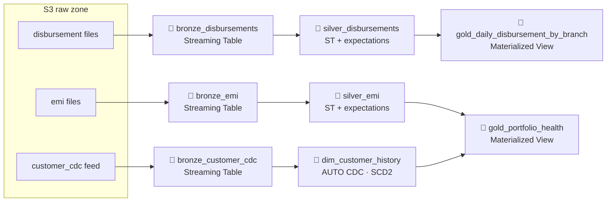

# Spark Declarative Pipelines (SDP) in Databricks — Complete Beginner → Advanced Notes

> Goal: Understand **Declarative Pipelines** end-to-end — from "what even is a pipeline" to building a full **Bronze → Silver → Gold** production pipeline with data quality, CDC/SCD, and observability. For every concept we answer: **What · Why · Why we need it · How to use · How to implement · When to use · How to decide · Impact** — plus exact interview scripts.
>
> **Company context (used throughout):** You work at **Gojoko Technologies**, a **fintech** that gives **loans and savings** through a mobile app. Raw events land in cloud storage from the app and core-banking system: `loan_applications`, `loan_disbursements`, `emi_repayments`, `savings_txns`, and a `customer_cdc` change feed. We need to turn this messy raw data into **clean, trusted, query-ready tables** for analysts, risk models, and dashboards — reliably, every day, without an army of hand-written jobs.
>
> **Toolbox:** SQL (Spark SQL) · PySpark / Apache Spark · Databricks · Delta Lake · Unity Catalog · Auto Loader · AWS S3. Every code sample uses one of these.

---

## How To Read These Notes

- 🟢 **BASICS** build the mental model. Read first, in order — don't skip the "imperative vs declarative" idea, everything depends on it.
- 🧠 **What** = plain-English definition.
- 🎯 **Why we need it** = the exact problem it solves.
- ✅ **Why use it** = the benefits / payoff.
- 🧪 **How to use / implement** = copy-paste-style SQL and PySpark you can picture running.
- ⏱️ **When to use** = the trigger conditions.
- 🧭 **How to decide** = the checklist you run in your head.
- 🗣️ **Say This** = the exact words to speak in an interview.
- 🎯 **Interview Perspective** = why they ask and how to score.
- ⚡ **Impact** = consequence of choosing right vs. wrong.

Take it slow — you do **not** need to memorize, you need to *understand*. The entire framework solves **one problem**: *"writing and operating reliable ETL by hand is painful — let the engine do the hard parts."* Once you feel that, the rest clicks.

---

## Table of Contents

1. [First: What Even Is a "Pipeline"?](#first-what-even-is-a-pipeline)
2. [The Naming Mess — DLT vs Lakeflow vs Spark Declarative Pipelines](#the-naming-mess--dlt-vs-lakeflow-vs-spark-declarative-pipelines)
3. [Declarative vs Imperative — The One Idea Behind Everything](#declarative-vs-imperative--the-one-idea-behind-everything)
4. [The Problem With Normal ETL (Why We Need SDP)](#the-problem-with-normal-etl-why-we-need-sdp)
5. [What Is Spark Declarative Pipelines?](#what-is-spark-declarative-pipelines)
6. [The Building Blocks — Streaming Tables, Materialized Views, Views, Flows](#the-building-blocks--streaming-tables-materialized-views-views-flows)
7. [The Vocabulary You Must Know First](#the-vocabulary-you-must-know-first)
8. [How It Works Under the Hood](#how-it-works-under-the-hood)
9. [How To Use — SQL](#how-to-use--sql)
10. [How To Use — Python](#how-to-use--python)
11. [Data Quality — Expectations](#data-quality--expectations)
12. [CDC / SCD with AUTO CDC (APPLY CHANGES)](#cdc--scd-with-auto-cdc-apply-changes)
13. [Pipeline Execution — Triggered vs Continuous, Dev vs Prod](#pipeline-execution--triggered-vs-continuous-dev-vs-prod)
14. [The Medallion Architecture with SDP — Full Gojoko Example](#the-medallion-architecture-with-sdp--full-gojoko-example)
15. [Implementation — Step by Step](#implementation--step-by-step)
16. [Observability — The Event Log](#observability--the-event-log)
17. [SDP vs Normal ETL — Side by Side](#sdp-vs-normal-etl--side-by-side)
18. [SDP vs Lakeflow Jobs — When to Use Which](#sdp-vs-lakeflow-jobs--when-to-use-which)
19. [The Decision Framework — Should I Use SDP?](#the-decision-framework--should-i-use-sdp)
20. [Product Editions & Cost](#product-editions--cost)
21. [Open-Source Spark Declarative Pipelines (the OSS version)](#open-source-spark-declarative-pipelines-the-oss-version)
22. [Common Pitfalls & How to Avoid Them](#common-pitfalls--how-to-avoid-them)
23. [Interview Spoken Scripts](#interview-spoken-scripts)
24. [Notes to Remember (Flashcards)](#-notes-to-remember-flashcards)

---

## First: What Even Is a "Pipeline"?

🟢 **BASICS — read this first or nothing else makes sense.**

A **data pipeline** is just a **chain of steps that moves and transforms data** from where it lands (raw) to where it's useful (clean, aggregated). At Gojoko:

```
Raw app/bank files (S3)  →  cleaned & validated  →  joined & enriched  →  daily business summaries
        (raw)                    (clean)                 (enriched)              (reporting)
```

Each arrow is a **transformation**. Each box is a **table**. A pipeline is the whole chain wired together so that when new data arrives, it flows through every step in the right order.

The hard part is **never the SQL** in each step. The hard part is everything *around* it:

- **Order**: Step 3 must not run before Step 2 finishes. Who guarantees that?
- **Incrementality**: Today only 2 million new rows arrived. Do we re-process all 5 billion historical rows, or just the new 2 million? Re-processing everything is slow and expensive.
- **Failures**: Step 4 crashed at 2 AM. Does the whole thing retry? From where? Did it leave half-written garbage?
- **Quality**: A bad file had `amount = -9999`. Did it poison the gold dashboard? How do we catch it?
- **Change tracking**: A customer moved cities. Do we keep history (SCD2) or overwrite (SCD1)?
- **Visibility**: Which table feeds which? If gold is wrong, where did it break? (lineage)

> 🔑 **The core realization:** Writing the *transform logic* is 20% of the work. The other 80% is **orchestration, incrementality, retries, quality, and observability**. **Declarative Pipelines exist to do that 80% for you**, so you only write the 20% that's actually your business logic.

---

## The Naming Mess — DLT vs Lakeflow vs Spark Declarative Pipelines

Before anything else, clear up the names, because the **same technology has had three names** and interviewers love to check you know this.

| Name | What it is | Status |
|---|---|---|
| **Delta Live Tables (DLT)** | The **original** Databricks declarative ETL framework, launched 2022. | ⬅️ Old name. You'll still hear "DLT" everywhere. |
| **Lakeflow Declarative Pipelines** | The **same product, rebranded** (Data+AI Summit, June 2025) under the **Lakeflow** umbrella. | ✅ Current Databricks product name. |
| **Spark Declarative Pipelines (SDP)** | The **open-source core** of that framework, **donated to Apache Spark** (June 2025, ships with Spark 4.x). Runs on *any* Spark, not just Databricks. | ✅ Current open-source name. |

So in 2025 Databricks did two things at once:
1. **Renamed** DLT → **Lakeflow Declarative Pipelines** (the managed product on Databricks).
2. **Open-sourced** the engine as **Spark Declarative Pipelines** and gave it to Apache Spark.

> 🗣️ **Say This:** *"Delta Live Tables was rebranded to Lakeflow Declarative Pipelines, and its engine was open-sourced into Apache Spark as Spark Declarative Pipelines. They're the same declarative ETL idea — DLT is just the old name. On Databricks I use the managed Lakeflow flavour; the OSS flavour runs on plain Spark 4."*

**Lakeflow** (the umbrella) has three parts — don't confuse them:
- **Lakeflow Connect** = managed **ingestion** connectors (pull from Salesforce, SQL Server, etc.).
- **Lakeflow Declarative Pipelines** = the **transform/ETL** framework (this document).
- **Lakeflow Jobs** = the general-purpose **orchestrator** (formerly "Workflows"). More on this in §18.

Throughout these notes I'll mostly say **"SDP"** / **"declarative pipelines"** to mean the framework, and call out Databricks-only features where relevant.

---

## Declarative vs Imperative — The One Idea Behind Everything

This single distinction is the whole soul of SDP. Get this and you've got 50% of it.

- **Imperative** = you write **HOW**, step by step. *"Read this file. Now filter. Now create the table if missing. Now checkpoint. Now write. Now run the next notebook. If it fails, catch the error and retry."* You micromanage the engine.
- **Declarative** = you write **WHAT** the result should be. *"This silver table is the bronze table with bad rows removed."* The engine figures out **how** — the order, the incremental processing, the checkpoints, the retries.

### 🍳 The restaurant analogy

- **Imperative cooking** = a recipe where you stand over the cook dictating every motion: *"pick up knife, cut onion into 4, turn on stove to medium…"* If anything goes wrong mid-way you must handle it yourself.
- **Declarative ordering** = you tell the kitchen *"I want a margherita pizza."* The kitchen (the engine) owns the steps, the timing, what to do if the oven trips, and how to reuse the dough they already made. You declared the **outcome**; they handle execution.

In SDP you **declare your tables as queries**, and the framework:
- reads your queries,
- works out which table depends on which (the **dependency graph / DAG**),
- runs them in the correct order,
- processes **only new data** where possible,
- retries failures,
- and records quality + lineage.

> 🔑 **One sentence to memorize:** *"In declarative pipelines you define the destination tables as SQL/Python queries and the engine derives the execution — dependencies, ordering, incremental refresh, retries, and quality — instead of you scripting it by hand."*

---

## The Problem With Normal ETL (Why We Need SDP)

> 🎯 This is the heart of the user question: *"Why need this if we already have normal ETL?"* Here's the honest, concrete answer.

Imagine building the Gojoko pipeline the **traditional/imperative** way — a bunch of notebooks or Spark jobs glued together by a scheduler. Here's what you end up hand-writing and babysitting:

### 1. Manual orchestration & dependencies
You create a workflow with tasks: `bronze_loans → silver_loans → gold_daily`. **You** must wire the order. Add a new table next month? **You** rewire the DAG. Miss an edge and a downstream job reads stale/empty data.

### 2. Hand-rolled incremental logic
To avoid reprocessing billions of rows, you write checkpointing, watermarking, "what's the max date I loaded last time" bookkeeping, and `MERGE` statements. This is fiddly and is where most production bugs live.

```python
# Typical imperative incremental load — lots of plumbing you must get right
last = spark.sql("SELECT MAX(load_ts) FROM silver_loans").first()[0]
new = (spark.read.table("bronze_loans").where(f"load_ts > '{last}'"))
# dedup, handle late data, manage checkpoint, MERGE into target, update watermark...
```

### 3. DIY data quality
Want to drop rows where `amount <= 0` and alarm if too many are bad? You write that yourself, in every job, differently each time. There's no standard, no metrics, no history of "how dirty was today's data."

### 4. DIY error handling & recovery
Job dies at 2 AM. Did it leave a half-written table? You add try/except, idempotency guards, cleanup logic, manual retries. Recovery logic often dwarfs the actual transform.

### 5. No built-in lineage / observability
"Why is the gold dashboard wrong?" You manually trace which notebook wrote which table. No automatic graph, no per-table quality metrics, no single event log.

### 6. Batch and streaming are two different codebases
A batch job and a streaming job for the same logic look completely different. Maintaining both is double the work and double the bugs.

### 7. It rots
Six months later you have 40 notebooks, a fragile scheduler DAG, copy-pasted checkpoint logic, and only one person who understands it. New requirement = high risk.

> ⚡ **Impact of normal ETL:** It *works*, but you spend **most of your effort on plumbing, not business value**. It's brittle, hard to onboard onto, expensive to change, and quality/lineage are afterthoughts.

### What SDP removes from your plate

| Pain in normal ETL | What SDP does for you |
|---|---|
| Wire the task order by hand | **Auto** dependency resolution from your queries (builds the DAG itself) |
| Hand-write incremental/checkpoint logic | **Auto** incremental processing (streaming tables + materialized views) |
| Custom retry/recovery code | **Auto** retries, recovery, and idempotent updates |
| Quality checks scattered everywhere | **Built-in expectations** with metrics + actions (warn/drop/fail) |
| Manually trace what feeds what | **Automatic lineage** graph + event log |
| Separate batch vs streaming code | **One model** for both |
| CDC/SCD coded by hand | **Built-in `AUTO CDC`** for SCD Type 1 & 2 |
| Create/manage target tables yourself | Framework **manages the tables** (creation, schema, evolution) |

> 🗣️ **Say This (the money answer):** *"Normal ETL isn't wrong — but with it you hand-write orchestration, incremental logic, retries, and quality checks, and you maintain batch and streaming separately. Declarative pipelines let me declare the tables as queries and the engine handles the DAG, incremental refresh, recovery, data quality, CDC, and lineage. I write less code, it's more reliable, and it's far easier to maintain and onboard."*

---

## What Is Spark Declarative Pipelines?

🧠 **What:** SDP is a **declarative framework for building reliable batch and streaming data pipelines** on Spark / Databricks. You define a set of **datasets** (tables/views) as **SQL or Python queries**, group them into a **pipeline**, and the framework **plans and runs** the whole thing — ordering, incremental updates, quality, recovery, and lineage included.

It stands on three foundations:
- **Delta Lake** — the storage format (ACID, time travel, schema evolution).
- **Structured Streaming** — the incremental processing engine under streaming tables.
- **The declarative pipeline engine** — the new part: reads your dataset definitions, builds the DAG, and executes.

✅ **Why use it (the payoff in one list):**
- **Less code** — declare *what*, not *how*.
- **Automatic orchestration** — DAG built from your queries.
- **Incremental & efficient** — processes only new data.
- **Built-in data quality** — expectations with metrics and enforcement.
- **Unified batch + streaming** — one programming model.
- **Automatic lineage + observability** — event log and dependency graph for free.
- **Self-healing** — retries, recovery, idempotency handled.
- **Built-in CDC/SCD** — `AUTO CDC` for Type 1 and Type 2.
- **Easy CI/CD** — deploy via Databricks Asset Bundles.

> 🔑 **Mental model:** A normal Spark job is a *verb* ("go do these steps"). An SDP pipeline is a set of *nouns* ("these tables exist and here's how each is defined"). You describe the **destinations**; the engine drives.

---

## The Building Blocks — Streaming Tables, Materialized Views, Views, Flows

Everything you build in SDP is one of these **dataset types**. Knowing *which to pick* is the core skill.

### 1. 🌊 Streaming Table (ST)
- **What:** A Delta table updated **incrementally** by a streaming query. Each new batch of source data is processed **once** and appended.
- **Use for:** **Ingestion** and append-style processing — Bronze, and any append-only Silver. Perfect with **Auto Loader** for files landing in S3.
- **Key trait:** Reads its source as a **stream** (`STREAM(...)` in SQL / `spark.readStream` in Python). Remembers what it already processed (no reprocessing).
- **Gojoko:** raw `loan_disbursements` files arriving continuously → `bronze_disbursements` streaming table.

### 2. 🧮 Materialized View (MV)
- **What:** A Delta table holding the **result of a query**, kept **fresh** by the engine. The engine recomputes it incrementally when it can, fully when it must.
- **Use for:** **Transformations and aggregations** where the result must always reflect the current full input — Silver joins, Gold summaries.
- **Key trait:** Reads sources as **batch** (the full current table) and guarantees the result matches the query over all current data.
- **Gojoko:** `gold_daily_disbursement_by_branch` = sum of disbursements grouped by branch/day.

### 3. 👻 View (temporary)
- **What:** A **named query that is NOT stored** — computed on the fly, used as an intermediate step inside the pipeline.
- **Use for:** Breaking complex logic into readable steps without materializing extra tables. Not queryable outside the pipeline.
- **Gojoko:** a `v_valid_customers` view reused by three downstream tables.

### 4. 🔁 Flow
- **What:** The **data-movement definition** that updates a table — "this data flows into that table." Most tables have one implicit flow (the query that defines them). But you can attach **multiple flows** to one streaming table (e.g., union several sources into one bronze table) and define special flows like **`AUTO CDC`** (CDC/SCD).
- **Use for:** Advanced cases — merging many sources into one table, or change-data-capture.

> 🧭 **How to decide ST vs MV (the rule of thumb):**
> - Source is **append-only** and you want **cheap incremental ingest** → **Streaming Table**.
> - You need an **always-correct aggregation/join** over the **whole** dataset (including updates/deletes upstream) → **Materialized View**.
> - Intermediate logic you don't want to persist → **View**.

| Dataset | Stored? | Incremental? | Reads source as | Typical layer |
|---|---|---|---|---|
| **Streaming Table** | ✅ Yes | ✅ Yes (append) | Stream | Bronze, append Silver |
| **Materialized View** | ✅ Yes | ✅ (engine decides) | Batch (full) | Silver, Gold |
| **View** | ❌ No | n/a | either | Intermediate logic |

---

## The Vocabulary You Must Know First

Don't skip this — every later section uses these words.

| Term | Plain-English meaning |
|---|---|
| **Pipeline** | The deployable unit. A collection of datasets + their config that the engine runs together as one DAG. |
| **Dataset** | Any table/view the pipeline defines (streaming table, materialized view, or view). |
| **DAG** | Directed Acyclic Graph — the dependency graph the engine builds from your queries (who feeds whom). |
| **Flow** | The query/stream that populates a table. Implicit (the table's definition) or explicit (`CREATE FLOW`, `AUTO CDC`). |
| **`LIVE` schema / `live.`** | The pipeline's **virtual schema**. Referencing `live.silver_loans` (older syntax) tells the engine "this is another dataset in *this* pipeline," which is how it draws the dependency edge. With Unity Catalog you can now often reference datasets by plain name. |
| **`STREAM(...)`** | SQL wrapper meaning "read this source incrementally as a stream." |
| **Expectation** | A declarative **data-quality rule** (`EXPECT ...`) with an action: warn, drop, or fail. |
| **`AUTO CDC` / `APPLY CHANGES`** | Built-in change-data-capture that applies inserts/updates/deletes and can build **SCD Type 1 or 2** automatically. |
| **Auto Loader (`cloudFiles`)** | Databricks' incremental file-ingestion source — detects new files in S3 efficiently, with schema inference/evolution. |
| **Triggered vs Continuous** | Run-once-then-stop (batch-like) vs always-on (low latency). |
| **Development vs Production mode** | Dev = reuse cluster, fail fast (fast iteration). Prod = fresh cluster, retries, robust. |
| **Full refresh vs Refresh** | Full = wipe and recompute from scratch (logic changed). Refresh = incremental, process only new data. |
| **Event log** | A Delta table the pipeline writes automatically: every run's operations, quality metrics, and lineage. |
| **Serverless** | Databricks-managed compute for the pipeline — no cluster to size; required for some features (e.g., incremental MV refresh enhancements). |

> 💡 **The `live.` "aha":** The reason you reference sibling tables via the pipeline's virtual schema instead of a hardcoded path is **exactly how the engine knows the dependency exists**. Your `FROM` clauses *are* the DAG. You never draw arrows manually — your queries draw them for you.

---

## How It Works Under the Hood

Here's what actually happens when you click **Start** on a pipeline. Understanding this is what separates "I used DLT once" from "I understand SDP."

```mermaid
flowchart LR
    A[Your SQL/Python<br/>dataset definitions] --> B[Engine parses all queries]
    B --> C[Build dependency DAG<br/>from FROM/read references]
    C --> D[Plan execution order<br/>+ choose incremental vs full]
    D --> E[Provision compute]
    E --> F[Run datasets in order<br/>Bronze → Silver → Gold]
    F --> G[Apply expectations<br/>collect metrics]
    G --> H[Write tables + checkpoints<br/>handle retries]
    H --> I[Emit event log<br/>lineage + metrics]
```



Step by step:

1. **Parse & analyze** — The engine reads **all** your dataset definitions *before running anything*. It validates schemas and references up front (catches typos/bad columns early).
2. **Build the DAG** — From each `FROM live.x` / `dlt.read("x")`, it draws an edge. The result is the full dependency graph. Bronze has no internal deps; Silver depends on Bronze; Gold depends on Silver.
3. **Plan** — It topologically sorts the DAG (correct order) and decides, per table, whether this run can be **incremental** (streaming table / smart MV) or needs a **full** recompute (e.g., you changed the logic, or did a full refresh).
4. **Provision compute** — Spins up the cluster (or uses serverless). Autoscaling is supported.
5. **Execute** — Runs datasets in dependency order; independent branches run in **parallel**. Streaming tables consume only new input since their last checkpoint.
6. **Enforce quality** — As rows flow, expectations are evaluated; metrics (pass/fail counts) are recorded, and the configured action (warn/drop/fail) is taken.
7. **Commit atomically** — Each table update is an atomic Delta commit. Checkpoints advance. Failures trigger **retries** (in production mode) and recovery from the last good state — no half-written corruption.
8. **Emit the event log** — Operational metrics, data-quality results, and lineage are written to a Delta event log you can query.

> ⚡ **Impact:** Because the engine owns planning + execution, you get **correct ordering, incrementality, parallelism, recovery, and lineage automatically** — the exact things you'd hand-code (and get subtly wrong) in normal ETL.

---

## How To Use — SQL

The SQL flavour is the friendliest entry point. You write `CREATE OR REFRESH ...` statements; the engine does the rest. Here's a mini Gojoko pipeline.

### Bronze — ingest raw files with Auto Loader (Streaming Table)

```sql
-- Raw loan disbursement files land in S3; ingest incrementally as a stream.
CREATE OR REFRESH STREAMING TABLE bronze_disbursements
COMMENT "Raw loan disbursements ingested from S3 via Auto Loader"
AS
SELECT *, current_timestamp() AS ingest_ts, _metadata.file_name AS source_file
FROM STREAM read_files(
  's3://gojoko-raw/disbursements/',
  format => 'json'
);
```

- `STREAMING TABLE` → incremental, append-only ingest.
- `read_files(...)` (Auto Loader) → efficiently picks up only **new** files, infers/evolves schema.

### Silver — clean & validate (Streaming Table + Expectations)

```sql
CREATE OR REFRESH STREAMING TABLE silver_disbursements (
  CONSTRAINT valid_amount   EXPECT (amount > 0)              ON VIOLATION DROP ROW,
  CONSTRAINT has_customer   EXPECT (customer_id IS NOT NULL) ON VIOLATION FAIL UPDATE,
  CONSTRAINT sane_date      EXPECT (disbursed_date >= '2015-01-01')
)
COMMENT "Validated, typed disbursements"
AS
SELECT
  CAST(disbursement_id AS STRING)          AS disbursement_id,
  CAST(customer_id    AS STRING)           AS customer_id,
  CAST(amount         AS DECIMAL(12,2))    AS amount,
  CAST(disbursed_date AS DATE)             AS disbursed_date,
  branch_id
FROM STREAM(live.bronze_disbursements);   -- live. = "the bronze table in THIS pipeline"
```

- The three `CONSTRAINT ... EXPECT` rules are **data quality** (next section).
- `STREAM(live.bronze_disbursements)` reads the bronze streaming table incrementally **and** declares the dependency.

### Gold — business aggregation (Materialized View)

```sql
CREATE OR REFRESH MATERIALIZED VIEW gold_daily_disbursement_by_branch
COMMENT "Daily disbursed amount per branch for dashboards"
AS
SELECT
  branch_id,
  disbursed_date,
  COUNT(*)      AS loans_count,
  SUM(amount)   AS total_disbursed
FROM live.silver_disbursements
GROUP BY branch_id, disbursed_date;
```

- A **Materialized View** because it's an aggregation that must always reflect the full current silver table; the engine keeps it fresh.

That's a complete 3-layer pipeline in ~40 lines of SQL — **no orchestration code, no checkpoint code, no retry code**.

---

## How To Use — Python

The Python flavour uses **decorators**. Same concepts, more flexibility (loops, parameters, reusable functions, unit-testable logic). On Databricks the module is `dlt`.

```python
import dlt
from pyspark.sql.functions import col, current_timestamp

# ---------- Bronze: streaming ingest ----------
@dlt.table(
    name="bronze_disbursements",
    comment="Raw loan disbursements ingested from S3 via Auto Loader"
)
def bronze_disbursements():
    return (
        spark.readStream.format("cloudFiles")
            .option("cloudFiles.format", "json")
            .load("s3://gojoko-raw/disbursements/")
            .withColumn("ingest_ts", current_timestamp())
    )

# ---------- Silver: clean + data quality ----------
@dlt.table(comment="Validated, typed disbursements")
@dlt.expect_or_drop("valid_amount", "amount > 0")
@dlt.expect_or_fail("has_customer", "customer_id IS NOT NULL")
@dlt.expect("sane_date", "disbursed_date >= '2015-01-01'")
def silver_disbursements():
    return (
        dlt.read_stream("bronze_disbursements")
            .select(
                col("disbursement_id").cast("string"),
                col("customer_id").cast("string"),
                col("amount").cast("decimal(12,2)"),
                col("disbursed_date").cast("date"),
                col("branch_id"),
            )
    )

# ---------- Gold: aggregation (materialized view) ----------
@dlt.table(comment="Daily disbursed amount per branch")
def gold_daily_disbursement_by_branch():
    return (
        dlt.read("silver_disbursements")
            .groupBy("branch_id", "disbursed_date")
            .agg(
                {"*": "count", "amount": "sum"}
            )
            .withColumnRenamed("count(1)", "loans_count")
            .withColumnRenamed("sum(amount)", "total_disbursed")
    )
```

Key Python pieces:
- `@dlt.table` → declares a streaming table or materialized view (the engine infers from whether you used `readStream` or `read`).
- `@dlt.view` → a non-persisted view.
- `dlt.read("x")` → batch read of sibling dataset; `dlt.read_stream("x")` → streaming read. **These calls are what draw the DAG edges.**
- `@dlt.expect*` decorators → data quality.

> 💡 **SQL or Python?** Use **SQL** for straightforward declarative transforms (most teams default here — it's readable and concise). Use **Python** when you need loops to generate many similar tables, parameterization, reusable helper functions, or unit-testable transformation logic. You can even **mix both** in one pipeline.

---

## Data Quality — Expectations

This is one of SDP's killer features and a guaranteed interview topic. **Expectations are declarative data-quality rules** attached to a dataset. Each has a name, a boolean condition, and an **action** when a row violates it.

### The three actions

| Action | SQL | Python | What happens to a bad row | What happens to the run |
|---|---|---|---|---|
| **Warn (retain)** | `EXPECT (cond)` | `@dlt.expect` | **Kept** in the table | Continues; violation **counted** in metrics |
| **Drop** | `EXPECT (cond) ON VIOLATION DROP ROW` | `@dlt.expect_or_drop` | **Dropped** (not written) | Continues; drops **counted** |
| **Fail** | `EXPECT (cond) ON VIOLATION FAIL UPDATE` | `@dlt.expect_or_fail` | — | **Pipeline stops** (the update fails) |

```sql
CREATE OR REFRESH STREAMING TABLE silver_emi (
  CONSTRAINT positive_emi   EXPECT (emi_amount > 0)            ON VIOLATION DROP ROW,
  CONSTRAINT known_customer EXPECT (customer_id IS NOT NULL)  ON VIOLATION FAIL UPDATE,
  CONSTRAINT not_future      EXPECT (paid_date <= current_date())   -- warn only
)
AS SELECT * FROM STREAM(live.bronze_emi);
```

### Why each action exists (Gojoko framing)
- **Warn** — *"I want to know how often `paid_date` is in the future, but I don't want to lose the row."* Great for monitoring without disrupting data.
- **Drop** — *"A repayment with `emi_amount <= 0` is garbage; don't let it pollute revenue numbers, but don't crash the pipeline over it."*
- **Fail** — *"A repayment with no `customer_id` is so wrong it means upstream is broken. Stop everything before bad data spreads."*

### Quarantine pattern (advanced, very interview-friendly)
Instead of silently dropping bad rows, **route them to a quarantine table** so analysts can inspect:

```sql
-- Tag rows as valid/invalid, then split into two tables downstream.
CREATE OR REFRESH STREAMING TABLE emi_tagged AS
SELECT *, (emi_amount > 0 AND customer_id IS NOT NULL) AS is_valid
FROM STREAM(live.bronze_emi);

CREATE OR REFRESH STREAMING TABLE silver_emi_clean AS
SELECT * EXCEPT (is_valid) FROM STREAM(live.emi_tagged) WHERE is_valid;

CREATE OR REFRESH STREAMING TABLE silver_emi_quarantine AS
SELECT * EXCEPT (is_valid) FROM STREAM(live.emi_tagged) WHERE NOT is_valid;
```

> ✅ **Why this matters:** Every expectation's pass/fail counts are written to the **event log**, so you get **automatic, queryable data-quality metrics over time** — "what % of EMI rows were bad each day?" — with zero extra code. In normal ETL you'd build this dashboard by hand.

> 🗣️ **Say This:** *"Expectations are declarative quality rules with three actions — warn, drop, or fail. I use warn for monitoring, drop for bad-but-tolerable rows, fail for breaches that mean upstream is broken. Metrics land in the event log automatically, and for auditability I often quarantine bad rows instead of dropping them."*

---

## CDC / SCD with AUTO CDC (APPLY CHANGES)

Remember SCD Type 1 (overwrite) and Type 2 (full history) from the SCD notes? Hand-coding SCD2 with `MERGE` is fiddly and error-prone. SDP gives it to you as **one declarative statement**: `AUTO CDC` (the new name; older syntax is `APPLY CHANGES INTO`).

### The setup
Gojoko's core-banking emits a **change feed** `customer_cdc` with columns like `customer_id, name, city, segment, operation ('INSERT'|'UPDATE'|'DELETE'), sequence_num`. We want a clean `dim_customer` dimension.

### SCD Type 1 (keep only the latest — overwrite)

```sql
CREATE OR REFRESH STREAMING TABLE dim_customer;

CREATE FLOW customer_scd1 AS AUTO CDC INTO dim_customer
FROM STREAM(live.customer_cdc)
KEYS (customer_id)                                   -- business key
APPLY AS DELETE WHEN operation = 'DELETE'            -- handle deletes
SEQUENCE BY sequence_num                              -- ordering of changes (avoids out-of-order bugs)
COLUMNS * EXCEPT (operation, sequence_num)
STORED AS SCD TYPE 1;
```

### SCD Type 2 (keep full history)

```sql
CREATE OR REFRESH STREAMING TABLE dim_customer_history;

CREATE FLOW customer_scd2 AS AUTO CDC INTO dim_customer_history
FROM STREAM(live.customer_cdc)
KEYS (customer_id)
APPLY AS DELETE WHEN operation = 'DELETE'
SEQUENCE BY sequence_num
COLUMNS * EXCEPT (operation, sequence_num)
STORED AS SCD TYPE 2;                                 -- engine maintains __START_AT / __END_AT history
```

Python equivalent:

```python
import dlt

dlt.create_streaming_table("dim_customer_history")

dlt.create_auto_cdc_flow(          # older name: dlt.apply_changes(...)
    target="dim_customer_history",
    source="customer_cdc",
    keys=["customer_id"],
    sequence_by="sequence_num",
    apply_as_deletes="operation = 'DELETE'",
    except_column_list=["operation", "sequence_num"],
    stored_as_scd_type=2,
)
```

### Why this is a big deal
- **`SEQUENCE BY`** solves out-of-order events — a classic, painful CDC bug — declaratively.
- **`STORED AS SCD TYPE 1/2`** flips between overwrite and full-history with a single word; the engine manages the `__START_AT` / `__END_AT` columns for Type 2.
- **`APPLY AS DELETE`** handles tombstones/deletes correctly.
- There's also **`APPLY CHANGES FROM SNAPSHOT`** for sources that send full snapshots instead of row-level changes.

> ⚡ **Impact:** What was a careful, bug-prone `MERGE` + windowing exercise (see the SCD notes) becomes ~8 declarative lines, with out-of-order handling and deletes built in.

> 🗣️ **Say This:** *"For CDC I use AUTO CDC — formerly APPLY CHANGES — with KEYS and SEQUENCE BY. I switch between SCD Type 1 and Type 2 with one keyword, deletes are handled with APPLY AS DELETE, and out-of-order events are handled by SEQUENCE BY. It replaces hand-written MERGE logic."*

---

## Pipeline Execution — Triggered vs Continuous, Dev vs Prod

Two independent toggles control how a pipeline runs. Interviewers love these because people confuse them.

### A) Execution mode — *how often it runs*

| Mode | Behaviour | Use for | Cost / latency |
|---|---|---|---|
| **Triggered** | Runs **once**: updates all tables in order, then **stops** the compute. | Scheduled batch (hourly/daily). Most analytics. | Cheaper; latency = schedule interval. |
| **Continuous** | Runs **constantly**, ingesting and updating as data arrives. | Real-time/near-real-time needs (fraud, live ops). | Always-on compute; low latency. |

> 🧭 **Decide:** Default to **Triggered** (cheaper, simpler, fits most reporting). Choose **Continuous** only when you genuinely need sub-minute freshness — and accept always-on cost.

### B) Pipeline mode — *how it behaves while developing*

| Mode | Cluster | On failure | Use for |
|---|---|---|---|
| **Development** | **Reused** (stays warm) for fast re-runs | **Fails fast**, no auto-retry, easier to debug | Building/iterating |
| **Production** | **Fresh** cluster per run, then terminated | **Auto-retries** with recovery, robust | Live workloads |

> 💡 Dev vs Prod is about **iteration speed vs robustness**, not how often it runs. You can run a Triggered-Development pipeline (iterate fast) and later flip the same pipeline to Production.

### Refresh types
- **Refresh (incremental):** normal run — process only new data. Cheap.
- **Full refresh:** truncate and **recompute from scratch** — use when you **changed transformation logic** (e.g., fixed a bug in silver) and need to rebuild history. Expensive; resets streaming checkpoints.

> ⚠️ **Careful:** A full refresh on a streaming table reprocesses everything from the source if the source still has it — or loses data if the source has aged out. Know your retention before full-refreshing.

---

## The Medallion Architecture with SDP — Full Gojoko Example

SDP and the **medallion (Bronze → Silver → Gold)** architecture are a perfect match. Here's the end-to-end picture.



- **🥉 Bronze** = raw, as-ingested, append-only → **Streaming Tables** (with Auto Loader). Keep it faithful to source; minimal transformation.
- **🥈 Silver** = cleaned, typed, validated, de-duplicated, conformed → **Streaming Tables with expectations**, and dimensions built with **AUTO CDC / SCD2**.
- **🥇 Gold** = business-level aggregates and marts for BI/ML → **Materialized Views**.

All of this is **one pipeline**. The engine wires the arrows from your `FROM` clauses, runs bronze before silver before gold, processes incrementally, enforces quality, and logs lineage — automatically.

> 🗣️ **Say This:** *"I map medallion onto SDP cleanly: Bronze and append-Silver as streaming tables with Auto Loader, dimensions via AUTO CDC for SCD2, and Gold as materialized views. One pipeline, automatic DAG, incremental refresh, expectations at Silver, lineage for free."*

---

## Implementation — Step by Step

How to actually stand this up on Databricks.

### Step 1 — Write the dataset definitions
Put your SQL or Python in notebooks or `.sql`/`.py` files in a repo, e.g.:
```
gojoko_pipeline/
  bronze.sql
  silver.sql
  gold.sql
  dimensions.py        # AUTO CDC logic
```

### Step 2 — Create the pipeline
**UI:** Workflows / Lakeflow → **Declarative Pipelines** → **Create pipeline** → add your source files → set:
- **Target** catalog + schema (Unity Catalog) where tables are published.
- **Compute**: serverless (recommended) or a cluster config (with autoscaling).
- **Mode**: Triggered or Continuous; Development or Production.
- **Configuration** key/values (parameters, e.g., source paths per environment).

### Step 3 — Run it
Click **Start**. Watch the **live DAG** render, tables populate, and per-table row counts + expectation metrics appear.

### Step 4 — Schedule it
Wrap the pipeline in a **Lakeflow Job** (orchestrator) with a schedule/trigger, or schedule the pipeline directly. The Job can also run other tasks around it (e.g., send a Slack alert after).

### Step 5 — Productionize with Databricks Asset Bundles (DABs) — CI/CD
Define the pipeline as code in `databricks.yml` so it's versioned and deployed via CI/CD across dev/stage/prod:

```yaml
# databricks.yml (excerpt)
bundle:
  name: gojoko_pipeline

resources:
  pipelines:
    gojoko_etl:
      name: gojoko_etl
      serverless: true
      catalog: gojoko
      target: analytics
      libraries:
        - file: { path: ./bronze.sql }
        - file: { path: ./silver.sql }
        - file: { path: ./gold.sql }
        - file: { path: ./dimensions.py }
      configuration:
        source_path: s3://gojoko-raw/

targets:
  dev:   { mode: development }
  prod:  { mode: production }
```

Deploy: `databricks bundle deploy -t prod`.

> ⚡ **Impact:** From notebooks-and-clicks to **fully version-controlled, environment-promoted, CI/CD-deployed** pipelines — the professional setup.

---

## Observability — The Event Log

Every pipeline automatically writes an **event log** (a Delta table) capturing **operations, data quality, and lineage**. You query it like any table — this is your built-in monitoring.

What's inside:
- **Operational metrics** — run durations, rows written per table, cluster events.
- **Data-quality results** — per-expectation pass/fail counts per run.
- **Lineage** — which dataset depends on which (the DAG, as data).
- **Status & errors** — failures, retries, and why.

Example — *how dirty was each day's data?*

```sql
-- Pull expectation results out of the event log (shape varies by version).
SELECT
  timestamp::date                              AS run_date,
  details:flow_progress:data_quality:expectations
                                               AS expectations
FROM event_log_table
WHERE event_type = 'flow_progress'
ORDER BY run_date DESC;
```

> ✅ **Why it matters:** Monitoring, alerting, audit, and lineage that you'd hand-build in normal ETL come **free and standardized**. Point a dashboard at the event log and you have a data-quality + freshness monitor with no extra pipelines.

---

## SDP vs Normal ETL — Side by Side

The master comparison — memorize the shape of this.

| Dimension | Normal ETL (imperative jobs) | Spark Declarative Pipelines |
|---|---|---|
| **You write** | HOW: steps, order, checkpoints, retries | WHAT: tables as queries |
| **Orchestration** | Manual DAG / scheduler wiring | **Auto** from query references |
| **Incremental** | Hand-coded checkpoints/watermarks | **Built-in** (streaming tables / MVs) |
| **Data quality** | DIY, inconsistent | **Expectations** + metrics, standardized |
| **Error recovery** | Custom try/except, idempotency | **Auto** retries + recovery |
| **CDC / SCD** | Hand-written MERGE | **AUTO CDC** (SCD 1 & 2) |
| **Batch + streaming** | Two codebases | **One** model |
| **Lineage / monitoring** | Manual / external | **Event log** + DAG, automatic |
| **Schema management** | You create/alter tables | Framework manages tables/schema |
| **Code volume** | High (mostly plumbing) | Low (mostly business logic) |
| **Maintainability** | Degrades over time | Stays clean (declarative) |
| **Control / flexibility** | **Total** (any logic, any tool) | High **within** the dataset model |
| **Best for** | Bespoke/odd workflows, non-table tasks | Reliable, table-centric ELT/ETL |

> ⚖️ **The honest trade-off:** SDP trades **some low-level control** for **huge gains in reliability, speed of development, and maintainability**. For 80–90% of table-to-table ETL, that's a great trade. For truly bespoke, non-table, multi-system orchestration, normal jobs (or Lakeflow Jobs) still win — see next section.

---

## SDP vs Lakeflow Jobs — When to Use Which

A frequent confusion. They're **complementary**, not competitors.

| | **Lakeflow Declarative Pipelines (SDP)** | **Lakeflow Jobs** (formerly Workflows) |
|---|---|---|
| **Purpose** | Define **data transformations** (tables/views) declaratively | **Orchestrate** arbitrary tasks of any kind |
| **Unit** | Datasets in a DAG | Tasks in a DAG (notebooks, JARs, Python, dbt, SQL, **a pipeline**, …) |
| **Strength** | Incremental ELT, quality, CDC, lineage | General scheduling, dependencies across **heterogeneous** steps, retries, alerts |
| **Analogy** | The **assembly line** that builds the tables | The **factory manager** scheduling all lines + shipping + cleanup |

**How they fit together:** A **Job** schedules and orchestrates; one of its **tasks** can be "run the Gojoko declarative pipeline," another task can "refresh a dashboard," another can "send an alert." Use **SDP for the data transformations**, **Jobs for end-to-end orchestration** around them.

> 🗣️ **Say This:** *"Declarative Pipelines build the tables; Jobs orchestrate everything. I put my ELT in a pipeline and run that pipeline as one task inside a Job that also handles upstream ingestion triggers, downstream dashboard refresh, and alerting."*

---

## The Decision Framework — Should I Use SDP?

🧭 Run this checklist in your head.

### ✅ Strong fit — use SDP when:
- You're building **table-to-table ELT** (medallion bronze/silver/gold).
- You want **incremental** processing without hand-coding checkpoints.
- You need **data-quality enforcement** with metrics.
- You need **CDC / SCD** (Type 1 or 2) on dimensions.
- You want **unified batch + streaming** in one model.
- You value **automatic lineage, monitoring, and recovery**.
- You want **less code** and **easier maintenance/onboarding**.

### ⚠️ Reconsider / use something else when:
- Your workflow is **not table-centric** (e.g., call an external API, move files, train a model, run a JAR) → orchestrate with **Lakeflow Jobs**.
- You need **fine-grained control** over execution/compute that the dataset model doesn't allow.
- You must run on **non-Spark** systems (then neither; though OSS SDP broadens Spark options).
- It's a **one-off script** where the framework overhead isn't worth it.
- Your team is deeply invested in an external orchestrator (Airflow/dbt) and the table model doesn't add enough — *(though you can still call pipelines from those).*

### The quick mental test
> *"Am I mostly **producing/refreshing tables** from other tables, and do I want the engine to handle order, incrementality, quality, and recovery?"*
> **Yes → Declarative Pipelines.** **No (I'm orchestrating mixed tasks) → Jobs/Airflow,** possibly **calling** a pipeline.

---

## Product Editions & Cost

> ⚠️ Editions/pricing evolve (especially with serverless and the Lakeflow rebrand) — always confirm against current Databricks pricing. The **conceptual tiers** to know:

| Edition | Capabilities | Use when |
|---|---|---|
| **Core** | Streaming ingest + transform | Basic ingestion pipelines |
| **Pro** | Core **+ CDC** (`AUTO CDC` / `APPLY CHANGES`, SCD 1 & 2) | You need change-data-capture / dimensions |
| **Advanced** | Pro **+ data-quality expectations** | You need quality enforcement (most production) |

Cost basics:
- Billed in **DBUs** based on compute used (cluster size × time), plus the edition multiplier; **serverless** simplifies sizing.
- **Triggered** pipelines are cheaper (compute spins down between runs); **Continuous** keeps compute always-on.
- **Full refreshes** cost more (recompute everything) — use sparingly.

> 💡 **Cost lever:** Default to **Triggered + serverless**, right-size schedules, and avoid unnecessary full refreshes. Reserve **Continuous** for genuine low-latency needs.

---

## Open-Source Spark Declarative Pipelines (the OSS version)

The part many people miss: since the engine was donated to **Apache Spark**, you can run declarative pipelines on **plain Spark 4.x** — no Databricks required.

What's the same:
- Same **declarative model**: streaming tables, materialized views, temporary views, flows, expectations.
- Same SQL surface (`CREATE ... STREAMING TABLE`, `MATERIALIZED VIEW`) and a Python decorator API.

What's different on OSS:
- Python module is **`pyspark.pipelines`** (commonly aliased `sdp`) instead of Databricks' `dlt`.
- You define a project with a **`pipeline.yml`** spec and run it with the **`spark-pipelines`** CLI (`spark-pipelines run`).
- No Databricks-only niceties (managed serverless, the polished UI/event-log UX, Unity Catalog integration, Auto Loader) unless you wire equivalents yourself.

```python
# OSS Spark Declarative Pipelines (Spark 4.x) — note the module + decorators
from pyspark import pipelines as sdp

@sdp.materialized_view
def gold_daily_disbursement_by_branch():
    return (
        spark.read.table("silver_disbursements")
             .groupBy("branch_id", "disbursed_date")
             .sum("amount")
    )
```

```yaml
# pipeline.yml (OSS)
name: gojoko_pipeline
definitions:
  - glob:
      include: transformations/**/*.py
  - glob:
      include: transformations/**/*.sql
```

```bash
spark-pipelines run --spec pipeline.yml
```

> 🗣️ **Say This:** *"On Databricks I use the managed Lakeflow flavour with `dlt`, serverless, Auto Loader, and the event-log UI. The open-source Spark Declarative Pipelines is the same engine on Spark 4 — `pyspark.pipelines`, a `pipeline.yml`, and the `spark-pipelines` CLI — minus the managed conveniences. Same concepts, portable skill."*

---

## Common Pitfalls & How to Avoid Them

1. **Using a Materialized View where a Streaming Table belongs (or vice-versa).**
   - Append-only ingest that you re-wrote as an MV → expensive recompute. *Fix:* streaming table for append ingest; MV for aggregations over the full set.

2. **Forgetting `STREAM(...)` / `read_stream`.** Reading a source as batch when you wanted incremental → reprocesses everything each run. *Fix:* use `STREAM(...)` / `dlt.read_stream(...)` for incremental sources.

3. **Hardcoding paths instead of referencing sibling datasets.** Bypasses the DAG; the engine can't order/track it. *Fix:* reference `live.x` / `dlt.read("x")` so the dependency is captured.

4. **Casual full refreshes on streaming tables.** May reprocess or, worse, lose data if the source aged out. *Fix:* understand source retention; prefer incremental; full-refresh deliberately.

5. **Overusing `FAIL UPDATE` expectations.** A single bad row halts the whole pipeline at 3 AM. *Fix:* `FAIL` only for true integrity breaches; `DROP`/quarantine for tolerable dirt.

6. **No `SEQUENCE BY` in AUTO CDC.** Out-of-order change events corrupt SCD history. *Fix:* always `SEQUENCE BY` a reliable ordering column.

7. **Trying to write to a pipeline-managed table from outside the pipeline.** The pipeline **owns** its tables. *Fix:* all writes to those tables happen inside the pipeline.

8. **Continuous mode by default.** Burns money for latency you don't need. *Fix:* default Triggered; Continuous only when required.

9. **Treating it like an arbitrary orchestrator.** It's for **datasets**, not "ssh to a box and move files." *Fix:* use Lakeflow Jobs for non-table tasks and call the pipeline from there.

10. **Skipping dev mode.** Iterating in production mode = slow (fresh cluster each run) and noisy. *Fix:* build in Development mode, promote to Production.

---

## Interview Spoken Scripts

**Q: "What are Spark Declarative Pipelines / DLT?"**
> *"A declarative ETL framework on Spark/Databricks. Instead of scripting how to run jobs, I declare tables as SQL or Python queries; the engine builds the dependency DAG, runs them in order, processes incrementally, enforces data quality, handles CDC and recovery, and gives me lineage and an event log automatically. It's the same engine as the old Delta Live Tables — rebranded to Lakeflow Declarative Pipelines and open-sourced into Apache Spark as Spark Declarative Pipelines."*

**Q: "Why use it over normal ETL?"**
> *"Normal ETL makes me hand-write orchestration, incremental logic, retries, and quality checks, and maintain batch and streaming separately. Declarative pipelines do that 80% of plumbing for me. I write less code, it's more reliable, easier to maintain, and quality plus lineage are built in rather than bolted on."*

**Q: "Streaming Table vs Materialized View?"**
> *"Streaming tables process append-only sources incrementally — ideal for ingestion and bronze. Materialized views keep a query result fresh over the full current input — ideal for silver joins and gold aggregations. ST for append/ingest; MV for always-correct transforms and aggregates."*

**Q: "How do you handle data quality?"**
> *"Expectations — declarative rules with three actions: warn keeps the row and counts it, drop removes bad rows, fail stops the pipeline. Metrics go to the event log automatically. For auditability I often quarantine bad rows into a separate table rather than dropping them."*

**Q: "How do you do CDC / SCD?"**
> *"AUTO CDC, formerly APPLY CHANGES. I give it KEYS and SEQUENCE BY, handle deletes with APPLY AS DELETE, and choose STORED AS SCD TYPE 1 or 2. It replaces hand-written MERGE and handles out-of-order events."*

**Q: "Triggered vs Continuous? Dev vs Prod?"**
> *"Triggered runs once and stops — cheaper, for batch. Continuous is always-on for low latency. Development reuses the cluster and fails fast for quick iteration; Production uses a fresh cluster with automatic retries. They're independent toggles."*

**Q: "Declarative Pipelines vs Jobs/Workflows?"**
> *"Pipelines build tables declaratively; Jobs orchestrate arbitrary tasks. I run the pipeline as a task inside a Job that also handles ingestion triggers, dashboard refreshes, and alerts."*

---

## 🎴 Notes to Remember (Flashcards)

- **SDP in one line:** declare tables as queries → engine handles DAG, incrementality, quality, CDC, recovery, lineage.
- **Three names, one tech:** **DLT** (old) = **Lakeflow Declarative Pipelines** (managed) = **Spark Declarative Pipelines** (open source in Spark 4).
- **Declarative = WHAT, not HOW.** Your `FROM` clauses *are* the dependency graph.
- **Streaming Table** = incremental append (ingest/bronze). **Materialized View** = always-fresh aggregate/join (silver/gold). **View** = unstored intermediate.
- **Expectations** → `EXPECT`: **warn** (keep+count) · **DROP ROW** · **FAIL UPDATE**. Metrics auto-logged.
- **CDC** → `AUTO CDC` (`APPLY CHANGES`): `KEYS`, `SEQUENCE BY`, `APPLY AS DELETE`, `STORED AS SCD TYPE 1|2`.
- **Execution:** **Triggered** (run-once, cheap) vs **Continuous** (always-on). **Dev** (reuse cluster, fail fast) vs **Prod** (fresh cluster, retries).
- **Refresh:** incremental (cheap) vs **full refresh** (recompute; use after logic changes).
- **Medallion fit:** Bronze/append-Silver = streaming tables (+Auto Loader); dimensions = AUTO CDC/SCD2; Gold = materialized views.
- **Event log** = automatic ops + quality + lineage, queryable as Delta.
- **Pipelines build tables; Jobs orchestrate.** They complement.
- **Why over normal ETL:** removes the 80% plumbing (orchestration, incrementality, retries, quality, lineage) → less code, more reliable, easier to maintain.
- **Decide:** table-to-table ELT with incremental + quality + lineage → SDP. Mixed/non-table orchestration → Jobs (which can call SDP).
- **OSS:** `pyspark.pipelines` (alias `sdp`), `pipeline.yml`, `spark-pipelines run`.

---

> 🧾 **One-paragraph summary to close:** Spark Declarative Pipelines (the engine behind Databricks' Lakeflow Declarative Pipelines, formerly Delta Live Tables, now also in open-source Apache Spark) let you **declare your bronze/silver/gold tables as SQL or Python queries** and hand the hard parts — **dependency ordering, incremental processing, retries/recovery, data-quality expectations, CDC/SCD, lineage, and monitoring** — to the engine. You need it because **normal ETL forces you to hand-write all that plumbing**, which is brittle and expensive to maintain. Use it for **table-centric ELT** where you want reliability and low code; use **Lakeflow Jobs** to orchestrate everything around it.
