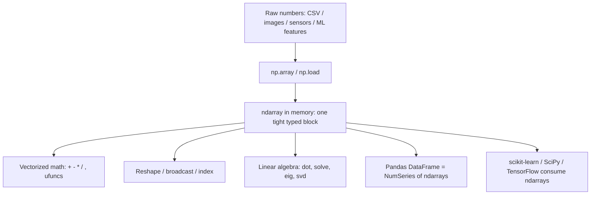

# NumPy — Complete Beginner → Ultra-Advanced Notes

> Goal: Learn **NumPy from absolute zero** in very simple words, then go deep. For **every** concept we cover the **What**, **Why**, **Why we need it**, **How to use**, **How to implement**, **When**, **How to decide**, and the **Impact** of using vs. ignoring it. Each topic ends with **interview questions + answers** (basic → ultra-advanced), scenario-style, with the exact words to say.
>
> **Company context (used throughout):** You work at **Gojoko Technologies**, a **fintech** that gives **loans and savings** through a mobile app. Our data is things like **customers, branches, loan disbursements, EMI repayments, savings transactions**. Almost every example uses these so the learning sticks.
>
> **Toolbox:** Python · **NumPy** · Pandas · scikit-learn · SciPy · (and where it matters) PySpark / Databricks / Dask — because NumPy is the **engine under all of them**, and interviewers love that you know **what runs underneath** Pandas and ML.

---

## How To Read These Notes

- 🟢 **BASICS** build the mental model. Read first, in order.
- 🧠 **What** = the plain-English definition.
- 🎯 **Why we need it** = the problem it solves.
- ✅ **Why use it** = the benefit over the alternative.
- 🧪 **How to use / implement** = copy-paste-style code you can picture running.
- ⏱️ **When** = the situation that calls for it.
- 🧭 **How to decide** = the quick rule for choosing.
- 🗣️ **Say This** = the exact words to speak in an interview.
- 🎯 **Interview Perspective** = why they ask and how to score.
- ⚡ **Impact** = what happens if you apply it vs. ignore it.

Take it slow — you do **not** need to memorize, you need to *understand*. Type every snippet yourself once. NumPy is the **brick** under Pandas, ML, and SciPy — get it solid and everything above it gets easy.

---

## Table of Contents

### 🟢 Basics
1. [Why NumPy — The Problem It Solves](#1-why-numpy--the-problem-it-solves)
2. [Setup, Import & The NumPy Ecosystem](#2-setup-import--the-numpy-ecosystem)
3. [The ndarray — NumPy's Core Object (vs Python Lists)](#3-the-ndarray--numpys-core-object-vs-python-lists)
4. [Array Creation — array, zeros, ones, arange, linspace & friends](#4-array-creation--array-zeros-ones-arange-linspace--friends)
5. [Basic Operations & Indexing / Slicing (1D, 2D, nD)](#5-basic-operations--indexing--slicing-1d-2d-nd)

### 🟡 Intermediate
6. [Array Attributes — shape, size, ndim, dtype, itemsize](#6-array-attributes--shape-size-ndim-dtype-itemsize)
7. [Reshaping — reshape, flatten, ravel, transpose, newaxis](#7-reshaping--reshape-flatten-ravel-transpose-newaxis)
8. [Broadcasting — Automatic Array Expansion](#8-broadcasting--automatic-array-expansion)
9. [Mathematical & Aggregation Functions (sum, mean, std, axis)](#9-mathematical--aggregation-functions-sum-mean-std-axis)
10. [The Random Module — rand, randint, normal, seed, Generator](#10-the-random-module--rand-randint-normal-seed-generator)
11. [Linear Algebra Basics — dot, matmul, @, matrix multiply](#11-linear-algebra-basics--dot-matmul---matrix-multiply)

### 🔵 Advanced
12. [Advanced Indexing — Boolean & Fancy Indexing](#12-advanced-indexing--boolean--fancy-indexing)
13. [Vectorization — Killing Loops for Speed](#13-vectorization--killing-loops-for-speed)
14. [Statistical Functions — median, percentile, variance, correlation](#14-statistical-functions--median-percentile-variance-correlation)
15. [Sorting & Searching — sort, argsort, where, searchsorted, unique](#15-sorting--searching--sort-argsort-where-searchsorted-unique)
16. [Linear Algebra Advanced — inverse, determinant, eigen, SVD, solve](#16-linear-algebra-advanced--inverse-determinant-eigen-svd-solve)
17. [Fourier Transforms — np.fft](#17-fourier-transforms--npfft)

### 🔴 Ultra-Advanced
18. [Memory Layout — C-order vs F-order, Strides, Contiguity](#18-memory-layout--c-order-vs-f-order-strides-contiguity)
19. [Views vs Copies — The #1 Source of Silent Bugs](#19-views-vs-copies--the-1-source-of-silent-bugs)
20. [Performance Optimization — Vectorize, Broadcast, Avoid Copies](#20-performance-optimization--vectorize-broadcast-avoid-copies)
21. [Masked Arrays — Handling Missing / Invalid Data](#21-masked-arrays--handling-missing--invalid-data)
22. [Integration — Pandas, SciPy, scikit-learn](#22-integration--pandas-scipy-scikit-learn)
23. [Big Data Integration — Dask & Spark Interop](#23-big-data-integration--dask--spark-interop)
24. [Best Practices — Clean Code, Reproducibility, Scalability](#24-best-practices--clean-code-reproducibility-scalability)

### 📝 Interview Prep
25. [Scenario-Based Interview Q&A](#25-scenario-based-interview-qa)
26. [Master Comparison Tables](#26-master-comparison-tables)
27. [Common Pitfalls & How to Avoid Them](#27-common-pitfalls--how-to-avoid-them)
28. [Interview Spoken Scripts](#28-interview-spoken-scripts)
29. [Notes to Remember (Flashcards)](#-notes-to-remember-flashcards)

---

# 🟢 BASICS

## 1. Why NumPy — The Problem It Solves

### 🧠 What is NumPy?
**NumPy** (short for **Num**erical **Py**thon) is a free Python library for **fast math on big blocks of numbers**. Its one job is to give Python a super-fast, memory-efficient container called the **`ndarray`** (n-dimensional array) and a huge toolbox of math that runs on the whole array at once.

> **Analogy:** A Python list is a **bag of loose items** — flexible but slow to count. A NumPy array is a **carton of eggs in a tray** — all the same type, packed tightly in a grid, so machines can process them in bulk at lightning speed.

### 🎯 Why we need it (the problem)
Plain Python is **slow for numbers**. Suppose Gojoko has **10 million EMI amounts** and you want to add 18% interest to each:

```python
# ❌ Pure Python — a slow loop, one number at a time
amounts = [50000, 32000, 75000, ...]   # 10 million of them
with_interest = []
for a in amounts:
    with_interest.append(a * 1.18)
```

This crawls because Python checks the **type of every number on every step**, stores each as a bulky object, and the loop runs in slow interpreted Python. For 10M rows this can take **seconds to minutes**.

```python
# ✅ NumPy — one vectorized operation, runs in fast C
import numpy as np
amounts = np.array([50000, 32000, 75000, ...])
with_interest = amounts * 1.18      # whole array at once, ~10–100× faster
```

Same result, but NumPy stores all numbers **together in one tight block of memory**, all the **same type**, and does the multiply in **compiled C** with **no Python loop**. That is the entire reason NumPy exists: **speed and memory efficiency for numeric data.**

### ✅ Why use it (benefits)
- **Speed** — 10× to 100× faster than Python loops (operations run in C, not Python).
- **Memory-efficient** — a million `int64` take ~8 MB in NumPy vs ~30+ MB as a Python list.
- **Vectorization** — write `a + b` instead of a loop; shorter, clearer, faster.
- **Broadcasting** — combine arrays of different shapes without manual loops.
- **The foundation** — **Pandas, scikit-learn, SciPy, TensorFlow, OpenCV** all store data in NumPy arrays. Learn NumPy and you understand what runs *under* all of them.

### 🧪 The "feel the difference" example
```python
import numpy as np, time

py_list = list(range(1_000_000))
np_arr  = np.arange(1_000_000)

t = time.time(); [x * 2 for x in py_list]; print("list:", time.time() - t)
t = time.time(); np_arr * 2;              print("numpy:", time.time() - t)
# Typical: NumPy is ~50× faster on a million elements.
```

### ⏱️ When to use NumPy vs alternatives
| Situation | Best tool |
|---|---|
| Pure numeric math, matrices, ML feature arrays, images | **NumPy** |
| Labeled tables with mixed types (text + numbers + dates) | **Pandas** (built on NumPy) |
| Scientific algorithms (optimization, signal, stats tests) | **SciPy** (built on NumPy) |
| Data bigger than RAM / on a cluster | **Dask / PySpark** |
| Tiny one-off math, a handful of values | plain **Python** is fine |

### 🧭 How to decide
> **Rule of thumb:** *If your data is numbers in a grid (vector, matrix, tensor) and you care about speed — use NumPy. If you need column names, mixed types, and joins — use Pandas (which is NumPy underneath anyway).*

### ⚡ Impact
- **Apply it:** numeric code becomes **fast, compact, and memory-light**; ML preprocessing that took minutes takes seconds.
- **Ignore it:** you write slow Python loops that crawl on real data, blow up memory, and fail in interviews where "vectorize this" is the #1 ask.

### 🎯 Interview Q&A — Why NumPy
**Q1 (Basic): "What is NumPy and why is it faster than a Python list?"**
> *Simple:* "NumPy gives Python a fast array type. It's faster because it stores all numbers of the **same type** packed together in one block of memory and does math on the whole block in **compiled C**, with no slow Python loop."
> *Deeper:* "Three reasons: **homogeneous dtype** (no per-element type checks), **contiguous memory** (cache-friendly, SIMD-friendly), and **vectorized C loops** instead of the Python interpreter. A Python list stores **pointers to boxed objects** scattered in memory, so iterating is slow and bulky."

**Q2 (Intermediate): "Why does almost every data/ML library depend on NumPy?"**
> "Because NumPy defines the standard **n-dimensional array** and a fast math layer. Pandas stores columns as NumPy arrays, scikit-learn takes NumPy arrays as input/output, SciPy adds algorithms on top, and deep-learning frameworks mirror its API. It's the **lingua franca** for numeric data in Python, so libraries interoperate through it without copying logic."

**📝 Remember:** *NumPy = fast, typed, contiguous arrays + vectorized C math. It's the brick under Pandas/SciPy/sklearn. "Vectorize" = let NumPy do the loop in C.*

---

## 2. Setup, Import & The NumPy Ecosystem

### 🧠 What
Getting NumPy ready and knowing what sits **around** it. NumPy is the **base layer**: Pandas (tables), SciPy (science algorithms), scikit-learn (ML), Matplotlib (plots), and more all stand on it.

### 🧪 Install & import (the universal convention)
```python
# Install once (terminal)
# pip install numpy

import numpy as np        # EVERYONE writes "np" — never rename it differently

print(np.__version__)     # always know your version; behavior changes across versions
```

> 💡 The `np` alias is near-universal. In an interview, `import numpy as np` instantly signals real experience. Writing `import numpy` and then `numpy.array(...)` looks junior.

### 🧠 The mental model: how the pieces fit


### 🧠 Key building blocks to know by name
| Piece | Role in one line |
|---|---|
| **`ndarray`** | The core object: an n-dimensional grid of one dtype. |
| **`dtype`** | The element type: `int64`, `float64`, `bool`, `complex128`, etc. |
| **`shape`** | A tuple of sizes per dimension, e.g. `(1000, 3)` = 1000 rows × 3 cols. |
| **`axis`** | The direction an operation runs along (0 = down rows, 1 = across cols). |
| **`ufunc`** | "Universal function" — a fast element-wise C function (`np.add`, `np.exp`). |
| **`broadcasting`** | The rule that stretches smaller arrays to fit bigger ones in math. |
| **`view` / `copy`** | A window into the same memory vs a fresh independent block. |

### ⚡ Impact
Knowing the ecosystem means you reach for the **right layer** — NumPy for raw math, Pandas for labeled tables, SciPy for algorithms — instead of reinventing them, and you understand **why** your Pandas/ML code is fast (NumPy underneath) and **where** it stops (RAM → Dask/Spark).

### 🎯 Interview Q&A — Ecosystem
**Q (Basic): "Where does NumPy sit relative to Pandas and scikit-learn?"**
> "NumPy is the **bottom layer** — the fast array and math engine. Pandas wraps NumPy arrays with labels and mixed types for tables. scikit-learn and SciPy **consume** NumPy arrays to do ML and science. So NumPy is the shared foundation they all speak."

**📝 Remember:** *`import numpy as np`. NumPy = base layer; Pandas/SciPy/sklearn sit on top and pass NumPy arrays around.*

---

## 3. The ndarray — NumPy's Core Object (vs Python Lists)

### 🧠 What is an ndarray?
**`ndarray`** = **n-d**imensional **array** = NumPy's one and only star object. It is a **grid of values, all of the same type**, indexed by a tuple of integers. "n-dimensional" means it can be:
- **1-D** = a vector (a single row of numbers) → e.g. one customer's 12 monthly EMIs.
- **2-D** = a matrix (rows × columns) → e.g. a table of customers × features.
- **3-D and up** = a tensor → e.g. a stack of images, or batches for deep learning.

> **Analogy:** 1-D is a **shelf** of boxes, 2-D is a **grid of shelves** (a wall), 3-D is a **room of walls**. Same idea, more directions.

### 🎯 Why we need it (vs a Python list)
A Python list *can* hold numbers, but it's the wrong tool for math at scale. The differences are not cosmetic — they decide speed, memory, and correctness.

| Feature | Python `list` | NumPy `ndarray` |
|---|---|---|
| **Element type** | Mixed allowed (`[1, "a", 3.0]`) | **One dtype** for all (homogeneous) |
| **Memory** | Pointers to scattered boxed objects | **One contiguous block** of raw values |
| **Speed of math** | Slow Python loop | **Fast vectorized C** |
| **Whole-array math** | ✗ (`[1,2,3] * 2` → repeats list) | ✓ (`arr * 2` → doubles each value) |
| **Multi-dimensional** | Nested lists, clumsy | **Native nD** with one shape |
| **Built-in math** | Almost none | Hundreds of functions (mean, dot, fft…) |

The killer trap that catches beginners:
```python
[1, 2, 3] * 2          # → [1, 2, 3, 1, 2, 3]   (list REPEATS — not math!)
np.array([1,2,3]) * 2  # → array([2, 4, 6])      (NumPy MULTIPLIES — real math)
```

### 🧪 How to create & inspect one
```python
import numpy as np

a = np.array([50000, 32000, 75000])          # 1-D, dtype inferred as int64
m = np.array([[1, 2, 3], [4, 5, 6]])         # 2-D, shape (2, 3)

a.ndim       # 1   → number of dimensions
m.ndim       # 2
a.shape      # (3,)     → sizes per dimension
m.shape      # (2, 3)
a.dtype      # int64    → the element type
a.size       # 3        → total number of elements
m.size       # 6
type(a)      # <class 'numpy.ndarray'>
```

### 🧪 The dtype matters — pick it on purpose
```python
np.array([1, 2, 3])                    # int64  (whole numbers)
np.array([1.0, 2.0, 3.0])              # float64 (decimals)
np.array([1, 2, 3], dtype=np.float32)  # force 32-bit float (half the memory)
np.array([True, False, True])          # bool
np.array([1, 2, 3], dtype=np.int8)     # tiny ints, range −128..127 → beware overflow
```

> ⚠️ **Overflow trap:** small dtypes silently wrap around. `np.array([200], dtype=np.int8) + np.array([100], dtype=np.int8)` → `44`, not `300`. Choose a dtype big enough for your values.

### ⏱️ When / 🧭 How to decide
> Use an ndarray whenever your data is **numbers in a regular grid** and you'll do math on them. If you need **labels, mixed types, or joins**, use a Pandas DataFrame (which holds ndarrays inside).

### ⚡ Impact
- **Apply it:** compact memory, fast math, clean nD handling for ML/images/matrices.
- **Ignore it (use lists):** slow loops, big memory, the `* 2` repeat-trap, and no real linear algebra.

### 🎯 Interview Q&A — ndarray vs list
**Q1 (Basic): "Difference between a Python list and a NumPy array?"**
> *Simple:* "A list can hold any mixed types and is slow for math; a NumPy array holds **one type**, packs values **contiguously**, and does math on the whole array fast in C."
> *Deeper:* "List = array of pointers to boxed PyObjects, heterogeneous, cache-unfriendly. ndarray = contiguous buffer of raw fixed-size values + a dtype + a shape + strides, so it supports vectorized SIMD-friendly C operations and true n-dimensional indexing."

**Q2 (Intermediate): "What does `dtype` control and why pick it deliberately?"**
> "`dtype` is the fixed element type. It controls **memory** (`int8` is 1 byte, `int64` is 8), **value range** (overflow if too small), and **precision** (`float32` vs `float64`). For ML you often downcast to `float32` to halve memory and speed up, but for money you keep enough precision and range to avoid overflow/rounding."

**Q3 (Advanced): "Why is `arr * 2` math but `list * 2` is repetition?"**
> "Because operators are defined per type. `list.__mul__(2)` means 'concatenate the list 2 times' by Python's design. `ndarray.__mul__(2)` is overloaded to mean 'elementwise multiply', dispatching to a C ufunc that runs over the contiguous buffer. Same syntax, different semantics — a classic gotcha."

**📝 Remember:** *ndarray = one dtype + shape + contiguous memory. Lists repeat on `*`, arrays do math. Pick dtype on purpose (memory, range, precision); small ints overflow silently.*

---

## 4. Array Creation — array, zeros, ones, arange, linspace & friends

### 🧠 What
The set of functions that **build** arrays. You rarely type all values by hand — you generate them: all-zeros for placeholders, ranges for sequences, evenly-spaced points for plots/grids, random for simulations.

### 🎯 Why we need it
In real work you need arrays of a **known shape** before you fill them (e.g., an empty results matrix), **sequences** (e.g., months 1–12, time steps), and **grids** (e.g., 100 evenly spaced interest-rate values to test). Typing these by hand is impossible at scale.

### 🧪 The core constructors (with what each is for)
```python
import numpy as np

# 1) From existing data
np.array([1, 2, 3])                      # from a list/tuple
np.array([[1, 2], [3, 4]])               # 2-D from nested lists

# 2) Filled with a constant — great as placeholders
np.zeros(5)              # array([0., 0., 0., 0., 0.])      → 1-D, 5 zeros (float64)
np.zeros((2, 3))         # 2×3 matrix of zeros
np.ones((2, 3))          # 2×3 matrix of ones
np.full((2, 2), 7)       # 2×2 all 7s
np.empty((2, 2))         # UNINITIALIZED (fast, but contains garbage — fill it yourself)

# 3) Sequences (like Python range, but as arrays)
np.arange(0, 10, 2)      # array([0, 2, 4, 6, 8])  → start, stop(excl), step
np.arange(5)             # array([0, 1, 2, 3, 4])

# 4) Evenly spaced points (great for plotting / sweeps)
np.linspace(0, 1, 5)     # array([0., 0.25, 0.5, 0.75, 1.])  → start, stop(incl), COUNT

# 5) Special / structural
np.eye(3)                # 3×3 identity matrix (1s on diagonal)
np.identity(3)           # same as eye for square
np.diag([1, 2, 3])       # diagonal matrix from a vector

# 6) "Like" an existing array (match its shape & dtype)
base = np.zeros((2, 3))
np.zeros_like(base)      # zeros with same shape/dtype
np.ones_like(base)
np.full_like(base, 9)
```

### 🔑 `arange` vs `linspace` — the classic confusion
| | `np.arange(start, stop, step)` | `np.linspace(start, stop, num)` |
|---|---|---|
| You specify | the **step** size | the **number** of points |
| Stop is | **excluded** | **included** (by default) |
| Best for | integer/known-step sequences | exact count of evenly spaced points |
| Float risk | step+float → rounding can miss/overshoot | safe, exact count guaranteed |

```python
np.arange(0, 1, 0.1)     # 10 points, 0.0..0.9, can have float rounding surprises
np.linspace(0, 1, 11)    # exactly 11 points 0.0..1.0 — prefer this for floats
```

### 🧪 ML preprocessing flavor (Gojoko)
```python
# Placeholder feature matrix: 1000 customers × 5 features, to be filled
X = np.zeros((1000, 5), dtype=np.float32)

# A bias/intercept column of ones to prepend in linear models
bias = np.ones((1000, 1), dtype=np.float32)

# 50 candidate interest rates from 8% to 24% to sweep in a what-if
rates = np.linspace(0.08, 0.24, 50)
```

### ⏱️ When / 🧭 How to decide
- Need a **placeholder** of known shape → `zeros`/`ones`/`full`.
- Need an **integer sequence / known step** → `arange`.
- Need an **exact count of evenly spaced** values (plots, sweeps) → `linspace`.
- Need a **matrix identity** → `eye`.
- Need **same shape as an existing array** → the `*_like` family.
- Need it filled fast and you'll overwrite it anyway → `empty` (else avoid — it's garbage).

### ⚡ Impact
- **Apply it:** you build correctly-shaped, correctly-typed arrays in one line — no fragile manual construction.
- **Ignore it:** you hand-build with loops/lists (slow, error-prone), or misuse `arange` with floats and get off-by-one grids that break plots and models.

### 🎯 Interview Q&A — Creation
**Q1 (Basic): "How do you create a 3×4 array of zeros, and one of all 7s?"**
> "`np.zeros((3, 4))` and `np.full((3, 4), 7)`. Note the shape is passed as a **tuple**. `zeros`/`ones` default to `float64`; pass `dtype=` if you need ints."

**Q2 (Intermediate): "`arange` vs `linspace` — when each?"**
> "Use `arange(start, stop, step)` when you know the **step** and are working with integers — but the stop is **excluded** and floats can round badly. Use `linspace(start, stop, num)` when you need an **exact number** of evenly spaced points and want the stop **included** — safer for floats, plots, and parameter sweeps."

**Q3 (Advanced): "Why might `np.empty` be dangerous, and when is it useful?"**
> "`empty` allocates memory **without initializing** it, so it contains whatever garbage was there — reading it before writing gives random values and nondeterministic bugs. It's useful as a **micro-optimization** when you will immediately overwrite **every** element (skipping the zero-fill), e.g., filling a preallocated output buffer in a loop you can't avoid."

**Q (Scenario): "You need a feature matrix for 10k samples and 20 features, memory-tight, to fill incrementally."**
> "`X = np.zeros((10_000, 20), dtype=np.float32)`. I preallocate the exact shape so writes don't reallocate, and choose `float32` to **halve memory** vs `float64` since ML rarely needs double precision. If I overwrite every cell, `np.empty` saves the zero-fill, but I default to `zeros` for safety unless profiling says otherwise."

**📝 Remember:** *Shapes are tuples. `zeros/ones/full` = placeholders · `arange` = known step (stop excluded) · `linspace` = exact count (stop included) · `eye` = identity · `*_like` = match an array · `empty` = uninitialized garbage (overwrite fully).*

---

## 5. Basic Operations & Indexing / Slicing (1D, 2D, nD)

### 🧠 What
Two everyday skills: **(a) operations** — doing math on whole arrays (add, subtract, multiply, divide, compare), and **(b) indexing/slicing** — pulling out specific elements, rows, columns, or sub-blocks.

### 🎯 Why we need it
Every analysis is "take some numbers, do math, then pick out the parts you care about." Operations let you transform all values at once; indexing lets you **select** exactly the cells/rows/columns to read or change — the bread-and-butter of all data work.

### 🧪 (a) Element-wise operations — math on the whole array
```python
import numpy as np
a = np.array([10, 20, 30, 40])
b = np.array([1, 2, 3, 4])

a + b      # array([11, 22, 33, 44])   add elementwise
a - b      # array([ 9, 18, 27, 36])
a * b      # array([ 10, 40, 90, 160]) elementwise multiply (NOT matrix multiply)
a / b      # array([10., 10., 10., 10.])
a ** 2     # array([100, 400, 900, 1600])
a % 7      # remainder elementwise

a + 100    # array([110, 120, 130, 140])  scalar broadcasts to all
a > 25     # array([False, False,  True,  True])  comparison → boolean array
```

> 🔑 **Key idea:** `*` is **element-wise**, not matrix multiplication. For real matrix multiply you use `@` / `np.dot` / `np.matmul` (see §11). Mixing these up is a top interview trap.

### 🧪 (b) Indexing & slicing — **1-D** (just like Python lists, but more)
```python
a = np.array([10, 20, 30, 40, 50])

a[0]        # 10        first element
a[-1]       # 50        last element
a[1:4]      # array([20, 30, 40])   slice start:stop(excl)
a[:3]       # array([10, 20, 30])
a[::2]      # array([10, 30, 50])   every 2nd
a[::-1]     # array([50, 40, 30, 20, 10])   reversed

a[1:4] = 0  # assign to a slice → array([10, 0, 0, 0, 50])  (changes in place!)
```

### 🧪 (b) Indexing & slicing — **2-D** (rows, columns, blocks)
```python
m = np.array([[1, 2, 3],
              [4, 5, 6],
              [7, 8, 9]])

m[0, 0]      # 1        row 0, col 0  → use [row, col], a single index!
m[1, 2]      # 6        row 1, col 2
m[1]         # array([4, 5, 6])   whole row 1
m[:, 0]      # array([1, 4, 7])   whole COLUMN 0 (all rows, col 0)
m[0:2, 1:3]  # array([[2, 3],     sub-block: rows 0-1, cols 1-2
             #        [5, 6]])
m[:, -1]     # array([3, 6, 9])   last column
```

> 🔑 **Critical syntax:** for 2-D use **`m[row, col]`**, *not* `m[row][col]`. Both can work for reading, but `m[row, col]` is the real NumPy way — faster and required for advanced indexing. `m[row][col]` makes a temporary array first.

### 🧪 (b) Indexing — **nD** (the same idea, more commas)
```python
t = np.zeros((2, 3, 4))   # 3-D: 2 blocks, each 3 rows × 4 cols (e.g., 2 images)
t[0]            # first block → shape (3, 4)
t[0, 1]         # first block, row 1 → shape (4,)
t[0, 1, 2]      # a single scalar
t[..., 0]       # the "..." (Ellipsis) = "all remaining axes"; here = first col of every block
```

### 🧪 Combining ops + indexing (Gojoko mini-example)
```python
emis = np.array([5000, 0, 4500, 0, 6000])     # 0 = missed payment
paid_mask = emis > 0                           # boolean array of who paid
emis[paid_mask]                                # array([5000, 4500, 6000])  only paid
emis[emis == 0] = np.nan                       # mark missed as NaN (needs float dtype)
```

### ⏱️ When / 🧭 How to decide
- Need to **transform all values** → element-wise op (`+ - * / **`).
- Need **specific cells/rows/cols** → indexing/slicing with `[ ]`.
- Need a **column** in 2-D → `m[:, j]`. Need a **row** → `m[i]` or `m[i, :]`.
- Selecting by a **condition** → boolean mask (`a[a > x]`) — covered deep in §12.

### ⚡ Impact
- **Apply it:** you read and edit exactly the data you want in one expression — concise, fast, intention-revealing.
- **Ignore it:** you fall back to nested loops to touch elements (slow, verbose) and confuse `*` with matrix multiply (wrong results).

### 🎯 Interview Q&A — Operations & Indexing
**Q1 (Basic): "How do you get the third column of a 2-D array `m`?"**
> "`m[:, 2]` — the `:` means *all rows*, and `2` selects column index 2. For a row it's `m[2]` or `m[2, :]`. Always prefer the comma form `m[row, col]` over `m[row][col]`."

**Q2 (Basic): "What does `a * b` do for two equal-length arrays?"**
> "**Element-wise** multiplication: it multiplies matching positions, returning a same-shape array. It is **not** matrix multiplication — for that use `a @ b`, `np.dot`, or `np.matmul`."

**Q3 (Intermediate): "Does slicing return a copy or a view? Why does it matter?"**
> "Basic slicing returns a **view** — a window into the *same* memory. So `b = a[1:4]; b[0] = 99` also changes `a`. This is fast (no copy) but a silent-bug source. If you need independence, do `b = a[1:4].copy()`. (Deep dive in §19.)"

**Q4 (Advanced): "Explain `t[..., 0]` on a 3-D array."**
> "`...` (Ellipsis) means 'all the axes I didn't mention'. On a `(2,3,4)` array, `t[..., 0]` keeps both leading axes and takes index 0 of the last axis → shape `(2, 3)`. It's a clean way to index the last (or first) axis without counting how many dimensions there are."

**Q (Scenario): "From a customers×features matrix, zero out a bad feature column and select rows where feature 0 exceeds a threshold."**
> "`X[:, bad_idx] = 0` zeroes the whole column in place. Then `X[X[:, 0] > threshold]` returns just the rows whose first feature beats the threshold — a boolean mask on a single column used to filter entire rows. No loops, runs in C."

**📝 Remember:** *`*` is elementwise (use `@` for matrix). 2-D: `m[row, col]`, column = `m[:, j]`. Slices are **views** (edits leak back) — `.copy()` to detach. `...` = all remaining axes. Comparisons make boolean arrays you can index with.*

---

# 🟡 INTERMEDIATE

## 6. Array Attributes — shape, size, ndim, dtype, itemsize

### 🧠 What
**Attributes** are the read-only facts an array carries about itself — its shape, how many dimensions, how many elements, what type, and how big each element is. You access them with a dot, **no parentheses** (they're properties, not methods).

### 🎯 Why we need it
Before you do math you must know the **structure**. A bug like "shapes (1000, 3) and (3, 1000) don't align" is solved by **reading the shape first**. Attributes are how you debug, validate, and reason about arrays — especially in ML where shape mismatches are the #1 error.

### 🧪 The attributes you must know cold
```python
import numpy as np
m = np.array([[1, 2, 3],
              [4, 5, 6]], dtype=np.int32)

m.shape        # (2, 3)    → tuple of sizes per dimension (rows, cols)
m.ndim         # 2         → number of dimensions/axes
m.size         # 6         → total elements (= product of shape: 2*3)
m.dtype        # int32     → element type
m.itemsize     # 4         → bytes per element (int32 = 4 bytes)
m.nbytes       # 24        → total bytes = size * itemsize (6 * 4)
m.T            # transpose → shape becomes (3, 2)
len(m)         # 2         → length of the FIRST axis only (rows), not total!
```

> ⚠️ `len(m)` gives only the **first dimension** (rows), not the element count. Use **`m.size`** for total elements. This trips people up constantly.

### 🧠 How `shape` reads, by dimension
| `shape` | Meaning | Gojoko example |
|---|---|---|
| `(5,)` | 1-D vector of 5 | one customer's 5 features |
| `(1000, 5)` | 1000 rows × 5 cols | 1000 customers × 5 features |
| `(12, 1000, 5)` | 12 blocks of the above | 12 months of monthly snapshots |
| `()` | a 0-D scalar array | a single aggregated value |

### 🧪 Using attributes to validate (the pro habit)
```python
def train(X, y):
    assert X.ndim == 2, f"X must be 2-D, got {X.ndim}-D"
    assert X.shape[0] == y.shape[0], f"rows differ: {X.shape[0]} vs {y.shape[0]}"
    # ... safe to proceed
```

### ⏱️ When / 🧭 How to decide
- Confused why an op fails → **print `.shape`** of every array first.
- Estimating memory → **`.nbytes`** (or `.size * .itemsize`).
- Need element count → **`.size`** (never `len`).
- Need a transposed view → **`.T`**.

### ⚡ Impact
- **Apply it:** you catch shape/type bugs **before** they corrupt results; you predict memory use; you read others' arrays instantly.
- **Ignore it:** you guess at structure, hit cryptic broadcast errors, and waste time on bugs that one `.shape` print would reveal.

### 🎯 Interview Q&A — Attributes
**Q1 (Basic): "Difference between `shape`, `size`, and `ndim`?"**
> "`shape` is the tuple of sizes per axis like `(1000, 5)`. `size` is the **total** number of elements (their product, 5000). `ndim` is the **count of axes** (2 here). They answer 'how is it laid out', 'how many values', and 'how many dimensions'."

**Q2 (Intermediate): "How do you compute an array's memory footprint?"**
> "`arr.nbytes`, which equals `arr.size * arr.itemsize`. `itemsize` is bytes per element from the dtype — `float64` is 8, `float32` is 4. So switching a 1M-element array from `float64` to `float32` drops it from 8 MB to 4 MB."

**Q3 (Advanced): "Why is `len(arr)` not the element count for a 2-D array?"**
> "`len` follows Python's sequence protocol and returns the length of the **first axis** — the number of rows. For `(1000, 5)` that's `1000`, not `5000`. NumPy is multi-dimensional, so 'length' is ambiguous; use **`.size`** for total elements and **`.shape`** for per-axis sizes."

**📝 Remember:** *Attributes use no `()`. `shape`=per-axis tuple · `size`=total elements · `ndim`=#axes · `dtype`=type · `itemsize`=bytes/element · `nbytes`=total bytes · `.T`=transpose. `len`=first axis only — use `size` for total.*

---

## 7. Reshaping — reshape, flatten, ravel, transpose, newaxis

### 🧠 What
**Reshaping** = changing how the **same data** is *arranged* (its shape) without changing the values. The total number of elements stays the same; you're just re-drawing the grid lines.

> **Analogy:** 12 chocolates can sit as **1×12**, **2×6**, **3×4**, or **4×3** in the box. Same 12 chocolates, different layout. Reshaping is rearranging the box, not eating or adding chocolates.

### 🎯 Why we need it
ML and math demand **specific shapes**. A model may want `(n_samples, n_features)`; an image flattened to a vector; a 1-D array turned into a column to broadcast. Reshaping converts data between these forms **cheaply** (often a view, no copy).

### 🧪 `reshape` — the main tool
```python
import numpy as np
a = np.arange(12)            # array([0,1,...,11]) shape (12,)

a.reshape(3, 4)              # 3 rows × 4 cols
a.reshape(4, 3)              # 4 rows × 3 cols
a.reshape(2, 6)              # 2 × 6

a.reshape(3, -1)             # -1 = "you figure out this axis" → (3, 4)
a.reshape(-1, 2)             # → (6, 2);  -1 is computed as 12/2
a.reshape(2, 2, 3)           # to 3-D (2 blocks × 2 × 3)
```
> 🔑 **The `-1` trick:** put `-1` for **one** axis and NumPy computes it so the total matches. Hugely useful when you know all but one dimension (e.g., `X.reshape(-1, n_features)`).

> ⚠️ Total must match: `np.arange(12).reshape(5, 3)` → **error** (5×3=15 ≠ 12).

### 🧪 `flatten` vs `ravel` — both make it 1-D, key difference
```python
m = np.array([[1, 2], [3, 4]])

m.flatten()   # array([1, 2, 3, 4]) — always a COPY (independent)
m.ravel()     # array([1, 2, 3, 4]) — a VIEW when possible (faster, shares memory)
```
| | `flatten()` | `ravel()` |
|---|---|---|
| Returns | always a **copy** | a **view** if possible (else copy) |
| Speed/memory | slower, extra memory | faster, no copy |
| Edits leak back? | no | **yes** (if it's a view) |
| Use when | you need an independent 1-D array | you just need to read/iterate cheaply |

### 🧪 `transpose` / `.T` — flip axes
```python
m = np.array([[1, 2, 3],
              [4, 5, 6]])     # shape (2, 3)
m.T                            # shape (3, 2): rows become columns
# array([[1, 4],
#        [2, 5],
#        [3, 6]])

t = np.zeros((2, 3, 4))
t.transpose(1, 0, 2).shape     # (3, 2, 4) — reorder axes by index for nD
```

### 🧪 Adding a dimension — `newaxis` / `reshape` / `expand_dims`
```python
v = np.array([1, 2, 3])        # shape (3,)

v[:, np.newaxis]               # shape (3, 1) → a COLUMN vector
v[np.newaxis, :]               # shape (1, 3) → a ROW vector
v.reshape(-1, 1)               # same as column vector
np.expand_dims(v, axis=0)      # shape (1, 3)
v[:, None]                     # None is an alias for np.newaxis
```
> 🔑 Turning a 1-D array into a **column** `(n, 1)` is essential for **broadcasting** (next section) — e.g., scaling each row by a per-row value.

### 🧪 Gojoko ML reshape
```python
# A flat list of 3000 numbers → 1000 customers × 3 features
flat = np.arange(3000)
X = flat.reshape(1000, 3)          # or reshape(-1, 3) if rows unknown

# Per-customer scaling factor as a column to multiply each row
factors = np.array([1.0, 1.1, 0.9, ...])     # shape (1000,)
X_scaled = X * factors[:, np.newaxis]          # (1000,3) * (1000,1) → broadcasts
```

### ⏱️ When / 🧭 How to decide
- Change layout, keep data → **`reshape`** (use `-1` for the unknown axis).
- Need a guaranteed independent 1-D → **`flatten`**; just reading cheaply → **`ravel`**.
- Swap rows/cols or reorder axes → **`.T`** / **`transpose`**.
- Add a length-1 axis for broadcasting → **`np.newaxis`** / `reshape(-1, 1)` / `expand_dims`.

### ⚡ Impact
- **Apply it:** data slots into the exact shape models/operations expect, usually with **zero copy** (fast).
- **Ignore it:** shape-mismatch errors everywhere, or you copy data needlessly (`flatten` when `ravel` would do), wasting memory.

### 🎯 Interview Q&A — Reshaping
**Q1 (Basic): "What does `reshape(-1, 1)` do and why use `-1`?"**
> "It turns the array into a single **column** (n rows, 1 col). The `-1` tells NumPy to **infer** that dimension from the total size, so I don't have to compute it. Handy when I know the number of columns but not the rows."

**Q2 (Intermediate): "Difference between `flatten` and `ravel`?"**
> "Both flatten to 1-D. `flatten` **always copies**, so edits don't affect the original. `ravel` returns a **view when it can**, so it's faster and uses no extra memory — but writing to it may change the original. Use `ravel` to read cheaply, `flatten` when you need independence."

**Q3 (Advanced): "Does `reshape` copy data? When would it have to?"**
> "Usually **no copy** — it returns a **view** by just reinterpreting the strides over the same buffer. It must copy only when the requested layout can't be expressed as a stride trick over the existing memory — e.g., reshaping a non-contiguous array (like after some transposes/fancy indexing). You can pass `order='C'/'F'` to control traversal order."

**Q (Scenario): "Model expects `(n_samples, n_features)` but you have a flat array of all values and a 1-D label vector — fix the shapes."**
> "Reshape features with `X = flat.reshape(-1, n_features)` so rows auto-compute. If the model needs labels as a column, `y = y.reshape(-1, 1)`. I'd assert `X.shape[0] == y.shape[0]` to confirm the sample counts line up before fitting — shape asserts catch the most common ML bug."

**📝 Remember:** *`reshape` keeps data, changes layout (mostly a view); `-1` infers one axis; totals must match. `flatten`=copy, `ravel`=view-if-possible. `.T`/`transpose`=reorder axes. `np.newaxis`/`reshape(-1,1)` adds a length-1 axis → enables broadcasting (column vectors).*

---

## 8. Broadcasting — Automatic Array Expansion

### 🧠 What
**Broadcasting** is NumPy's rule for doing math on arrays of **different shapes** by automatically **stretching** the smaller one to match the bigger one — **without actually copying** the data. It's how `array + scalar` and `matrix + row` "just work".

> **Analogy:** You have 1000 loan amounts and **one** interest rate. You don't write the rate 1000 times — you mentally "stretch" that single rate across all 1000. Broadcasting does exactly that, virtually, in memory.

### 🎯 Why we need it
Without broadcasting you'd write loops or manually tile (repeat) the small array to match — slow, memory-wasting, and verbose. Broadcasting lets you scale, shift, normalize, and combine arrays of compatible shapes in **one fast, memory-light expression**. It's the secret behind most "no-loop" feature engineering.

### 🧪 The simplest case — array + scalar
```python
import numpy as np
amounts = np.array([50000, 32000, 75000])
amounts * 1.18         # the scalar 1.18 is "broadcast" to every element
# array([59000., 37760., 88500.])
```

### 🧪 The rules (read carefully — interviewers love this)
Compare shapes **from the right**, dimension by dimension. Two dimensions are **compatible** if:
1. they are **equal**, OR
2. one of them is **1** (it gets stretched to match the other).

If a dimension is **missing**, treat it as 1 (prepend 1s to the shorter shape).

```
Example A:  (3, 4)  +  (4,)
            (3, 4)  +  (1, 4)   ← (4,) is treated as (1,4)
            → stretch rows → result (3, 4)   ✅

Example B:  (3, 4)  +  (3, 1)
            → stretch the 1-col to 4 cols → result (3, 4)   ✅

Example C:  (3, 4)  +  (3,)
            (3, 4)  +  (1, 3)   ← 4 vs 3, neither is 1 → ❌ ERROR
```

### 🧪 The everyday 2-D patterns
```python
m = np.array([[1, 2, 3],
              [4, 5, 6]])           # shape (2, 3)

m + np.array([10, 20, 30])          # add a ROW (shape (3,)) to every row
# (3,) → (1,3) → stretched down to (2,3)
# array([[11, 22, 33],
#        [14, 25, 36]])

m + np.array([[100], [200]])        # add a COLUMN (shape (2,1)) to every column
# (2,1) → stretched across to (2,3)
# array([[101, 102, 103],
#        [204, 205, 206]])
```

### 🔑 The "outer" pattern — column × row
```python
col = np.array([1, 2, 3]).reshape(3, 1)   # (3,1)
row = np.array([10, 20]).reshape(1, 2)     # (1,2)
col + row                                   # (3,1)+(1,2) → (3,2)
# array([[11, 21],
#        [12, 22],
#        [13, 23]])
```

### 🧪 The killer ML use case — standardize features (z-score), no loops
```python
# X: 1000 customers × 5 features. Standardize each COLUMN: (x - mean) / std
X = np.random.rand(1000, 5)

col_mean = X.mean(axis=0)       # shape (5,)  → one mean per feature
col_std  = X.std(axis=0)        # shape (5,)

X_std = (X - col_mean) / col_std   # (1000,5) - (5,) / (5,)  → broadcasts per column
# Every feature now has mean ~0, std ~1. Zero explicit loops. This is THE classic example.
```

### ⏱️ When / 🧭 How to decide
- Applying **one value (or one row/column) to many** → broadcasting.
- Per-**column** stats (mean/std) applied to a matrix → align on the last axis, shapes like `(n, k)` vs `(k,)`.
- Per-**row** scaling → reshape the per-row vector to a **column** `(n, 1)` first.
- Shapes don't broadcast → `reshape`/`newaxis` to introduce a length-1 axis, or rethink the alignment.

### ⚡ Impact
- **Apply it:** feature scaling, normalization, and grid math become **one fast line** with minimal memory (no real expansion happens).
- **Ignore it:** you write nested loops or `np.tile` huge arrays, burning time and memory — and you'll fail the "scale features without a loop" interview question.

### 🎯 Interview Q&A — Broadcasting
**Q1 (Basic): "What is broadcasting in one sentence?"**
> "It's NumPy automatically stretching a smaller array across a bigger one so they can be combined element-wise **without copying**, like applying one interest rate to a whole column of loans."

**Q2 (Intermediate): "State the broadcasting rules."**
> "Align shapes from the **right**. For each axis, they're compatible if they're **equal** or **one of them is 1** (the 1 stretches). Missing leading axes count as 1. If any pair is neither equal nor 1, it errors. The result takes the max size along each axis."

**Q3 (Advanced): "Does broadcasting actually duplicate the small array in memory?"**
> "No — that's the point. NumPy uses **stride tricks**: it sets the stride to **0** along the broadcast axis so the same memory is reread, giving the illusion of a larger array with **no extra allocation**. So it's both fast and memory-efficient; only the result array is allocated."

**Q (Scenario): "Standardize a 1M×50 feature matrix per column without loops."**
> "`Xs = (X - X.mean(axis=0)) / X.std(axis=0)`. `mean`/`std` over `axis=0` give shape `(50,)`, one per feature, which broadcasts against `(1_000_000, 50)` down every row. It's a single vectorized expression — fast in C, no Python loop, and no big temporary tile of the means."

**Q (Scenario, trap): "Subtracting a per-row mean fails with a shape error — why and fix?"**
> "Per-row mean is `X.mean(axis=1)` with shape `(n,)`, which broadcasts against the **columns**, not the rows, so `(n, k) - (n,)` fails (k vs n). Fix: make it a column with `X.mean(axis=1, keepdims=True)` → shape `(n, 1)`, which broadcasts across columns correctly. `keepdims=True` is the clean fix."

**📝 Remember:** *Broadcasting = stretch the smaller array (no copy, stride=0). Rule: align from the right; axes must be equal or one is 1. Per-column stats → `axis=0` (shape `(k,)`). Per-row → use `keepdims=True` to get `(n,1)`. Z-score = `(X - X.mean(0)) / X.std(0)`.*

---

## 9. Mathematical & Aggregation Functions (sum, mean, std, axis)

### 🧠 What
NumPy's library of **math** (element-wise like `np.sqrt`, `np.exp`, `np.log`) and **aggregation** (collapse many numbers into a summary like `sum`, `mean`, `std`, `min`, `max`). The single most important idea here is the **`axis`** argument — *which direction* you collapse.

### 🎯 Why we need it
Summaries answer the real questions: total disbursed, average EMI, the spread (std) of incomes, the max single loan. Element-wise math powers transformations (log-scale a skewed income, exponentiate, take square roots). Doing these in C over the whole array is fast and concise.

### 🧪 Element-wise math (ufuncs) — apply to every element
```python
import numpy as np
a = np.array([1, 4, 9, 16])

np.sqrt(a)       # array([1., 2., 3., 4.])
np.exp([0, 1])   # array([1., 2.718...])
np.log(a)        # natural log of each
np.log1p(a)      # log(1+x) — safe for skewed money/income features
np.abs([-3, 2])  # array([3, 2])
np.round([1.27, 2.55], 1)   # array([1.3, 2.6])
np.clip(a, 2, 10)           # clamp values into [2, 10]
```

### 🧪 Aggregations — collapse to a summary
```python
a = np.array([5000, 3200, 7500, 6000])

a.sum()       # 21700      total
a.mean()      # 5425.0     average
a.std()       # spread (population std by default; ddof=1 for sample)
a.var()       # variance
a.min()       # 3200
a.max()       # 7500
a.argmin()    # 1   → INDEX of the smallest
a.argmax()    # 2   → INDEX of the largest
a.cumsum()    # array([5000, 8200, 15700, 21700]) running total
a.prod()      # product of all
np.median(a)  # middle value
```
> 🔑 `argmin`/`argmax` return the **position**, not the value — perfect for "which customer/branch had the max?".

### 🔑 The `axis` argument — the concept that unlocks 2-D
For a 2-D array, `axis` chooses the **direction to collapse**:
- **`axis=0`** → collapse **down the rows** → one result **per column** (column-wise).
- **`axis=1`** → collapse **across the columns** → one result **per row** (row-wise).
- **no axis** → collapse **everything** → a single scalar.

```python
m = np.array([[1, 2, 3],
              [4, 5, 6]])      # shape (2, 3)

m.sum()             # 21        everything
m.sum(axis=0)       # array([5, 7, 9])    per column (down the rows)
m.sum(axis=1)       # array([6, 15])      per row (across the columns)
m.mean(axis=0)      # array([2.5, 3.5, 4.5])  average of each column
```

> **Memory hook:** `axis=0` is **vertical** (↓, results have the column shape); `axis=1` is **horizontal** (→, results have the row shape). "Axis is the dimension that **disappears**."

### 🧪 `keepdims=True` — keep the axis for broadcasting
```python
col_sum = m.sum(axis=1, keepdims=True)   # shape (2, 1) instead of (2,)
m / col_sum                               # now broadcasts cleanly across columns
# Turns each row into fractions of its row total — no shape error.
```

### 🧪 NaN-safe aggregations (real data has gaps)
```python
a = np.array([5000, np.nan, 7500])
a.mean()           # nan  → any NaN poisons the result
np.nanmean(a)      # 6250.0  → ignores NaN
np.nansum(a)       # 12500.0
# Also: np.nanstd, np.nanmin, np.nanmax, np.nanmedian
```

### 🧪 Gojoko example
```python
# X: customers × [loan_amount, income, age]
totals_per_feature = X.sum(axis=0)          # column totals
avg_per_customer   = X.mean(axis=1)         # row means (mixed units — usually not meaningful!)
biggest_loan_idx   = X[:, 0].argmax()       # which customer has the largest loan
```

### ⏱️ When / 🧭 How to decide
- One number for the whole array → **no axis**.
- One number **per column** (per feature) → **`axis=0`**.
- One number **per row** (per record) → **`axis=1`**.
- Need the result to broadcast back onto the array → add **`keepdims=True`**.
- Data has NaN → use the **`np.nan*`** variants.

### ⚡ Impact
- **Apply it:** correct, fast summaries in one call; right `axis` = right answer.
- **Ignore it (wrong axis):** you compute per-row when you meant per-column (or vice versa) — silently wrong KPIs. And forgetting `nan*` turns one missing value into an all-NaN result.

### 🎯 Interview Q&A — Math & Aggregation
**Q1 (Basic): "What does `axis=0` vs `axis=1` mean for a 2-D array?"**
> "`axis=0` collapses **down the rows**, giving one value **per column** (column-wise). `axis=1` collapses **across the columns**, giving one value **per row**. The axis you name is the one that **disappears** from the shape."

**Q2 (Basic): "Difference between `max` and `argmax`?"**
> "`max` returns the largest **value**; `argmax` returns its **index/position**. So to find *which* branch had the highest disbursement I use `argmax` to get the index, then look it up."

**Q3 (Intermediate): "Your mean is `nan` — why and how to fix?"**
> "A single `np.nan` in the array poisons standard aggregations because any arithmetic with NaN is NaN. Use the NaN-aware version like `np.nanmean`/`np.nansum`, which skip NaNs. The deeper fix is deciding *why* values are missing and imputing/dropping appropriately before aggregating."

**Q4 (Advanced): "What's `ddof` in `std`/`var` and when do you change it?"**
> "`ddof` is the 'delta degrees of freedom' — the divisor is `N - ddof`. NumPy defaults to `ddof=0` (population std, divide by N). For a **sample** estimate of the population you use `ddof=1` (Bessel's correction, divide by N−1), which is what pandas defaults to. Mismatched defaults between NumPy and pandas cause subtle discrepancies, so state it explicitly."

**Q (Scenario): "Compute each feature's mean and std across 1M customers, then z-score."**
> "`mu = X.mean(axis=0); sd = X.std(axis=0)` give per-feature stats of shape `(k,)`. Then `(X - mu) / sd` broadcasts down every row to standardize. If a later step needs the means aligned back onto `X`, I'd compute them with `keepdims=True`. All vectorized — no loops over a million rows."

**📝 Remember:** *`axis` = the dimension that disappears. `axis=0`=per column (↓), `axis=1`=per row (→), none=scalar. `argmin/argmax`=index not value. `keepdims=True` to broadcast back. NaN poisons aggregations → use `np.nanmean` etc. `std` defaults `ddof=0`; pandas uses `ddof=1`.*

---

## 10. The Random Module — rand, randint, normal, seed, Generator

### 🧠 What
`np.random` generates **random numbers** as arrays — uniform, integers, normal (bell-curve), shuffles, random picks. Modern NumPy prefers a **`Generator`** object (`np.random.default_rng()`); the older `np.random.rand/seed` functions still work and appear everywhere.

### 🎯 Why we need it
You need randomness to **simulate** (what-if loan scenarios), **sample** (take 10k customers from millions), **shuffle** (before train/test split), **initialize** ML model weights, and **bootstrap** statistics. And you need it **reproducible** — same seed → same numbers — so results are verifiable.

### 🧪 The classic (legacy) functions — still everywhere
```python
import numpy as np

np.random.seed(42)               # make results REPRODUCIBLE (same every run)

np.random.rand(3)                # 3 floats in [0, 1)  uniform
np.random.rand(2, 3)             # 2×3 of uniform floats
np.random.randn(2, 3)            # 2×3 from the standard NORMAL (mean 0, std 1)
np.random.randint(0, 100, 5)     # 5 ints in [0, 100)
np.random.uniform(8, 24, 5)      # 5 floats in [8, 24)
np.random.normal(50000, 10000, 5)  # normal: mean 50000, std 10000
np.random.choice([1, 2, 3], size=10, p=[0.7, 0.2, 0.1])  # weighted picks
np.random.shuffle(arr)           # shuffle IN PLACE
np.random.permutation(10)        # a shuffled 0..9 (returns new array)
```

### 🔑 `seed` = reproducibility (interviews love this)
```python
np.random.seed(42); print(np.random.rand(3))   # always the SAME three numbers
np.random.seed(42); print(np.random.rand(3))   # identical again
```
Without a seed, every run differs — fine for production randomness, **bad** for debugging, tests, and sharing results. Set a seed so a teammate re-running your notebook gets the **exact same** output.

### 🧪 The modern way — `default_rng` (NumPy ≥ 1.17, recommended)
```python
rng = np.random.default_rng(42)        # a Generator with its own state

rng.random(3)                          # uniform floats in [0,1)
rng.integers(0, 100, 5)                # ints in [0, 100)  (note: integers, not randint)
rng.normal(50000, 10000, 5)            # normal
rng.choice([1, 2, 3], size=10)
rng.shuffle(arr)                       # in place
```
| | Legacy `np.random.*` | Modern `default_rng()` |
|---|---|---|
| State | one global, shared | **isolated per Generator** |
| Reproducible | `np.random.seed()` | `default_rng(seed)` |
| Quality/speed | older algorithm | **better, faster** (PCG64) |
| Thread safety | risky (global) | safer (independent objects) |
| Recommendation | legacy code | **use for new code** |

> 🔑 Modern `Generator` avoids a **hidden global state** — different parts of your code don't accidentally interfere with each other's randomness. Prefer it in new projects.

### 🧪 Gojoko simulations
```python
rng = np.random.default_rng(42)

# Simulate 10k customer incomes ~ Normal(60k, 15k)
incomes = rng.normal(60_000, 15_000, size=10_000).clip(min=0)

# Randomly assign each to one of 5 branches, weighted
branches = rng.choice([1, 2, 3, 4, 5], size=10_000, p=[0.3, 0.25, 0.2, 0.15, 0.1])

# Reproducible train/test split: shuffle row indices
idx = rng.permutation(len(incomes))
train_idx, test_idx = idx[:8000], idx[8000:]
```

### ⏱️ When / 🧭 How to decide
- Need uniform [0,1) → `rand`/`rng.random`. Need integers → `randint`/`rng.integers`.
- Need bell-curve values (incomes, noise) → `normal`/`randn`.
- Need weighted categorical picks → `choice` with `p=`.
- Need a **reproducible** result → set a **seed** (legacy) or pass a seed to `default_rng`.
- New code / parallelism / libraries → **`default_rng`**.

### ⚡ Impact
- **Apply it:** reproducible experiments, valid sampling, correct simulations — results others can re-run and trust.
- **Ignore reproducibility:** non-deterministic results, unexplainable metric swings between runs, untrustworthy benchmarks, flaky tests.

### 🎯 Interview Q&A — Random
**Q1 (Basic): "How do you make random results reproducible?"**
> "Set a **seed** before generating: `np.random.seed(42)` (legacy) or `rng = np.random.default_rng(42)` (modern). Same seed → same sequence, so a teammate re-running the code gets identical numbers — essential for debugging, tests, and reproducible ML splits."

**Q2 (Intermediate): "`rand` vs `randn` vs `randint`?"**
> "`rand` → uniform floats in [0,1). `randn` → standard **normal** (mean 0, std 1) floats, so it can be negative and clusters near 0. `randint(low, high, size)` → uniform **integers** in [low, high). Pick by the distribution you need: uniform, bell-curve, or discrete."

**Q3 (Advanced): "Why prefer `default_rng()` over the legacy `np.random` functions?"**
> "Legacy functions share **one global state**, so unrelated code can perturb each other's randomness and it's not thread-safe. `default_rng()` returns an **isolated Generator** with its own state, uses a **better, faster** algorithm (PCG64), and makes parallel/reproducible code cleaner. NumPy officially recommends it for new code."

**Q (Scenario): "Create a reproducible 80/20 train/test split of 1M rows."**
> "`rng = np.random.default_rng(42); idx = rng.permutation(n)` to shuffle row indices reproducibly, then slice `train, test = idx[:int(.8*n)], idx[int(.8*n):]` and index the data with those. Seeding guarantees the **same split** every run, so results are comparable; shuffling first avoids any ordering bias in the original data."

**📝 Remember:** *Seed for reproducibility (`default_rng(42)` preferred over `np.random.seed`). `rand`=uniform, `randn/normal`=bell-curve, `randint/integers`=ints, `choice(p=)`=weighted picks, `permutation`=shuffled indices for splits. Modern `Generator` = isolated state, faster, thread-safer.*

---

## 11. Linear Algebra Basics — dot, matmul, @, matrix multiply

### 🧠 What
**Linear algebra** = math on vectors and matrices. The core operations: the **dot product** (multiply-and-sum two vectors → one number) and **matrix multiplication** (combine two matrices → a new matrix). NumPy gives you `np.dot`, `np.matmul`, and the `@` operator.

> **Analogy:** A dot product is a **weighted total** — multiply each item by its weight and add up. "3 apples × $2 + 2 oranges × $3 = $12" is a dot product of `[3, 2]·[2, 3]`.

### 🎯 Why we need it
Almost all of ML is matrix multiplication: a **linear model** is `predictions = X @ weights`; a **recommendation system** multiplies a user-factor matrix by an item-factor matrix; neural-network layers are matrix multiplies. Doing this fast (in optimized C/BLAS) is exactly NumPy's job.

### 🧪 Dot product (1-D · 1-D → scalar)
```python
import numpy as np
features = np.array([3, 2, 5])         # e.g., [loans, savings, tenure_yrs]
weights  = np.array([0.5, 1.2, 0.3])   # model weights

np.dot(features, weights)              # 3*0.5 + 2*1.2 + 5*0.3 = 5.4
features @ weights                     # 5.4  → same, '@' is the modern operator
(features * weights).sum()             # 5.4  → what it does under the hood
```

### 🔑 `*` vs `@` — the trap you MUST get right
```python
a = np.array([1, 2, 3])
b = np.array([4, 5, 6])

a * b      # array([ 4, 10, 18])   ELEMENT-WISE (Hadamard) — same shape out
a @ b      # 32                    DOT PRODUCT — single number (4+10+18)
```
> `*` multiplies matching positions (shape preserved). `@` does the **row-by-column multiply-and-sum** of linear algebra. Confusing them is the #1 linear-algebra interview mistake.

### 🧪 Matrix multiplication (2-D @ 2-D)
The rule: **inner dimensions must match**. `(m, k) @ (k, n) → (m, n)`. The `k`s touch and cancel; the outer `m` and `n` form the result.
```python
A = np.array([[1, 2],
              [3, 4]])        # (2, 2)
B = np.array([[5, 6],
              [7, 8]])        # (2, 2)

A @ B                          # (2,2)@(2,2) → (2,2)
# array([[19, 22],            # row0·col0 = 1*5+2*7 = 19, etc.
#        [43, 50]])
np.matmul(A, B)                # identical
np.dot(A, B)                   # identical for 2-D
```

### 🧪 Shape rule, visualized
```
   X      @   W     =   pred
(1000,3)  (3,1)      (1000,1)
       ↑    ↑
       these must match (the 3s)
```
```python
X = np.random.rand(1000, 3)    # 1000 customers × 3 features
W = np.array([[0.5], [1.2], [0.3]])   # (3, 1) weights
predictions = X @ W            # (1000,3)@(3,1) → (1000,1): one score per customer
```
> ⚠️ If inner dims don't match you get `shapes (1000,3) and (4,1) not aligned`. Always read shapes; transpose one side if needed (`X @ W` vs `X @ W.T`).

### 🧪 Other essentials
```python
A.T                       # transpose
np.dot(a, b)              # 1-D·1-D = scalar; 2-D·2-D = matrix product
np.cross([1,0,0],[0,1,0]) # vector cross product → [0,0,1]
np.outer([1,2],[3,4])     # outer product → (2,2) matrix
np.trace(A)               # sum of the diagonal
A @ np.eye(2)             # multiplying by identity returns A
```

### 🧪 Recommendation-system flavor (Gojoko cross-sell)
```python
# users × latent factors, items × latent factors → predicted affinity per (user,item)
U = np.random.rand(1000, 8)     # 1000 customers, 8 latent factors
I = np.random.rand(50, 8)       # 50 products, 8 latent factors
scores = U @ I.T                # (1000,8) @ (8,50) → (1000,50): affinity matrix
top_product_per_user = scores.argmax(axis=1)   # best product index per customer
```

### ⏱️ When / 🧭 How to decide
- "Multiply matching elements, keep the shape" → **`*`**.
- "Weighted sum / combine vectors or matrices (linear algebra)" → **`@`** / `np.dot` / `np.matmul`.
- Linear model prediction → **`X @ W`**.
- Shapes don't align → check inner dims; **transpose** one operand.

### ⚡ Impact
- **Apply it:** ML predictions, projections, and recommenders run as a **single fast BLAS-backed call** — often the fastest path on the CPU.
- **Ignore it (use `*` or loops):** wrong results (element-wise where you needed matrix), or hand-rolled triple loops that are 100×+ slower than `@`.

### 🎯 Interview Q&A — Linear Algebra Basics
**Q1 (Basic): "Difference between `*` and `@` on arrays?"**
> "`*` is **element-wise** multiplication — matching positions, shape preserved. `@` is **matrix multiplication / dot product** — the row-by-column multiply-and-sum of linear algebra, which changes shape per the `(m,k)@(k,n)→(m,n)` rule. They're completely different operations that look similar."

**Q2 (Intermediate): "What's the shape rule for matrix multiplication?"**
> "The **inner dimensions must match**: `(m, k) @ (k, n)` gives `(m, n)`. The shared `k` is summed over and disappears; the outer `m` (rows of the first) and `n` (cols of the second) form the result. If the inner dims differ, NumPy raises a 'not aligned' error."

**Q3 (Advanced): "`np.dot` vs `np.matmul` vs `@` — any differences?"**
> "For 1-D and 2-D they agree. They diverge for **higher dimensions**: `matmul`/`@` treat extra leading axes as a **stack of matrices** and broadcast over them (batched matmul), while `np.dot` does a different sum-product contraction over the last/second-to-last axes. For batches of matrices use `@`/`matmul`. Also, `@` can't multiply by a scalar (use `*`)."

**Q (Scenario): "Predict scores for 1M customers with a 20-feature linear model — vectorize it."**
> "Stack features into `X` of shape `(1_000_000, 20)` and weights `W` of shape `(20,)` (or `(20,1)`), then `pred = X @ W`. That's one BLAS-backed matrix multiply producing all million predictions at once — far faster and cleaner than looping per customer. I'd verify inner dims align (20 == 20) and add the bias either as a column of ones in `X` or with `+ b` afterward via broadcasting."

**Q (Scenario): "Build an affinity matrix between users and items for recommendations."**
> "With latent-factor matrices `U` (users×f) and `I` (items×f), compute `scores = U @ I.T` → a (users×items) matrix where entry (u,i) is the dot product of their factor vectors = predicted affinity. Then `scores.argsort(axis=1)[:, ::-1][:, :k]` gives each user's top-k item indices. It's the dot product expressing 'how aligned are this user's and item's tastes'."

**📝 Remember:** *`*`=elementwise; `@`/`dot`/`matmul`=matrix multiply. Rule: `(m,k)@(k,n)→(m,n)` — inner dims must match. Linear model = `X @ W`. Recommender = `U @ I.T`. For batched/nD matmul use `@`/`matmul`, not `dot`. Transpose to fix alignment.*

---

# 🔵 ADVANCED

## 12. Advanced Indexing — Boolean & Fancy Indexing

### 🧠 What
Two powerful ways to select beyond simple slices:
- **Boolean indexing** = select with a **True/False mask** the same shape as the data ("give me elements where the condition is True").
- **Fancy indexing** = select with an **array of integer positions** ("give me elements at indices 3, 0, 7, 3").

> **Analogy:** Boolean indexing is a **bouncer with a guest-list rule** ("only customers with income > 50k get in"). Fancy indexing is **calling specific seat numbers** ("rows 3, 0, 7, please").

### 🎯 Why we need it
Real questions are conditional and selective: *"all loans above ₹1L"*, *"the rows for these specific customer indices"*, *"replace every negative balance with 0"*. These would be loops in plain Python; here they're one vectorized expression — fast and clear.

### 🧪 Boolean indexing — select / filter / assign by condition
```python
import numpy as np
amounts = np.array([50000, 32000, 75000, 18000, 90000])

mask = amounts > 40000          # array([ True, False,  True, False,  True])
amounts[mask]                   # array([50000, 75000, 90000])  → only Trues
amounts[amounts > 40000]        # same, inline (the common form)

# Combine conditions: use & | ~  (NOT and/or) and wrap each in ( )
amounts[(amounts > 30000) & (amounts < 80000)]   # array([50000, 32000, 75000])
amounts[~(amounts > 40000)]                       # array([32000, 18000]) → NOT (invert)

# Conditional ASSIGNMENT — edit only matching elements
amounts[amounts < 20000] = 0    # floor tiny loans to 0 (in place)
```
> ⚠️ **Top trap:** use **`&`, `|`, `~`** (bitwise) with **parentheses around each condition** — *not* Python's `and`/`or`, which raise "truth value of an array is ambiguous".

### 🧪 Boolean indexing on 2-D (filter whole rows by a column)
```python
X = np.array([[50000, 28, 1],
              [32000, 41, 0],
              [90000, 35, 1]])      # [loan, age, defaulted]

X[X[:, 2] == 1]                      # rows where 'defaulted' (col 2) == 1
# array([[50000, 28, 1],
#        [90000, 35, 1]])
X[X[:, 0] > 40000, 0]                # the loan values that exceed 40k
```

### 🧪 Fancy indexing — select by integer position arrays
```python
a = np.array([10, 20, 30, 40, 50])

a[[0, 2, 4]]            # array([10, 30, 50])  → pick positions 0,2,4
a[[3, 3, 1]]            # array([40, 40, 20])  → repeats ALLOWED, order preserved
idx = np.array([4, 0, 2])
a[idx]                  # array([50, 10, 30])  → reorder by an index array
```

### 🧪 Fancy indexing on 2-D (row + column arrays)
```python
m = np.array([[1, 2, 3],
              [4, 5, 6],
              [7, 8, 9]])

m[[0, 2]]                      # rows 0 and 2 (whole rows)
m[[0, 1, 2], [0, 1, 2]]        # array([1, 5, 9]) → the DIAGONAL: (0,0),(1,1),(2,2)
m[[0, 2], [1, 0]]              # array([2, 7]) → elements (0,1) and (2,0)
```
> 🔑 With two index arrays, NumPy **pairs them up element-by-element** — `m[rows, cols]` returns `[m[rows[i], cols[i]] for each i]`. To get a *block* (all combinations), use `m[np.ix_(rows, cols)]` or slice.

### 🔑 Critical: boolean/fancy indexing returns a **COPY** (slices return a view)
```python
a = np.array([10, 20, 30, 40])
sub = a[a > 15]          # COPY → editing sub does NOT change a
sub[0] = 999             # a is unchanged
# But: a[a > 15] = 0     → assignment THROUGH the index DOES change a
```
This is the opposite of basic slicing (§5/§19), and a frequent interview point.

### 🧪 `np.where` — vectorized if/else (preview of §15)
```python
risk = np.where(amounts > 50000, "high", "low")   # elementwise ternary
# For each element: condition ? "high" : "low"
```

### 🧪 Gojoko example — flag and fix
```python
balances = np.array([1200, -50, 800, -10, 3000])
balances[balances < 0] = 0                  # no negative balances allowed
high_value = balances[balances > 1000]      # VIP threshold filter
overdue_idx = np.array([1, 3])              # specific customers flagged elsewhere
balances[overdue_idx]                        # pull just those (fancy)
```

### ⏱️ When / 🧭 How to decide
- Select/edit by a **condition** → **boolean mask** (`a[a > x]`, `a[mask] = ...`).
- Select/reorder/repeat by **specific positions** → **fancy** (`a[[i, j, k]]`).
- Filter **rows of a matrix by a column rule** → `X[X[:, c] == v]`.
- Need a vectorized if/else → **`np.where`**.

### ⚡ Impact
- **Apply it:** conditional filtering, flagging, and reordering become one fast line — the workhorse of cleaning and feature engineering.
- **Ignore it:** you loop with `if` statements (slow, verbose), misuse `and`/`or` (crash), and accidentally rely on copy-vs-view semantics you don't understand (silent bugs).

### 🎯 Interview Q&A — Advanced Indexing
**Q1 (Basic): "How do you select all elements greater than 50 from array `a`?"**
> "`a[a > 50]`. The inner `a > 50` builds a boolean mask the same shape as `a`, and indexing with that mask returns only the elements where it's True. It's the vectorized replacement for a filtering loop."

**Q2 (Basic): "Why can't I write `a[a > 30 and a < 80]`?"**
> "Python's `and`/`or` expect single True/False, but `a > 30` is a whole **boolean array**, so Python can't reduce it — hence 'truth value is ambiguous'. Use the **bitwise** operators `&`/`|`/`~` with **each condition in parentheses**: `a[(a > 30) & (a < 80)]`."

**Q3 (Intermediate): "Does boolean/fancy indexing return a view or a copy?"**
> "A **copy** — unlike basic slicing, which returns a view. So `sub = a[a > 0]; sub[0] = 9` leaves `a` unchanged. However, **assigning through** the index, like `a[a > 0] = 9`, *does* modify `a` in place. Knowing copy-vs-view here prevents silent bugs."

**Q4 (Advanced): "What does `m[[0,1,2],[0,1,2]]` return and why?"**
> "The **diagonal** `[m[0,0], m[1,1], m[2,2]]`. With two index arrays, NumPy zips them position-by-position, so it picks `(0,0)`, `(1,1)`, `(2,2)`. To select a sub-**block** of all row×col combinations instead, I'd use `m[np.ix_([0,1,2],[0,1,2])]` or slicing."

**Q (Scenario): "From a 1M×10 feature matrix, keep only rows where the target column is 1 and the income column exceeds a threshold."**
> "`X[(X[:, target] == 1) & (X[:, income] > thr)]`. Two column-level boolean conditions combined with `&` (each parenthesized) build a single row mask, and indexing with it returns the qualifying rows — fully vectorized, no loop over a million rows. The result is a copy, so I can transform it without touching `X`."

**📝 Remember:** *Boolean mask = filter by condition (`a[a>x]`); use `&`/`|`/`~` + parentheses, never `and`/`or`. Fancy = pick by integer positions (repeats/reorder ok); two index arrays → element-pairs (diagonal). Boolean/fancy → **copy**; slicing → view. Assigning through an index edits in place.*

---

## 13. Vectorization — Killing Loops for Speed

### 🧠 What
**Vectorization** means expressing a computation as **operations on whole arrays** instead of Python `for` loops over individual elements. NumPy then runs the loop in **compiled C** under the hood — one fast batch instead of millions of slow interpreter steps.

> **Analogy:** A loop is paying **1000 customers one at a time at a single counter**. Vectorization is a **machine that processes all 1000 at once**. Same work, vastly less waiting.

### 🎯 Why we need it
Python loops are slow because each iteration pays interpreter overhead, type checks, and object boxing. On real data (millions of rows) that's the difference between **milliseconds and minutes**. Interviewers constantly ask "make this loop faster" — the answer is almost always "vectorize it."

### 🧪 The transformation — loop → vectorized
```python
import numpy as np
amounts = np.arange(1_000_000)

# ❌ Slow: Python loop
result = np.empty(len(amounts))
for i in range(len(amounts)):
    result[i] = amounts[i] * 1.18 + 100

# ✅ Fast: vectorized (10–100× faster, and shorter)
result = amounts * 1.18 + 100
```

### 🧪 Replacing conditional loops — `np.where` / `np.select`
```python
# ❌ Loop with if/else
risk = []
for a in amounts:
    risk.append("high" if a > 50000 else "low")

# ✅ np.where — vectorized ternary (condition, value_if_true, value_if_false)
risk = np.where(amounts > 50000, "high", "low")

# ✅ Many conditions → np.select (like a vectorized if/elif/else)
conditions = [amounts > 80000, amounts > 40000, amounts > 0]
choices    = ["high", "medium", "low"]
tier = np.select(conditions, choices, default="none")   # first match wins
```

### 🧪 Vectorizing aggregations and math
```python
# ❌ manual sum
total = 0
for a in amounts: total += a

# ✅ vectorized
total = amounts.sum()

# Distances between two sets of points, no loops (broadcasting + vectorization)
# (essential in clustering / nearest-neighbor)
A = np.random.rand(1000, 2)
B = np.random.rand(50, 2)
dists = np.sqrt(((A[:, None, :] - B[None, :, :]) ** 2).sum(axis=2))   # (1000, 50)
```

### ⚠️ `np.vectorize` is NOT real vectorization
```python
f = np.vectorize(lambda x: x * 1.18 + 100)   # convenient, but it's a Python loop inside!
# Use it only for convenience on small data — it does NOT give C-speed.
# For speed, express the math with native array operations.
```

### 🔑 Measure it (always)
```python
# In a notebook:
# %timeit [x*1.18 for x in py_list]      # e.g. 120 ms
# %timeit np_arr * 1.18                  # e.g. 2 ms  → ~60× faster
```

### 🧭 The vectorization ladder (slow → fast)
| Approach | Speed | Use |
|---|---|---|
| `for` loop + `append` | 🐢 slowest | avoid on big data |
| `np.vectorize` / list comprehension | 🐢 still Python-speed | convenience only |
| `np.where` / `np.select` | 🚀 fast | conditional logic |
| native array ops (`a*b`, `.sum()`, `@`) | 🚀🚀 fastest | everything you can |

### 🧪 Gojoko example — risk scoring a million customers
```python
loan   = X[:, 0]; income = X[:, 1]; missed = X[:, 2]
# Vectorized risk score: no loop over a million rows
score = 0.4 * (loan / income) + 0.6 * missed
flag  = np.where(score > 0.5, 1, 0)        # 1 = review, 0 = ok
```

### ⏱️ When / 🧭 How to decide
- You're about to write `for i in range(len(arr))` → **stop, vectorize**.
- Conditional value per element → **`np.where`** (2 outcomes) / **`np.select`** (many).
- Pairwise/grid computation → **broadcasting** with `newaxis`.
- Truly can't vectorize (irregular, stateful) → consider **Numba/Cython**, not a Python loop.

### ⚡ Impact
- **Apply it:** 10–100× speedups, shorter code, lower memory churn — the single biggest performance lever in NumPy/Pandas.
- **Ignore it:** code that's correct on 1k rows but **unusably slow on 10M**, and a failed "optimize this" interview.

### 🎯 Interview Q&A — Vectorization
**Q1 (Basic): "What is vectorization and why is it faster?"**
> "It's doing math on **entire arrays at once** instead of looping element-by-element. It's faster because NumPy runs the loop in **compiled C** over contiguous memory, skipping Python's per-iteration interpreter overhead and type checks — typically 10–100× quicker."

**Q2 (Intermediate): "How would you vectorize an if/else over an array?"**
> "Use `np.where(condition, value_if_true, value_if_false)` for two outcomes, or `np.select([cond1, cond2, ...], [val1, val2, ...], default=...)` for many. Both evaluate the condition as a boolean array and assign results in C — no Python loop."

**Q3 (Advanced): "Is `np.vectorize` actually vectorized? What about truly unavoidable loops?"**
> "`np.vectorize` is a **convenience wrapper** that still loops in Python — it does **not** give C-speed; it just cleans up the syntax. For genuine speedups I express the logic with native array ops/broadcasting. If an algorithm is inherently sequential/irregular (can't be expressed as array ops), I reach for **Numba** (`@njit`) or **Cython** to compile the loop, rather than leaving it in pure Python."

**Q (Scenario): "A teammate's feature-engineering loop takes 8 minutes on 5M rows. How do you speed it up?"**
> "First `%timeit`/profile to find the hot loop. Then replace the per-row Python loop with **vectorized array math**: arithmetic becomes `a*b+c`, if/else becomes `np.where`/`np.select`, lookups become fancy/boolean indexing, and pairwise work uses **broadcasting**. That typically cuts minutes to seconds. If a piece is truly sequential, I isolate it and JIT it with Numba. I always measure before and after to prove the win."

**📝 Remember:** *Vectorize = whole-array ops, loop runs in C → 10–100× faster. Replace `for`+`if` with `np.where`/`np.select`. `np.vectorize` is NOT fast (Python loop). Measure with `%timeit`. Unavoidable sequential loop → Numba/Cython, never plain Python on big data.*

---

## 14. Statistical Functions — median, percentile, variance, correlation

### 🧠 What
NumPy's statistics toolbox: **central tendency** (mean, median), **spread** (variance, std, range), **position** (percentiles, quantiles), and **relationships** (covariance, correlation). These describe and summarize data numerically.

### 🎯 Why we need it
Stats are how you *understand* data before modeling: Is income **skewed** (median ≠ mean)? What's the **95th percentile** loan size (for risk limits)? Are two features **correlated** (redundant)? These guide cleaning, feature selection, and business thresholds.

### 🧪 Central tendency
```python
import numpy as np
income = np.array([30000, 32000, 35000, 38000, 500000])   # one outlier!

income.mean()        # 127000.0  → dragged up by the outlier (misleading)
np.median(income)    # 35000.0   → the middle value, robust to outliers
```
> 🔑 **Mean vs median:** the mean is sensitive to outliers; the median is **robust**. If mean ≫ median, your data is **right-skewed** (a few huge values) — common with money. Report median for "typical".

### 🧪 Spread
```python
income.var()         # variance: average squared distance from the mean
income.std()         # standard deviation: sqrt(variance), same units as data
income.ptp()         # "peak to peak" = max − min = range
income.std(ddof=1)   # SAMPLE std (divide by N−1) — matches pandas default
```

### 🧪 Percentiles & quantiles — position in the distribution
```python
loans = np.array([10000, 25000, 40000, 60000, 90000, 150000])

np.percentile(loans, 50)              # 50000.0 → the median (50th percentile)
np.percentile(loans, 95)              # 95th percentile → risk/limit thresholds
np.percentile(loans, [25, 50, 75])    # the quartiles → array([..., ..., ...])
np.quantile(loans, 0.95)              # same as percentile but on a 0–1 scale

# IQR (interquartile range) — robust spread, used for outlier detection
q1, q3 = np.percentile(loans, [25, 75])
iqr = q3 - q1
outliers = loans[(loans < q1 - 1.5*iqr) | (loans > q3 + 1.5*iqr)]
```

### 🧪 Relationships — covariance & correlation
```python
income = np.array([30000, 50000, 70000, 90000])
loan   = np.array([10000, 20000, 25000, 40000])

np.corrcoef(income, loan)     # 2×2 correlation matrix; off-diagonal = the correlation
# array([[1.  , 0.98],
#        [0.98, 1.  ]])  → ~0.98: strong positive (higher income → bigger loan)
np.cov(income, loan)          # covariance matrix (unscaled)
```
> 🔑 **Correlation** is in **[−1, 1]**: +1 = move together, −1 = move oppositely, 0 = no linear link. The diagonal of `corrcoef` is always 1 (a variable with itself). Highly correlated features are often **redundant** for models.

### 🧪 Axis-aware stats (per feature on a matrix)
```python
X = np.random.rand(1000, 5)
np.median(X, axis=0)               # median per feature → shape (5,)
np.percentile(X, 95, axis=0)       # 95th pct per feature
X.std(axis=0)                      # std per feature
```

### 🧪 NaN-safe versions
```python
np.nanmean(a); np.nanmedian(a); np.nanstd(a); np.nanpercentile(a, 95)
```

### 🧪 Gojoko example — risk limits & redundancy check
```python
# Set the loan cap at the 99th percentile (cover all but extreme tails)
cap = np.percentile(loan_amounts, 99)
# Detect outlier incomes via IQR
q1, q3 = np.percentile(incomes, [25, 75]); iqr = q3 - q1
suspicious = incomes[(incomes > q3 + 1.5*iqr)]
# Are income and credit_score redundant?
r = np.corrcoef(incomes, credit_scores)[0, 1]
```

### ⏱️ When / 🧭 How to decide
- "Typical value" with possible outliers → **median** (not mean).
- "Spread/volatility" → **std/var**; robust spread → **IQR**.
- "Threshold / limit / tail" → **percentile/quantile**.
- "Are these two related / redundant?" → **corrcoef**.
- Data has NaN → **`np.nan*`** variants.

### ⚡ Impact
- **Apply it:** correct, robust summaries → sensible thresholds, outlier handling, and feature selection.
- **Ignore it:** mean-based decisions on skewed money inflate everything; missing outlier detection lets bad data poison models; keeping correlated features adds noise and instability.

### 🎯 Interview Q&A — Statistics
**Q1 (Basic): "When do you use median over mean?"**
> "When data is **skewed or has outliers** — like income or loan size. The mean gets pulled toward extreme values, while the **median** (the middle) stays representative of the 'typical' case. If mean ≫ median, that's a red flag for right-skew."

**Q2 (Intermediate): "What does the 95th percentile tell you, and a use case?"**
> "It's the value below which **95% of the data** falls. In fintech I'd use it to set a **risk limit or cap** — e.g., the 99th-percentile loan size flags the riskiest 1% — or to define SLA/latency thresholds. It describes the **tail**, which averages hide."

**Q3 (Advanced): "Interpret a correlation of 0.98 between two features for a model."**
> "It means they move almost identically (strong positive linear relationship), so they're largely **redundant**. Feeding both into a linear model causes **multicollinearity** — unstable, hard-to-interpret coefficients. I'd drop one, combine them, or use regularization/PCA. Note correlation only captures **linear** association and doesn't imply causation."

**Q (Scenario): "Detect outlier transactions for fraud screening using NumPy."**
> "Use the **IQR rule**: `q1, q3 = np.percentile(x, [25, 75]); iqr = q3 - q1`, then flag `x < q1 - 1.5*iqr` or `x > q3 + 1.5*iqr` with a boolean mask. It's robust to skew (unlike mean±3·std, which outliers themselves distort). For per-feature screening I'd pass `axis=0`. The flagged mask feeds straight into review/quarantine logic."

**📝 Remember:** *Mean = outlier-sensitive; median = robust ("typical"). std/var = spread (`ddof=1` for sample, matches pandas). percentile/quantile = position/tails/limits. IQR = q3−q1 → robust outlier rule (±1.5·IQR). corrcoef ∈ [−1,1]; high = redundant (multicollinearity). Use `np.nan*` with gaps; `axis=0` per feature.*

---

## 15. Sorting & Searching — sort, argsort, where, searchsorted, unique

### 🧠 What
Tools to **order** data (`sort`, `argsort`), **find** things (`where`, `nonzero`, `searchsorted`), and **summarize categories** (`unique`). Searching/sorting underpin ranking, top-N, deduplication, and fast lookups.

### 🎯 Why we need it
Business asks "**top 5** branches by disbursement", "**where** are the defaults", "how many **distinct** customers", "**insert** this value keeping order". All of these are sort/search problems — and NumPy does them fast in C.

### 🧪 Sorting — values vs indices
```python
import numpy as np
a = np.array([30, 10, 50, 20, 40])

np.sort(a)            # array([10, 20, 30, 40, 50])  → SORTED VALUES (returns a copy)
a.sort()              # sorts a IN PLACE (no return)
np.sort(a)[::-1]      # descending (reverse the sorted result)

np.argsort(a)         # array([1, 3, 0, 4, 2]) → the INDICES that would sort a
```
> 🔑 **`argsort` is the superpower:** it returns the **positions** that sort the array. Use it to sort *one* array by *another* (sort customers by their score), or to get top-N indices.

### 🧪 The "sort table by a column" pattern (super common)
```python
X = np.array([[1, 90000],     # [customer_id, loan_amount]
              [2, 30000],
              [3, 75000]])

order = np.argsort(X[:, 1])        # indices that sort by loan_amount (col 1)
X_sorted = X[order]                 # reorder the WHOLE table by that column
# Descending (largest loans first):
X[np.argsort(X[:, 1])[::-1]]

# Top-3 largest loans WITHOUT full sort (faster): np.argpartition
top3_idx = np.argpartition(X[:, 1], -3)[-3:]   # the 3 largest (unordered among themselves)
```
> 🔑 **`argpartition`** finds the top/bottom-k in **O(n)** without sorting everything — use it for "top 5 of a million" instead of a full `argsort`.

### 🧪 Searching — `where`, `nonzero`, `searchsorted`
```python
a = np.array([10, 0, 30, 0, 50])

np.where(a > 20)            # (array([2, 4]),)  → INDICES where condition is True
np.where(a > 20, a, -1)     # array([-1, -1, 30, -1, 50]) → ternary (true→a, false→-1)
np.nonzero(a)               # (array([0, 2, 4]),) → indices of non-zero elements
np.argmax(a); np.argmin(a)  # index of max / min

sorted_a = np.array([10, 20, 30, 40, 50])
np.searchsorted(sorted_a, 35)        # 3 → where to INSERT 35 to keep order
np.searchsorted(sorted_a, [5, 25])   # array([0, 2]) → vectorized binary search (fast!)
```
> 🔑 **`searchsorted`** is a **binary search** (O(log n)) on a **sorted** array — great for fast lookups, bucketing values into bins, or "which tier does this fall in".

### 🧪 `unique` — distinct values (and counts)
```python
branches = np.array([1, 2, 2, 3, 1, 1, 3])

np.unique(branches)                          # array([1, 2, 3]) → sorted distinct
vals, counts = np.unique(branches, return_counts=True)
# vals=[1,2,3], counts=[3,2,2] → like a value_counts / GROUP BY count
np.unique(branches, return_index=True)       # also gives first-occurrence indices
np.unique(branches, return_inverse=True)     # mapping to reconstruct (label encoding!)
```

### 🧪 Gojoko example — leaderboard & bucketing
```python
# Top 5 branches by total disbursement
totals = np.array([12_00000, 9_50000, 15_00000, 7_00000, 11_00000])
top5_idx = np.argsort(totals)[::-1][:5]          # ranked indices, biggest first

# Bucket loan sizes into tiers using sorted edges (fast binary search)
edges = np.array([25000, 50000, 100000])         # tier boundaries
tiers = np.searchsorted(edges, loan_amounts)      # 0=small,1=mid,2=large,3=jumbo

# Count loans per branch
b, c = np.unique(branch_ids, return_counts=True)
```

### ⏱️ When / 🧭 How to decide
- Need sorted **values** → `np.sort`; sorted **positions** (to reorder another array) → **`argsort`**.
- Need **top/bottom-k** fast (no full sort) → **`argpartition`**.
- Need **indices where a condition holds** → `np.where(cond)` / `np.nonzero`.
- Need a vectorized **if/else** → `np.where(cond, a, b)`.
- Fast lookup / bucketing on **sorted** data → **`searchsorted`**.
- Distinct values / counts / label-encode → **`np.unique`**.

### ⚡ Impact
- **Apply it:** rankings, top-N, dedup, and lookups run in C with the right complexity (binary search, partial sort) — fast even on millions.
- **Ignore it:** full sorts where a partial sort would do (wasted time), Python loops to find/count (slow), and reinventing label-encoding by hand.

### 🎯 Interview Q&A — Sorting & Searching
**Q1 (Basic): "Difference between `sort` and `argsort`?"**
> "`sort` returns the **sorted values**; `argsort` returns the **indices** that would sort the array. `argsort` is more powerful because I can use those indices to reorder a *different* array — e.g., sort customer IDs by their scores via `ids[np.argsort(scores)]`."

**Q2 (Intermediate): "How do you get the top 5 without sorting the whole array, and why bother?"**
> "Use `np.argpartition(a, -5)[-5:]` to get the indices of the 5 largest in **O(n)**, versus `argsort`'s **O(n log n)** full sort. On a million elements that's a big saving when I only need a handful. If I also need them ordered, I sort just those five afterward."

**Q3 (Advanced): "When and why use `searchsorted`?"**
> "On a **sorted** array, `searchsorted` does a **binary search** (O(log n)) to find insertion points — ideal for fast membership/position lookups and **bucketing** values into bins (e.g., assigning loan sizes to tiers). It's vectorized, so I can locate many values at once, far faster than a linear scan or Python loop."

**Q (Scenario): "Rank a million customers by risk score and return the riskiest 10 customer IDs."**
> "`idx = np.argpartition(scores, -10)[-10:]` grabs the top-10 indices cheaply, then `top = idx[np.argsort(scores[idx])[::-1]]` orders just those ten, and `ids[top]` maps to customer IDs. Using `argpartition` avoids a full sort of a million scores, and `argsort` on the small subset gives the final ordering — fast and correct."

**Q (Scenario): "Get distinct branches and how many loans each has — like a SQL GROUP BY count."**
> "`vals, counts = np.unique(branch_ids, return_counts=True)` gives sorted distinct branch IDs and their frequencies in one vectorized pass — the NumPy equivalent of `GROUP BY branch_id, COUNT(*)`. `return_inverse=True` additionally yields integer codes, which is exactly **label encoding** for ML."

**📝 Remember:** *`sort`=values, `argsort`=indices (reorder other arrays / top-N). `argpartition`=top-k in O(n), no full sort. `np.where(cond)`=indices; `np.where(cond,a,b)`=ternary. `searchsorted`=binary search on sorted data (lookups/bucketing). `np.unique(return_counts/return_inverse=True)`=value_counts / label-encode.*

---

## 16. Linear Algebra Advanced — inverse, determinant, eigen, SVD, solve

### 🧠 What
The `np.linalg` module: **solving linear systems** (`solve`), **inverses** and **determinants** (`inv`, `det`), **eigenvalues/eigenvectors** (`eig`), and **Singular Value Decomposition** (`svd`). These are the math engines behind regression, PCA, recommendations, and stability analysis.

### 🎯 Why we need it
- **Solve** `Ax = b` → the closed-form of linear regression and many physics/finance models.
- **Eigen/SVD** → **PCA** (dimensionality reduction), **recommender** latent factors, **spectral** methods.
- **det/inv** → invertibility checks, covariance math, classical formulas.

> **Analogy:** SVD is like finding the **main directions a cloud of points stretches** — the few axes that capture most of the shape. That's exactly what PCA uses to compress features.

### 🧪 Solving linear systems — `solve` (prefer over `inv`)
```python
import numpy as np
A = np.array([[3, 1],
              [1, 2]])
b = np.array([9, 8])

x = np.linalg.solve(A, b)     # solves A x = b → array([2., 3.])
# ✅ Numerically better & faster than x = inv(A) @ b
```
> 🔑 **Never compute `inv(A) @ b` to solve a system** — `np.linalg.solve` is faster and far more **numerically stable**. Computing the inverse explicitly amplifies rounding error.

### 🧪 Inverse & determinant
```python
A = np.array([[4, 7],
              [2, 6]])
np.linalg.inv(A)        # matrix inverse (A @ inv(A) ≈ identity)
np.linalg.det(A)        # determinant; ≈ 0 means SINGULAR (not invertible)
np.linalg.matrix_rank(A)  # rank → independent rows/cols
```
> ⚠️ If `det(A) ≈ 0` the matrix is **singular** (or near-singular) and `inv` is unstable/undefined. Check rank/condition number before trusting an inverse.

### 🧪 Eigenvalues & eigenvectors — `eig` / `eigh`
```python
A = np.array([[2, 0],
              [0, 3]])
vals, vecs = np.linalg.eig(A)     # vals = eigenvalues, vecs = eigenvectors (columns)
# For SYMMETRIC matrices (like covariance), use eigh — faster & more accurate:
vals, vecs = np.linalg.eigh(cov_matrix)
```
> 🔑 **Eigenvectors** are directions that a matrix only **stretches** (not rotates); **eigenvalues** are how much. The covariance matrix's top eigenvectors are the **principal components** (PCA).

### 🧪 SVD — the workhorse (PCA, recommenders, denoising)
```python
X = np.random.rand(1000, 5)
U, S, Vt = np.linalg.svd(X, full_matrices=False)
# X ≈ U @ diag(S) @ Vt ; S = singular values (importance of each component, descending)
# Keep top-k components to compress / denoise:
k = 2
X_reduced = U[:, :k] * S[:k]        # (1000, k) low-dimensional representation
```

### 🧪 Norms, etc.
```python
np.linalg.norm([3, 4])          # 5.0 → vector length (L2 norm)
np.linalg.norm(A, 'fro')        # Frobenius norm of a matrix
np.linalg.pinv(A)               # pseudo-inverse (works for non-square/singular)
```

### 🧪 Gojoko example — PCA-style feature compression
```python
# Standardize, then reduce 20 features to the 3 most informative directions
Xc = (X - X.mean(axis=0)) / X.std(axis=0)
U, S, Vt = np.linalg.svd(Xc, full_matrices=False)
top3 = U[:, :3] * S[:3]                 # 20 features → 3 components
explained = (S**2) / (S**2).sum()       # variance explained per component
```

### ⏱️ When / 🧭 How to decide
- Solve `Ax=b` (regression, systems) → **`solve`** (not `inv`).
- Need invertibility / classical formula → `inv`/`det`, but check rank/conditioning.
- Dimensionality reduction / latent factors / denoising → **`svd`** (or `eigh` on covariance) → PCA.
- Vector/matrix size → **`norm`**.
- Non-square or singular and you must "invert" → **`pinv`**.

### ⚡ Impact
- **Apply it:** stable, fast solutions to regression/PCA/recommenders using battle-tested LAPACK under the hood.
- **Ignore it (e.g., `inv` to solve):** numerically unstable results, silent precision loss on ill-conditioned data, and slow/incorrect ML internals.

### 🎯 Interview Q&A — Advanced Linear Algebra
**Q1 (Basic): "How do you solve `Ax = b` in NumPy, and why not use the inverse?"**
> "`x = np.linalg.solve(A, b)`. I avoid `inv(A) @ b` because explicitly forming the inverse is **slower and numerically unstable** — it amplifies rounding errors, especially for ill-conditioned matrices. `solve` uses a factorization (LU) that's more accurate and efficient."

**Q2 (Intermediate): "What does a determinant near zero tell you?"**
> "The matrix is **singular or nearly so** — its rows/columns are (almost) linearly dependent, so it has **no reliable inverse** and any system `Ax=b` is unstable or has no unique solution. In practice I check the **condition number** too, since a tiny-but-nonzero determinant can still be badly conditioned."

**Q3 (Advanced): "Explain SVD and how it powers PCA and recommenders."**
> "SVD factors any matrix `X = U·S·Vᵀ`, where `S` holds **singular values** ranked by importance and `U`,`Vᵀ` give orthogonal directions. **PCA** keeps the top-k singular directions to capture most variance in fewer dimensions. **Recommenders** use truncated SVD to learn **latent factors** for users and items, so `U·S` and `V` reconstruct/predict the ratings matrix. Truncating also **denoises** by dropping small components."

**Q (Scenario): "Reduce 100 correlated features to ~10 for a model — how, with NumPy?"**
> "Standardize the data, then run truncated SVD (`U, S, Vt = np.linalg.svd(Xc, full_matrices=False)`) and keep the top components via `U[:, :k] * S[:k]`, choosing `k` from the **explained-variance ratio** `S**2 / (S**2).sum()` (e.g., enough to reach 95%). This is PCA: it removes redundancy from correlated features, shrinks dimensionality, and usually stabilizes and speeds up the model."

**📝 Remember:** *`solve(A,b)` to solve systems — never `inv@b` (unstable). `det≈0` ⇒ singular/non-invertible (check rank/condition). `eig`/`eigh` (symmetric→`eigh`): eigenvectors=stretch directions. **SVD** = `U·S·Vᵀ`, top-k ⇒ PCA / latent factors / denoise; explained variance = `S²/ΣS²`. `norm`=size, `pinv`=safe inverse.*

---

## 17. Fourier Transforms — np.fft

### 🧠 What
The **Fourier Transform** decomposes a signal that varies over **time** into the **frequencies** it's made of. `np.fft` computes the **Fast Fourier Transform (FFT)** — an efficient O(n log n) algorithm to go from the time domain to the frequency domain and back.

> **Analogy:** Given a **chord** (a mix of sounds), the FFT tells you **which individual notes** (frequencies) are in it and how loud each is. It "unmixes" a signal into its pure tones.

### 🎯 Why we need it
Many signals have hidden **periodicity**: daily/weekly cycles in transactions, seasonality in repayments, vibration frequencies in sensors, tones in audio. FFT reveals these cycles, enables **filtering** (remove noise/specific frequencies), **compression**, and **feature extraction** for time-series ML.

### 🧪 The core functions
```python
import numpy as np

signal = np.array([...])            # samples over time
freqs  = np.fft.fft(signal)         # → complex array of frequency components
power  = np.abs(freqs)              # magnitude (strength) of each frequency
back   = np.fft.ifft(freqs)         # inverse FFT → reconstruct the time signal

# Real-valued signals: rfft is faster (returns only the non-redundant half)
freqs  = np.fft.rfft(signal)
xf     = np.fft.rfftfreq(len(signal), d=1.0)   # the actual frequency values (d=sample spacing)
```

### 🧪 Find the dominant cycle (concrete example)
```python
# Daily transaction counts for ~1 year, with a hidden weekly cycle
t = np.arange(365)
signal = 100 + 20*np.sin(2*np.pi*t/7) + np.random.normal(0, 5, 365)   # 7-day cycle + noise

freqs = np.fft.rfft(signal - signal.mean())     # remove the mean (the 0-frequency offset)
xf    = np.fft.rfftfreq(len(signal), d=1.0)      # frequencies in "cycles per day"
power = np.abs(freqs)

dominant = xf[np.argmax(power[1:]) + 1]          # strongest frequency (skip index 0)
period   = 1 / dominant                           # ≈ 7.0 days → the weekly cycle revealed!
```

### 🧪 Denoising by filtering frequencies
```python
freqs = np.fft.rfft(noisy_signal)
freqs[xf > cutoff] = 0                  # zero out high frequencies (noise)
clean = np.fft.irfft(freqs)             # back to a smoothed time signal (low-pass filter)
```

### 🧪 2-D FFT (images)
```python
np.fft.fft2(image)        # 2-D FFT for image processing (frequency-domain filtering)
np.fft.fftshift(freqs)    # shift the zero-frequency to the center for visualization
```

### 🧪 Gojoko example — seasonality detection
```python
# Detect repayment seasonality from daily EMI volumes
vol = daily_emi_volume - daily_emi_volume.mean()
power = np.abs(np.fft.rfft(vol))
xf = np.fft.rfftfreq(len(vol), d=1.0)
peak_period = 1 / xf[np.argmax(power[1:]) + 1]    # e.g., ~30 days → monthly salary cycle
```

### ⏱️ When / 🧭 How to decide
- Suspect a **hidden cycle/seasonality** → FFT to find dominant frequencies.
- Want to **remove noise** or specific frequencies → FFT → zero bands → inverse FFT.
- **Real-valued** signal → use **`rfft`/`irfft`** (faster, half the output).
- **Images / 2-D** → `fft2` / `fftshift`.
- High-level time-series work → often **SciPy** (`scipy.fft`, `scipy.signal`) builds on this.

### ⚡ Impact
- **Apply it:** uncover cycles invisible in raw plots, filter noise cleanly, and extract powerful frequency features for forecasting.
- **Ignore it:** you miss seasonality, hand-roll fragile cycle detection, or filter noise crudely in the time domain.

### 🎯 Interview Q&A — Fourier Transforms
**Q1 (Basic): "What does an FFT do in plain words?"**
> "It takes a signal that changes over **time** and tells you which **repeating cycles (frequencies)** it's built from and how strong each is — like identifying the individual notes inside a musical chord. It's the fast algorithm for the Fourier transform."

**Q2 (Intermediate): "Give a practical use of FFT on business/time-series data."**
> "Detecting **seasonality**: run an FFT on daily transaction volumes and the dominant frequency reveals the cycle length — e.g., a peak at 1/7 cycles-per-day means a **weekly** pattern, or ~1/30 a monthly salary cycle. That insight feeds forecasting models and capacity planning. FFT can also **denoise** by zeroing out unwanted frequency bands and inverting."

**Q3 (Advanced): "Why `rfft` over `fft` for real signals, and what's the role of `fftfreq`?"**
> "For **real-valued** inputs the FFT output is conjugate-symmetric, so half of it is redundant. `rfft` computes only the **non-redundant half**, roughly halving compute and memory. `fftfreq`/`rfftfreq` map each output bin to its **actual frequency** given the sample spacing `d`, so I can interpret peaks in real units (cycles per day, Hz) rather than raw bin indices."

**Q (Scenario): "Smooth a noisy daily-revenue series before forecasting, using NumPy."**
> "Apply a **low-pass filter via FFT**: `f = np.fft.rfft(x - x.mean())`, zero the bins where `rfftfreq > cutoff` (the high-frequency noise), then `np.fft.irfft` back to a smoothed series and re-add the mean. Choosing the cutoff keeps the meaningful low-frequency trend/seasonality while dropping jitter — cleaner input for the forecaster than raw, spiky data."

**📝 Remember:** *FFT = time → frequency ("unmix a chord into notes"), O(n log n). `np.abs(fft)` = strength per frequency; peak ⇒ dominant cycle (period = 1/freq). Subtract the mean first (kills the 0-freq spike). Real signals → `rfft`/`irfft` (faster); map bins with `rfftfreq(n, d)`. Filter = zero bands → inverse FFT. Images → `fft2`.*

---

# 🔴 ULTRA-ADVANCED

## 18. Memory Layout — C-order vs F-order, Strides, Contiguity

### 🧠 What
Under the hood, an ndarray is a **flat 1-D block of memory** plus metadata that says how to *interpret* it as nD. The two key pieces:
- **Order** — how a 2-D+ array is flattened into that line: **C-order** (row-by-row, the default) or **F-order** (column-by-column, Fortran-style).
- **Strides** — how many **bytes** to step in memory to move one index along each axis.

> **Analogy:** A multi-story library stores books on **one long conveyor belt** (flat memory). "C-order" shelves an entire **floor (row)** before the next; "F-order" shelves an entire **column** first. **Strides** are the instructions: "to go to the next book on this floor, move 8 cm; to go up a floor, move 80 cm."

### 🎯 Why we need it
Memory layout silently controls **speed**. Walking memory **in order** (contiguous) is cache-friendly and fast; **jumping around** (large strides) thrashes the cache and is slow. Knowing layout explains *why* `arr.sum(axis=0)` vs `axis=1` differ in speed, why a transpose is "free", and why some operations copy.

### 🧪 See the layout
```python
import numpy as np
a = np.array([[1, 2, 3],
              [4, 5, 6]], dtype=np.int64)   # C-order by default

a.strides           # (24, 8): 24 bytes to next ROW (3 cols × 8), 8 bytes to next COLUMN
a.flags['C_CONTIGUOUS']   # True
a.flags['F_CONTIGUOUS']   # False

f = np.asfortranarray(a)
f.strides           # (8, 16): 8 bytes to next row, 16 to next column (column-major)
```
Memory contents are identical numbers; only the **stride recipe** differs.

### 🔑 Transpose is "free" — it just swaps strides
```python
a.T.strides         # strides reversed → NO data copied, just reinterpreted
a.T.flags['C_CONTIGUOUS']   # False (a transposed C-array is F-contiguous)
```
That's why `.T` is instant even on huge arrays — it's a **view** with swapped strides, not a rearrangement.

### 🔑 Contiguity affects speed (and some ops force a copy)
```python
big = np.ones((10000, 10000))
big.sum(axis=1)     # sums along rows → walks memory IN ORDER (C-contiguous) → fast
big.sum(axis=0)     # sums down columns → jumps by a row-stride each step → slower
np.ascontiguousarray(big.T)   # forces a contiguous COPY (sometimes worth it before heavy ops)
```

### 🧪 `as_strided` — the sharp knife (advanced, dangerous)
```python
from numpy.lib.stride_tricks import sliding_window_view
x = np.arange(10)
sliding_window_view(x, 3)    # rolling windows of size 3 as a VIEW, zero copy
# [[0,1,2],[1,2,3],...]  → used for moving averages without copying
```
> ⚠️ The low-level `np.lib.stride_tricks.as_strided` can read **out of bounds** and corrupt memory if misused. Prefer the safe `sliding_window_view`.

### ⏱️ When / 🧭 How to decide
- Heavy reductions/iteration → arrange so you traverse the **contiguous** axis (rows for C-order).
- Interfacing with **Fortran/BLAS/LAPACK** or column-heavy ops → consider **F-order**.
- Rolling-window features → **`sliding_window_view`** (view, no copy).
- A function complains/seems slow on a transposed/sliced array → it may be **non-contiguous**; `ascontiguousarray` can help.

### ⚡ Impact
- **Apply it:** cache-friendly access patterns → measurable speedups on big arrays; you avoid needless copies.
- **Ignore it:** mysterious slowdowns (column-wise on C-arrays), surprise copies, and—if you misuse `as_strided`—memory corruption.

### 🎯 Interview Q&A — Memory Layout
**Q1 (Intermediate): "What are strides, and why is transpose 'free' in NumPy?"**
> "Strides are the **byte steps** to move one index along each axis over the flat memory buffer. Transpose just **swaps the strides** (and shape) without touching data, so it returns a **view** instantly — even for huge arrays. The cost only appears later if an operation needs a contiguous copy."

**Q2 (Advanced): "C-order vs F-order — what's the difference and when does it matter?"**
> "C-order (row-major, NumPy's default) lays rows out consecutively; F-order (column-major, Fortran) lays columns out consecutively. It matters for **performance**: traversing the contiguous axis is cache-friendly, so row-wise ops are faster on C-arrays and column-wise on F-arrays. It also matters when **interoperating** with Fortran/BLAS code or libraries expecting a specific order."

**Q3 (Ultra): "How can you compute rolling-window features without copying, and what's the risk?"**
> "`sliding_window_view` exposes overlapping windows as a **stride trick view** — zero copy — so a moving average is `sliding_window_view(x, w).mean(axis=-1)`. The underlying mechanism is `as_strided`, which is dangerous because it can fabricate a shape/stride that reads **outside the real buffer**, corrupting memory or crashing. So I use the safe high-level helper, not raw `as_strided`."

**Q (Scenario): "A column-wise reduction on a 50k×50k C-order array is slow — what do you do?"**
> "It's slow because `axis=0` walks memory with a large stride (cache misses on every step). Options: operate on the **transpose** so the reduction runs along the contiguous axis, store the data in **F-order** if column reductions dominate, or `ascontiguousarray` the relevant view once and reuse it. I'd benchmark, because forcing a copy has its own cost — worth it only if the reduction is repeated."

**📝 Remember:** *ndarray = flat buffer + shape + **strides** (byte steps per axis). C-order = row-major (default), F-order = column-major. Transpose/reshape/slice = **views** via stride tricks (often free). Traverse the **contiguous** axis for cache-friendly speed (rows on C-arrays). Rolling windows = `sliding_window_view` (safe); raw `as_strided` can corrupt memory.*

---

## 19. Views vs Copies — The #1 Source of Silent Bugs

### 🧠 What
- A **view** is a *window* into another array's memory — **same data**, different shape/slice. Editing a view **changes the original**.
- A **copy** is a *brand-new independent* array — editing it does **not** affect the original.

Knowing which you have is critical: it's the most common cause of "why did my original array change?!" bugs.

> **Analogy:** A **view** is a *Google Doc shared link* — everyone edits the same document. A **copy** is *Save As a new file* — your edits stay yours.

### 🎯 Why we need it
NumPy returns **views** for speed (no data duplication). But that means an innocent-looking edit can silently mutate data elsewhere. Mastering the rules prevents corrupted results and lets you decide when to spend memory on a real copy.

### 🔑 The rules (memorize)
| Operation | Returns | Edits affect original? |
|---|---|---|
| **Basic slicing** `a[1:4]`, `a[:, 0]` | **view** | ✅ yes |
| **reshape / ravel / .T / transpose** | **view** (usually) | ✅ yes |
| **Boolean indexing** `a[a > 0]` | **copy** | ❌ no |
| **Fancy indexing** `a[[0,2,4]]` | **copy** | ❌ no |
| **Arithmetic** `a + 1`, `a * 2` | **new array** | ❌ no |
| **`.copy()`** | **copy** (explicit) | ❌ no |
| **`astype()`** | **copy** | ❌ no |

### 🧪 The classic trap
```python
import numpy as np
a = np.array([10, 20, 30, 40, 50])

b = a[1:4]        # VIEW (basic slice)
b[0] = 999        # also changes a!
print(a)          # array([ 10, 999,  30,  40,  50])  ← surprise!

c = a[1:4].copy() # explicit COPY
c[0] = -1         # a is untouched
print(a)          # array([ 10, 999,  30,  40,  50])
```

### 🧪 How to check
```python
b = a[1:4]
b.base is a            # True  → b is a view ON a
b.flags['OWNDATA']     # False → it doesn't own its memory (it's a view)

c = a[1:4].copy()
c.base is None         # True  → c owns its own data (a copy)
np.shares_memory(a, b) # True;  np.shares_memory(a, c) → False
```

### 🔑 `SettingWithCopy`-style trouble (chained operations)
```python
# Modifying a slice of a slice can be ambiguous — be explicit:
a[a > 20][0] = 0       # ❌ edits a temporary COPY (from boolean indexing) → lost!
a[np.where(a > 20)[0][0]] = 0   # ✅ assign through a single, direct index

# Safe pattern: take the mask once, assign through it
mask = a > 20
a[mask] = 0            # ✅ this DOES modify a (assignment through boolean index)
```

### 🧪 Gojoko example — protect the source data
```python
raw = np.array([...])             # the source of truth
work = raw.copy()                  # work on a copy so 'raw' stays pristine
work[work < 0] = 0                 # clean the copy
# ... raw is still the untouched original for audit/reproducibility
```

### ⏱️ When / 🧭 How to decide
- Want speed and you **intend** to edit the original (or won't edit) → **view** (slicing) is great.
- Need an **independent** array (won't touch the source) → **`.copy()`**.
- Passing an array into a function that might mutate it and you need the original intact → **pass a copy** (or document the mutation).

### ⚡ Impact
- **Apply it:** you avoid the worst class of NumPy bugs — accidental mutation — and you save memory by using views when safe.
- **Ignore it:** silent data corruption (the original changes under you), irreproducible results, and hours lost to "ghost" bugs.

### 🎯 Interview Q&A — Views vs Copies
**Q1 (Basic): "What's the difference between a view and a copy?"**
> "A **view** shares the **same memory** as the original, so editing it changes the original. A **copy** is independent — editing it leaves the original alone. NumPy returns views from basic slicing for speed, and copies from boolean/fancy indexing."

**Q2 (Intermediate): "Which operations give a view vs a copy?"**
> "**Views:** basic slicing (`a[1:4]`), `reshape`, `ravel`, `.T`/transpose. **Copies:** boolean indexing (`a[a>0]`), fancy indexing (`a[[0,2]]`), arithmetic (`a+1`), `.copy()`, `astype`. When unsure I check `b.base`, `b.flags['OWNDATA']`, or `np.shares_memory(a, b)`."

**Q3 (Advanced): "You sliced an array, edited the slice, and the original changed unexpectedly — explain and fix."**
> "Basic slicing returns a **view** sharing memory, so my edit propagated back to the original. If I wanted independence I should have used `a[1:4].copy()`. Conversely, if I *meant* to edit the original, I'd assign **through** an index (`a[mask] = x`) rather than editing a temporary copy produced by boolean/fancy indexing, which would be discarded."

**Q (Scenario): "You're writing a preprocessing function — how do you avoid corrupting the caller's array?"**
> "I either operate on `arr.copy()` inside the function so the caller's original stays intact, or I clearly document that the function mutates in place. For a 'clean' transform I default to copying (predictable, no surprises); for a deliberately in-place optimizer on huge data, I document it and let the caller pass a copy if they need the original. Being explicit about view-vs-copy semantics is what prevents shared-memory bugs."

**📝 Remember:** *View = shared memory (edits leak); copy = independent. **Views:** slicing, reshape, ravel, `.T`. **Copies:** boolean/fancy indexing, arithmetic, `.copy()`, `astype`. Check with `.base`, `flags['OWNDATA']`, `np.shares_memory`. Assign **through** an index (`a[mask]=x`) to edit in place; `.copy()` to protect the source.*

---

## 20. Performance Optimization — Vectorize, Broadcast, Avoid Copies

### 🧠 What
The practical playbook for making NumPy code **fast and memory-light**: vectorize (no Python loops), broadcast (no manual tiling), avoid unnecessary copies, choose the right dtype, and operate in place when safe.

### 🎯 Why we need it
Correct-but-slow code fails at scale. On millions of rows, the difference between a loop and vectorized code is minutes vs milliseconds, and the difference between `float64`/copies and `float32`/in-place is gigabytes vs megabytes — sometimes the difference between **running and crashing**.

### 🔑 The optimization checklist (in priority order)
| Lever | What to do | Typical win |
|---|---|---|
| **1. Vectorize** | Replace loops with array ops / `np.where` / `np.select` | 10–100× speed |
| **2. Broadcast** | Combine shapes without `np.tile`/loops | speed + memory |
| **3. Right dtype** | `float32` over `float64`, smallest safe int | ~2× memory & speed |
| **4. Avoid copies** | Prefer views; use `out=` and in-place ops | big memory savings |
| **5. In-place ops** | `a *= 2` instead of `a = a * 2` | no temporary array |
| **6. Right reduction axis** | Traverse contiguous memory (§18) | cache-friendly speed |
| **7. Preallocate** | Build the output array once, fill it | no repeated realloc |

### 🧪 In-place operations — skip temporary arrays
```python
import numpy as np
a = np.ones(1_000_000)

a = a * 2          # ❌ creates a NEW 1M array, then rebinds (temporary allocated)
a *= 2             # ✅ multiplies IN PLACE — no temporary, half the memory traffic
np.multiply(a, 2, out=a)        # ✅ explicit in-place via out=
np.add(a, b, out=a)             # ✅ a += b without a temporary
```

### 🧪 Use `out=` to reuse buffers (avoid allocations in loops)
```python
result = np.empty_like(a)
for chunk in chunks:
    np.add(chunk, bias, out=result)   # reuse 'result' each time — no new allocation
```

### 🧪 Right dtype — halve memory instantly
```python
X = np.random.rand(1_000_000, 50)        # float64 → ~400 MB
X32 = X.astype(np.float32)               # → ~200 MB; usually fine for ML
# Smallest safe int for categories/IDs (mind overflow):
codes = labels.astype(np.int16)          # if values fit in −32768..32767
```

### 🧪 Avoid hidden copies
```python
# Chained temporaries each allocate:
y = ((X - X.mean(0)) / X.std(0)) * 2 + 1   # several temporaries on a huge X
# When memory-bound, break into in-place steps:
X -= X.mean(0); X /= X.std(0); X *= 2; X += 1   # mutates X, minimal extra memory
```

### 🧪 Measure — never guess
```python
# %timeit np_arr * 2                 # time it
# arr.nbytes / 1e6                   # MB used
# arr.flags                          # contiguity & ownership
# When NumPy alone isn't enough for a sequential algorithm:
#   from numba import njit  → @njit compiles a Python loop to machine code
```

### 🧪 Gojoko example — process 50M rows in tight memory
```python
loan = X[:, 0].astype(np.float32)
income = X[:, 1].astype(np.float32)
ratio = np.empty_like(loan)
np.divide(loan, income, out=ratio)     # in-place division into a preallocated buffer
np.clip(ratio, 0, 5, out=ratio)        # clamp in place — no extra arrays
```

### ⏱️ When / 🧭 How to decide
- Slow on big data → **vectorize first** (biggest win), then broadcast.
- Memory-bound / OOM risk → **downcast dtype**, **in-place ops**, **`out=`**, avoid copies.
- Repeated allocations in a loop → **preallocate** + `out=`.
- Genuinely sequential algorithm NumPy can't express → **Numba/Cython**.
- Always **measure** (`%timeit`, `.nbytes`) before and after — optimize the proven bottleneck.

### ⚡ Impact
- **Apply it:** code that scales to tens of millions of rows in seconds and fits in memory.
- **Ignore it:** slow loops, ballooning memory, OOM crashes, and "works on sample, dies on full data" surprises.

### 🎯 Interview Q&A — Performance
**Q1 (Basic): "Name three ways to speed up NumPy code."**
> "**Vectorize** (replace Python loops with whole-array operations), **broadcast** (avoid manually tiling arrays), and use the **right dtype** (e.g., `float32` to halve memory and speed up). Beyond that: operate **in place**, avoid unnecessary copies, and reduce along the contiguous axis."

**Q2 (Intermediate): "How do `out=` and in-place ops help, and what's the trade-off?"**
> "They **avoid allocating temporary arrays** — `a *= 2` or `np.add(a, b, out=a)` writes into existing memory instead of creating a new array, cutting memory traffic and GC pressure, which matters a lot on large data. The trade-off is they **mutate** the input, so I only use them when overwriting is intended and I'm sure no view shares that memory unexpectedly."

**Q3 (Advanced): "NumPy is still too slow for a custom sequential algorithm — what next?"**
> "If it truly can't be expressed as array ops (it's inherently iterative/stateful), I compile it: **Numba** with `@njit` turns the Python loop into machine code with near-C speed and minimal code change, or **Cython** for tighter control. I'd also confirm I'm memory- vs compute-bound first, and consider chunking or `out=` to control allocations before reaching for a JIT."

**Q (Scenario): "A pipeline OOMs on the full 80M-row dataset but works on a sample — fix it."**
> "I'd cut memory on several fronts: **downcast** to `float32`/small ints, replace chained expressions with **in-place** steps and `out=` to kill temporaries, read/keep **only needed columns**, and use **views** instead of copies. If it still doesn't fit, I'd **chunk** the processing (or move to **Dask/Spark**) so I never hold all 80M rows at once. Measuring `.nbytes` and profiling pinpoints where the memory actually goes before I change anything."

**📝 Remember:** *Priority: **vectorize → broadcast → right dtype → avoid copies → in-place/`out=` → contiguous axis → preallocate**. `a *= 2` beats `a = a*2` (no temporary). `float32` halves `float64` memory. Measure with `%timeit`/`.nbytes`. Can't vectorize a sequential algo → **Numba/Cython**. Doesn't fit RAM → chunk or **Dask/Spark**.*

---

## 21. Masked Arrays — Handling Missing / Invalid Data

### 🧠 What
A **masked array** (`numpy.ma`) is a normal array paired with a **boolean mask** marking which elements are **invalid/missing**. Operations then **automatically ignore** the masked entries — like a built-in "skip these" flag attached to the data.

> **Analogy:** It's data with **sticky notes** on certain cells saying "ignore me." A mean or sum politely steps over the noted cells without you filtering them out each time.

### 🎯 Why we need it
Real data has gaps and bad values (sensor errors, missed payments, sentinels like `-999`). Plain NumPy has no true integer NaN, and a single `np.nan` poisons aggregations. Masked arrays let you **keep the data in place** but **exclude** invalid entries from every computation, cleanly and consistently.

### 🧪 Creating masked arrays
```python
import numpy as np
import numpy.ma as ma

data = np.array([5000, -999, 7500, -999, 6000])   # -999 = "missing" sentinel

# Mask a sentinel value
m = ma.masked_equal(data, -999)
# masked_array(data=[5000, --, 7500, --, 6000], mask=[F,T,F,T,F])

m.mean()       # 6166.6  → ignores the masked -999s automatically!
m.sum()        # 18500
m.count()      # 3       → number of VALID (unmasked) values

# Other constructors
ma.masked_invalid(arr)              # mask NaN/inf
ma.masked_where(arr < 0, arr)       # mask by a condition
ma.masked_greater(arr, 100000)      # mask values > threshold
ma.array(data, mask=[0,1,0,1,0])    # explicit mask (1 = masked)
```

### 🧪 Working with masked arrays
```python
m.mask                 # the boolean mask (True = invalid)
ma.getdata(m)          # the underlying raw data (including masked values)
m.filled(0)            # turn masked entries into a fill value → plain array
m.compressed()         # array of ONLY the valid values (drops masked)
m + 1000               # arithmetic preserves the mask (masked stays masked)
```

### 🔑 Masked arrays vs NaN vs filtering
| Approach | Keeps shape? | Integer-safe? | Auto-skips in math? | Best for |
|---|---|---|---|---|
| **Filtering** `a[a != -999]` | ❌ (drops) | ✅ | n/a (already removed) | one-off removal |
| **NaN + `np.nanmean`** | ✅ | ❌ (forces float) | only with `nan*` funcs | float data, simple |
| **Masked array** | ✅ | ✅ | ✅ (everywhere) | invalid-but-keep, ints, many ops |

### 🧪 Gojoko example — sensor/feed with sentinels
```python
# A data feed uses -1 for "not reported"; we want stats over the real values only
reported = ma.masked_equal(feed, -1)
avg = reported.mean(axis=0)        # column means ignoring -1s, shape preserved
valid_counts = reported.count(axis=0)   # how many real values per column
clean = reported.filled(reported.mean())  # impute masked with column mean if needed
```

### ⏱️ When / 🧭 How to decide
- Invalid values you must **keep in place** (shape matters, e.g., aligned matrices) → **masked array**.
- Float data + a few NaNs + simple aggregates → **`np.nan*`** is lighter.
- You can just **drop** invalid values and don't need shape → **boolean filter**.
- Heavy/labeled missing-data workflows → **Pandas** (`NaN`/`pd.NA`) is usually more ergonomic.

### ⚡ Impact
- **Apply it:** clean stats over messy data **without reshaping or repeated filtering**, integer-safe, shape-preserving.
- **Ignore it:** NaN poisoning, fragile per-operation filters, or dropping rows and breaking alignment with other arrays.

### 🎯 Interview Q&A — Masked Arrays
**Q1 (Basic): "What is a masked array?"**
> "It's a NumPy array bundled with a **boolean mask** that flags invalid/missing entries. Operations like `mean` and `sum` automatically **skip** the masked elements, so I can keep the data in place but exclude bad values from computations without manual filtering."

**Q2 (Intermediate): "Masked array vs using NaN — when each?"**
> "NaN + `np.nanmean` is simplest for **float** data with a few gaps. But NaN **forces float dtype** (no integer NaN) and only the `nan*` functions skip it. **Masked arrays** are **integer-safe**, **shape-preserving**, and skip masked values across *all* operations and any sentinel (`-999`, out-of-range). I pick masked arrays when I must keep the original shape and handle non-float or arbitrary invalid markers."

**Q3 (Advanced): "How do you mask a sentinel like -999 and then impute it?"**
> "`m = ma.masked_equal(data, -999)` flags them; aggregations then ignore them. To impute, `m.filled(value)` replaces masked entries with a fill (e.g., the column mean computed from valid data) and returns a plain array. I can also `m.compressed()` to extract only valid values, or `m.count()` to audit how many real values remain per column."

**Q (Scenario): "A feature matrix uses -1 for 'not collected'; compute per-feature means and impute, keeping shape."**
> "Wrap it as `m = ma.masked_equal(X, -1)`, take `means = m.mean(axis=0)` (which ignores the -1s per column and keeps the 50-feature shape), then impute with `X_clean = m.filled(means)` — broadcasting the per-column mean into the masked spots. This avoids dropping rows (preserving alignment with labels) and avoids NaN-forced float issues if some columns are integer-coded."

**📝 Remember:** *Masked array = data + boolean mask (True=invalid); math auto-skips masked. `masked_equal/masked_invalid/masked_where` to build; `.mean()/.sum()` ignore masked; `.count()`=valid count; `.filled(v)`=impute; `.compressed()`=valid only. Integer-safe & shape-preserving (vs NaN which forces float). Heavy labeled missing data → Pandas.*

---

## 22. Integration — Pandas, SciPy, scikit-learn

### 🧠 What
How NumPy connects to the libraries built **on top of it**. NumPy is the shared currency: Pandas columns *are* NumPy arrays, scikit-learn eats and returns NumPy arrays, and SciPy adds algorithms that operate on NumPy arrays.

### 🎯 Why we need it
You rarely use NumPy alone. Understanding the **hand-offs** lets you move data between labeled tables (Pandas), ML models (sklearn), and scientific routines (SciPy) **without unnecessary copies or confusion** — and explains *why* those libraries are fast.

### 🧪 NumPy ↔ Pandas
```python
import numpy as np, pandas as pd

# Pandas → NumPy
df = pd.DataFrame({"loan": [50000, 32000], "income": [60000, 40000]})
arr = df.to_numpy()        # ✅ modern: whole DataFrame → 2-D ndarray
arr = df.values            # older alias (prefer to_numpy)
col = df["loan"].to_numpy()  # one column → 1-D array
s = df["loan"]
s.values                   # the Series' underlying NumPy array

# NumPy → Pandas
X = np.random.rand(100, 3)
df = pd.DataFrame(X, columns=["f1", "f2", "f3"])   # array → labeled table
```
> 🔑 A Pandas numeric column is literally a NumPy array underneath. Operations like `df["loan"] * 1.18` dispatch to NumPy — that's why Pandas is fast. `to_numpy()` exposes that array (sometimes a view, sometimes a copy — mixed dtypes force a copy/object array).

### 🧪 NumPy ↔ scikit-learn
```python
from sklearn.preprocessing import StandardScaler
from sklearn.linear_model import LinearRegression

X = np.random.rand(1000, 5)     # sklearn expects (n_samples, n_features) ndarray
y = np.random.rand(1000)

X_scaled = StandardScaler().fit_transform(X)   # returns a NumPy array
model = LinearRegression().fit(X_scaled, y)
preds = model.predict(X_scaled)                # returns a NumPy array
model.coef_                                     # the learned weights — a NumPy array
```
> 🔑 scikit-learn's entire API is **NumPy in, NumPy out**. The `(n_samples, n_features)` 2-D shape is exactly the reshaping you learned in §7 — that's why shape mastery matters for ML.

### 🧪 NumPy ↔ SciPy
```python
from scipy import stats, optimize, linalg, sparse

stats.zscore(X)                    # standardize (NumPy array in/out)
stats.ttest_ind(a, b)              # statistical test on NumPy arrays
optimize.minimize(fn, x0=np.zeros(3))   # optimization seeded with a NumPy array
linalg.svd(X)                      # SciPy's linear algebra (more options than numpy.linalg)
sparse.csr_matrix(X)               # sparse matrices for mostly-zero data (recommenders, text)
```
> 🔑 SciPy is the **algorithms layer**: it takes NumPy arrays and adds optimization, advanced stats, signal processing, sparse matrices, and more. Reach for SciPy when NumPy has the data structures but not the specific algorithm.

### 🧪 End-to-end Gojoko flow
```python
# 1) Load labeled data (Pandas)
df = pd.read_parquet("loans.parquet")
# 2) Extract numeric matrix (NumPy) for ML
X = df[["loan", "income", "tenure"]].to_numpy(dtype=np.float32)
y = df["defaulted"].to_numpy()
# 3) Scale + model (sklearn, all NumPy under the hood)
from sklearn.ensemble import RandomForestClassifier
Xs = StandardScaler().fit_transform(X)
clf = RandomForestClassifier().fit(Xs, y)
# 4) Statistical check (SciPy)
from scipy import stats
stats.pointbiserialr(df["income"], df["defaulted"])   # correlation of income vs default
```

### ⏱️ When / 🧭 How to decide
- Labeled, mixed-type tables, joins, I/O → **Pandas** (NumPy underneath).
- Pure numeric matrices for **ML** → **NumPy** arrays into **scikit-learn**.
- Need a **specific algorithm** (optimize, stats test, signal, sparse) → **SciPy**.
- Moving between them → `to_numpy()` / `pd.DataFrame(arr)`; mind copy-vs-view on mixed dtypes.

### ⚡ Impact
- **Apply it:** smooth, copy-aware hand-offs across the stack; you use each library for its strength.
- **Ignore it:** redundant conversions/copies, shape errors feeding models, and reinventing algorithms SciPy already provides.

### 🎯 Interview Q&A — Integration
**Q1 (Basic): "How are Pandas and NumPy related?"**
> "Pandas is built **on** NumPy. A numeric DataFrame column is stored as a NumPy array, and vectorized Pandas operations dispatch to NumPy in C — that's why Pandas is fast. I convert with `df.to_numpy()` (table → array) and `pd.DataFrame(arr, columns=...)` (array → table)."

**Q2 (Intermediate): "What shape does scikit-learn expect, and how does that tie back to NumPy?"**
> "A 2-D array of shape **`(n_samples, n_features)`** for `X`, and a 1-D `(n_samples,)` for `y`. That's exactly the reshaping NumPy provides — e.g., `reshape(-1, n_features)` or `y.reshape(-1)`. sklearn is NumPy-in, NumPy-out, so its scalers, models, and `coef_` are all NumPy arrays."

**Q3 (Advanced): "Does `df.to_numpy()` copy the data? Any pitfalls?"**
> "It depends on dtypes. For a **single dtype**, it can return a **view** (no copy); for **mixed dtypes** it must **upcast to a common type** (often `object` or `float64`), which **copies** and can change semantics — e.g., ints with NaN become floats. So I select a homogeneous numeric subset and pass an explicit `dtype=` to get a predictable, efficient array, and I'm careful that an `object` array kills NumPy's speed."

**Q (Scenario): "Walk through getting a Parquet table into a trained sklearn model and a SciPy stats test."**
> "Read with `pd.read_parquet`, select the numeric feature columns and call `to_numpy(dtype=np.float32)` to get an efficient `(n_samples, n_features)` matrix plus a `(n_samples,)` label array. Feed those into a sklearn pipeline (`StandardScaler` → estimator), which consumes and returns NumPy arrays. For a hypothesis check I pass the relevant NumPy arrays into a SciPy function like `stats.ttest_ind` or `pointbiserialr`. The whole flow shares NumPy arrays, so there's no awkward conversion beyond the one `to_numpy()` hand-off."

**📝 Remember:** *NumPy is the shared currency: Pandas columns = NumPy arrays (`df.to_numpy()` / `pd.DataFrame(arr)`); sklearn = NumPy-in/out, expects `(n_samples, n_features)`; SciPy = algorithms (optimize/stats/signal/sparse) on NumPy arrays. Mixed-dtype `to_numpy()` **copies/upcasts** (watch `object` arrays). Use each layer for its strength.*

---

## 23. Big Data Integration — Dask & Spark Interop

### 🧠 What
What to do when data **outgrows one machine's RAM**. NumPy is **in-memory and single-machine**. **Dask** mimics the NumPy API across chunks/cores/machines; **Spark** (PySpark) processes huge data on a cluster — and both ultimately move data **through NumPy** at the edges.

### 🎯 Why we need it
NumPy is brilliant up to a few GB. Beyond that — tens of GB to TB, or billions of rows — it **can't hold the data**. You need a layer that **chunks** the work and distributes it, while keeping NumPy-like ergonomics so your skills transfer.

### 🔑 The scale ladder
| Data size | Tool | Why |
|---|---|---|
| Fits in RAM (≤ few GB) | **NumPy / Pandas** | fastest, simplest |
| Larger-than-RAM, single machine or small cluster, NumPy-like API | **Dask** | chunked NumPy/Pandas, lazy, parallel |
| TB-scale, cluster, Databricks | **PySpark** | distributed, fault-tolerant |
| Already in a warehouse | **SQL** | push compute to the DB |

### 🧪 Dask — "NumPy that doesn't fit in memory"
```python
import dask.array as da
import numpy as np

# A 100,000 × 100,000 array (~80 GB) — impossible as one NumPy array
x = da.random.random((100_000, 100_000), chunks=(10_000, 10_000))
result = (x + 1).mean(axis=0)     # LAZY — builds a task graph, computes nothing yet
result.compute()                   # NOW runs in parallel over chunks → a NumPy array

# Each chunk IS a NumPy array; Dask schedules many NumPy ops across cores/nodes.
np_chunk = x.blocks[0, 0].compute()   # one block → an ndarray
```
> 🔑 Dask arrays are **grids of NumPy arrays** processed **lazily** (nothing runs until `.compute()`). The API mirrors NumPy, so `x.mean(axis=0)` looks identical — your NumPy knowledge transfers directly.

### 🧪 Spark interop — NumPy at the edges
```python
# PySpark DataFrames are distributed; you typically use Spark for the heavy lifting,
# then bring SMALL results back to NumPy/Pandas:
small_pdf = spark_df.groupBy("branch").sum().toPandas()   # aggregate big → small
arr = small_pdf.to_numpy()                                 # then NumPy for ML/plots

# Pandas UDFs (vectorized) pass data to workers as Pandas/NumPy for fast per-partition math:
from pyspark.sql.functions import pandas_udf
@pandas_udf("double")
def scale(s):                  # s arrives as a pandas Series (NumPy-backed)
    return (s - s.mean()) / s.std()   # vectorized NumPy under the hood, per partition
```
> ⚠️ **Never `.toPandas()` / `.collect()` a huge Spark DataFrame** — it pulls everything to the driver and OOMs. Aggregate/sample to a small result **first**, then convert to NumPy.

### 🧪 Gojoko example — billions of transactions
```python
# Spark does the cluster-scale aggregation; NumPy handles the small result + ML
agg = (spark.read.parquet("s3://.../txns")
            .groupBy("branch_id")
            .agg({"amount": "sum", "amount": "avg"})
            .toPandas())                 # small: one row per branch
X = agg.to_numpy()                       # NumPy for downstream modeling/plotting
```

### ⏱️ When / 🧭 How to decide
- Fits in RAM → **stay in NumPy/Pandas** (don't over-engineer).
- Slightly-too-big, want NumPy/Pandas API, single box or modest cluster → **Dask**.
- Massive, distributed, on Databricks/cluster → **PySpark**; bring only **small results** back to NumPy.
- Data lives in a warehouse → aggregate with **SQL** first.

### ⚡ Impact
- **Apply it:** you scale beyond RAM without rewriting your mental model (Dask) or you push TB-scale work to a cluster and use NumPy only where it fits (Spark).
- **Ignore it:** OOM crashes, `.toPandas()` disasters on the driver, or forcing NumPy on data it physically can't hold.

### 🎯 Interview Q&A — Big Data
**Q1 (Basic): "NumPy can't fit your data in memory — what do you reach for?"**
> "If it's a bit larger than RAM and I want a NumPy/Pandas-like API, **Dask**, which chunks the array and computes in parallel. For truly massive, distributed data on a cluster, **PySpark**. The rule is: fits in RAM → NumPy/Pandas; bigger → Dask/Spark."

**Q2 (Intermediate): "How does Dask relate to NumPy?"**
> "A Dask array is a **grid of NumPy array chunks** with the **same API**. Operations are **lazy** — they build a task graph and only run on `.compute()`, scheduling many NumPy operations across cores or nodes. So `x.mean(axis=0)` looks identical to NumPy but executes out-of-core and in parallel, which means my NumPy knowledge transfers directly."

**Q3 (Advanced): "Where does NumPy fit in a Spark pipeline, and what's the danger?"**
> "Spark does the **distributed** heavy lifting; NumPy/Pandas handle **small results** and per-partition vectorized math (via **Pandas UDFs**, where each partition arrives as a NumPy-backed Series). The danger is **`.toPandas()`/`.collect()` on a huge DataFrame** — it pulls all data to the **driver** and OOMs. So I aggregate or sample to a small result on the cluster first, then convert to NumPy for ML or plotting."

**Q (Scenario): "You must train an ML model on features derived from 5 billion transactions — design the data flow."**
> "Do the **aggregation/feature-building in Spark** (group, window, join at cluster scale), producing a compact per-entity feature table — small enough to fit one machine. Bring **that** back with `toPandas()` and `to_numpy()`, then train with scikit-learn on NumPy arrays. If the feature matrix is still larger than RAM, use **Dask** (or Spark MLlib) instead of pulling it down. The principle: distribute the big shuffle/aggregate, and use NumPy only on data that fits."

**📝 Remember:** *NumPy = in-memory, single machine. Scale ladder: RAM → NumPy/Pandas; bigger → **Dask** (chunked NumPy, lazy, `.compute()`); TB/cluster → **PySpark** (bring only small results back, **never `.toPandas()` a huge DF**). Dask chunks ARE NumPy arrays (API transfers). Spark Pandas UDFs pass NumPy-backed data per partition.*

---

## 24. Best Practices — Clean Code, Reproducibility, Scalability

### 🧠 What
The professional habits that make NumPy code **correct, readable, reproducible, and scalable** — the things that separate a script that "works on my machine once" from production-grade numerical code.

### 🎯 Why we need it
Numerical bugs are **silent** (wrong number, no error). Good practices catch them early, make results **repeatable** by teammates, and keep code fast as data grows. Interviewers probe these to gauge **seniority**.

### ✅ Clean code & correctness
```python
import numpy as np

# 1) Pin dtypes on purpose (memory, range, precision)
X = np.zeros((n, k), dtype=np.float32)        # not "whatever NumPy guesses"

# 2) Validate shapes at boundaries (asserts document AND protect)
assert X.ndim == 2 and X.shape[1] == k, f"bad X shape {X.shape}"
assert X.shape[0] == y.shape[0], "X/y row mismatch"

# 3) Vectorize; ban Python loops on big arrays
risk = np.where(loan / income > 0.5, 1, 0)    # not a for-loop

# 4) Use keepdims for clean broadcasting
Xs = (X - X.mean(axis=0, keepdims=True)) / X.std(axis=0, keepdims=True)

# 5) Be explicit about copy vs view when it matters
work = raw.copy()                              # protect the source of truth
```

### ✅ Reproducibility
```python
# 6) Seed all randomness with a Generator (modern, isolated)
rng = np.random.default_rng(42)
# 7) Record versions for audit
print("numpy", np.__version__)
# 8) Avoid global np.random.seed in libraries — pass an rng explicitly
def sample(data, rng):                         # caller controls reproducibility
    return rng.choice(data, size=100)
```

### ✅ Numerical safety
```python
# 9) Use log1p/expm1 for small/skewed values; clip to avoid log(0)
np.log1p(income)                               # safe near 0
safe = np.clip(probs, 1e-12, 1 - 1e-12)        # avoid log(0) in loss functions

# 10) Compare floats with tolerance, never ==
np.isclose(a, b)                               # not  a == b
np.allclose(A, B, rtol=1e-5)

# 11) Prefer solve over inv; eigh over eig for symmetric matrices
x = np.linalg.solve(A, b)                      # stable

# 12) Mind overflow with small int dtypes
np.array([200], dtype=np.int8)                 # ❌ wraps; pick a big-enough dtype
```

### ✅ Scalability
```python
# 13) Right tool for the size
#     ≤ few GB → NumPy/Pandas | larger → Dask | TB/cluster → Spark
# 14) Downcast + in-place to fit memory; read only needed columns
# 15) Measure before optimizing
# %timeit op ; arr.nbytes/1e6 ; arr.flags
```

### 🧪 The "senior" checklist
| Habit | Why it matters |
|---|---|
| Explicit **dtypes** | memory, range, precision, no surprises |
| **Shape asserts** at boundaries | catch the #1 ML bug early |
| **Vectorize** everything feasible | speed + readability |
| **Seed** with `default_rng` | reproducible experiments/tests |
| **`np.isclose`** for floats | avoid precision bugs |
| **`solve`/`eigh`** over `inv`/`eig` | numerical stability |
| **Copy vs view** awareness | no accidental mutation |
| **NaN-aware** funcs / masked arrays | correct stats on messy data |
| **Measure** then optimize | fix the real bottleneck |
| **Right scale tool** | no OOM, no over-engineering |

### ⏱️ When / 🧭 How to decide
- Always pin dtype and assert shapes at function/data **boundaries**.
- Any randomness → seed via a passed-in `Generator`.
- Any float comparison → `isclose`/`allclose`.
- Any linear system → `solve`; symmetric eigen → `eigh`.
- Performance work → **measure first**, then vectorize/downcast/in-place; scale tool to data size.

### ⚡ Impact
- **Apply it:** correct, fast, reproducible numerical code that scales and that teammates trust and can re-run.
- **Ignore it:** silent wrong numbers, irreproducible results, precision/overflow bugs, OOM at scale, and a junior impression in interviews.

### 🎯 Interview Q&A — Best Practices
**Q1 (Basic): "How do you make NumPy results reproducible?"**
> "Seed the randomness with a Generator — `rng = np.random.default_rng(42)` — and pass that `rng` around instead of relying on a hidden global seed. I also record the NumPy version. Same seed and version → identical results, which is essential for tests, debugging, and sharing experiments."

**Q2 (Intermediate): "Name a few habits that prevent silent numerical bugs."**
> "Pin **dtypes** explicitly (avoid overflow/precision surprises), **assert shapes** at boundaries (catches the most common ML error), compare floats with **`np.isclose`** not `==`, use **`solve`** instead of computing an inverse, and use **NaN-aware** functions or masked arrays so missing values don't poison results. And always **measure** before optimizing."

**Q3 (Advanced): "How do you balance performance and maintainability in numerical code?"**
> "I keep code **vectorized and readable** by default — that's usually both fast and clear. I optimize only **proven** bottlenecks (after `%timeit`/profiling), reaching for in-place ops, dtype downcasts, and `out=` when memory-bound, and Numba only for unavoidable sequential loops. I document any in-place mutation or view-sharing so the speed tricks don't become traps. And I match the **tool to the data size** rather than forcing NumPy past its limits — over-engineering for scale I don't have is its own anti-pattern."

**Q (Scenario): "You inherit a slow, flaky NumPy script that gives different numbers each run — how do you harden it?"**
> "First, **reproducibility**: replace any unseeded randomness with a seeded `default_rng` and pin versions, so runs are deterministic. Then **correctness**: add dtype pins and shape asserts at boundaries, swap `==` float checks for `np.isclose`, and switch `inv@b` to `solve`. Then **speed**: profile, vectorize the hot loops, downcast/in-place where memory-bound, and confirm the data even fits RAM (else Dask/Spark). I'd add a couple of assert-based sanity tests so the fixes stay fixed. The order is reproducible → correct → fast."

**📝 Remember:** *Pin dtypes; **assert shapes** at boundaries; **vectorize**; seed with `default_rng` (pass it, don't use global); floats via **`np.isclose`**; **`solve`/`eigh`** over `inv`/`eig`; know **copy vs view**; NaN-aware/masked for gaps; **measure before optimizing**; match tool to data size. Order when hardening: reproducible → correct → fast.*

---

# 📝 INTERVIEW PREP

## 25. Scenario-Based Interview Q&A

These are the **"here's a situation, what do you do"** questions — the kind that separate people who *know* NumPy from people who've only read about it. For each: the **scenario**, **why they ask**, the **spoken answer**, and the **impact**.

---

### Scenario 1 — Array creation for ML preprocessing
**❓ "You need to build a feature matrix for 10,000 customers and 20 features, memory is tight, and you'll fill it incrementally. How do you create it?"**

**🎯 Why they ask:** Tests whether you choose **shape, dtype, and constructor** deliberately — the very first decision in any ML pipeline.

**🗣️ Answer:**
> *"I'd preallocate the exact shape: `X = np.zeros((10_000, 20), dtype=np.float32)`. Preallocating means writes don't trigger reallocations, and `float32` halves memory versus the default `float64` — ML almost never needs double precision. If I overwrite **every** cell anyway, `np.empty` skips the zero-fill for a small speed win, but I default to `zeros` for safety. I'd assert the shape after filling to catch any row I missed."*

**⚡ Impact:** Right shape/dtype = half the memory and no reallocation churn; wrong choice (lists, `float64`, growing arrays) = slow and 2× memory, sometimes OOM.

---

### Scenario 2 — Broadcasting to scale features without loops
**❓ "Standardize (z-score) a 1,000,000 × 50 feature matrix per column, no Python loops."**

**🎯 Why they ask:** Broadcasting is *the* idiomatic NumPy skill; loops here scream "beginner".

**🗣️ Answer:**
> *"One vectorized line: `Xs = (X - X.mean(axis=0)) / X.std(axis=0)`. The per-column mean and std have shape `(50,)`, which **broadcasts** against `(1_000_000, 50)` down every row — no copies of the means, no loop. If a later step needed the stats aligned back onto `X`, I'd add `keepdims=True`. For a **per-row** operation instead, I'd use `keepdims=True` to get an `(n, 1)` column so it broadcasts across columns correctly."*

**⚡ Impact:** Milliseconds vs minutes, and no giant `np.tile` temporary. Done with a loop, this is unusably slow and fails the question.

---

### Scenario 3 — Vectorization to fix a slow Python loop
**❓ "A colleague's risk-scoring loop over 5,000,000 rows takes 8 minutes. Speed it up."**

**🎯 Why they ask:** The single most common NumPy interview task — "optimize this loop".

**🗣️ Answer:**
> *"First I'd `%timeit`/profile to confirm the loop is the bottleneck. Then **vectorize**: arithmetic becomes whole-array math (`score = 0.4*(loan/income) + 0.6*missed`), if/else becomes `np.where`/`np.select`, lookups become boolean/fancy indexing, and any pairwise work uses **broadcasting**. That turns 8 minutes into seconds because the loop now runs in C. If a piece is genuinely sequential and can't be expressed as array ops, I'd JIT it with **Numba's `@njit`** rather than leave it in Python. I always measure before and after to prove the gain."*

**⚡ Impact:** 10–100× speedup; the pipeline becomes viable on full data instead of only on a sample.

---

### Scenario 4 — Linear algebra for a recommendation system
**❓ "Build predicted affinity scores between 1,000,000 users and 500 items from latent factors."**

**🎯 Why they ask:** Tests matrix-multiply intuition and shape reasoning at scale.

**🗣️ Answer:**
> *"With user factors `U` (1,000,000 × f) and item factors `I` (500 × f), the affinity matrix is `scores = U @ I.T` → shape `(1,000,000, 500)`, where each entry is the **dot product** of a user's and item's factor vectors. Then `np.argsort(scores, axis=1)[:, ::-1][:, :k]` gives each user's **top-k** items — or `argpartition` for top-k without a full sort. I'd watch memory: a 1M×500 float64 matrix is ~4 GB, so I'd use `float32`, or compute it in **chunks** of users if it doesn't fit. The shape rule `(m,f)@(f,n)→(m,n)` confirms the inner `f`s align."*

**⚡ Impact:** One BLAS-backed multiply replaces nested loops (100×+ faster); chunking/dtype keeps it in memory.

---

### Scenario 5 — Performance via strides and views
**❓ "You need rolling 7-day averages over a 50,000,000-point series and memory is tight."**

**🎯 Why they ask:** Probes deep understanding of **views, strides, and copies**.

**🗣️ Answer:**
> *"I'd use `sliding_window_view(x, 7)` to get all 7-element windows as a **stride-trick view** — zero copy — then `.mean(axis=-1)` for the moving average. That avoids materializing 50M × 7 values. I'd avoid raw `as_strided` (it can read out of bounds and corrupt memory) and prefer the safe helper. If I must copy (e.g., for a non-contiguous op), I'd do it once with `ascontiguousarray` and reuse. I'd confirm with `np.shares_memory` that I'm not silently duplicating the data."*

**⚡ Impact:** Constant extra memory instead of 7× the array; the difference between fitting in RAM and OOM.

---

### Scenario 6 — Integration with Pandas/Spark workflows
**❓ "Features come from 2,000,000,000 transactions in Spark, but the model is scikit-learn. Design the flow."**

**🎯 Why they ask:** Tests whether you know **where NumPy fits** in a real big-data stack.

**🗣️ Answer:**
> *"Do the **aggregation/feature engineering in Spark** at cluster scale — group, window, join over the 2 billion rows — producing a compact per-customer feature table. Bring **only that small result** back with `.toPandas()` then `.to_numpy(dtype=np.float32)` to get an `(n_samples, n_features)` matrix for scikit-learn, which is NumPy-in/out. The rule I'd state: **never `.toPandas()` the raw big DataFrame** — it OOMs the driver — aggregate first. If even the feature matrix is larger than RAM, I'd use **Dask** or Spark MLlib instead of pulling it down."*

**⚡ Impact:** Scales correctly (distribute the heavy shuffle, NumPy only on what fits); naïve `.collect()` crashes the driver.

---

### Scenario 7 — The copy-vs-view bug
**❓ "After slicing an array and editing the slice, the original changed. What happened and how do you prevent it?"**

**🎯 Why they ask:** The most common real-world NumPy bug.

**🗣️ Answer:**
> *"Basic slicing returns a **view** that shares memory with the original, so editing the slice propagated back. If I wanted independence, I should have used `a[1:4].copy()`. To diagnose I'd check `b.base`, `b.flags['OWNDATA']`, or `np.shares_memory(a, b)`. Conversely, if I *intend* to edit the original, I assign **through** an index like `a[mask] = x`, not by editing a temporary copy produced by boolean/fancy indexing (which would be silently discarded)."*

**⚡ Impact:** Prevents silent data corruption and irreproducible results — a senior-level awareness.

---

### Scenario 8 — Missing/invalid data
**❓ "A feature feed uses -999 for missing values. Compute correct per-feature means and impute, keeping the shape."**

**🎯 Why they ask:** Real data is dirty; tests NaN/masked-array judgment.

**🗣️ Answer:**
> *"I'd mask the sentinel: `m = np.ma.masked_equal(X, -999)`, then `means = m.mean(axis=0)` ignores the -999s per column and **keeps the shape**, and `X_clean = m.filled(means)` imputes the masked spots via broadcasting. Masked arrays are **integer-safe** and shape-preserving — better here than NaN (which forces float) or dropping rows (which breaks alignment with the labels). If the data were float and I just needed quick stats, `np.nanmean` would be the lighter option."*

**⚡ Impact:** Correct stats and clean imputation without corrupting dtypes or row alignment; ignoring it poisons every downstream metric.

---

### Bonus rapid-fire scenarios
- **"Reverse a 1-D array":** `a[::-1]` (a view, no copy).
- **"Get indices of the 5 largest values":** `np.argpartition(a, -5)[-5:]` (O(n), no full sort).
- **"Replace all negatives with 0":** `a[a < 0] = 0` or `np.clip(a, 0, None)`.
- **"Count distinct values with frequencies":** `np.unique(a, return_counts=True)`.
- **"Find where two sorted arrays would merge":** `np.searchsorted(sorted_a, values)`.
- **"Normalize each row to sum to 1":** `a / a.sum(axis=1, keepdims=True)`.
- **"One-hot encode integer labels 0..k-1":** `np.eye(k)[labels]`.
- **"Flatten only for reading, cheaply":** `a.ravel()` (view) not `a.flatten()` (copy).
- **"Pairwise distances between two point sets":** `np.sqrt(((A[:,None,:]-B[None,:,:])**2).sum(-1))`.
- **"Solve a linear system":** `np.linalg.solve(A, b)` — never `inv(A) @ b`.

---

## 26. Master Comparison Tables

### `ndarray` vs Python `list`
| Aspect | `list` | `ndarray` |
|---|---|---|
| Types | mixed | one dtype (homogeneous) |
| Memory | pointers, scattered | contiguous block |
| Math speed | slow (Python loop) | fast (C, vectorized) |
| `* 2` | repeats the list | multiplies each element |
| nD | nested, clumsy | native, with `shape` |

### Array creation
| Need | Function |
|---|---|
| From data | `np.array` |
| Zeros / ones / constant | `np.zeros` / `np.ones` / `np.full` |
| Integer sequence (known step) | `np.arange` (stop **excluded**) |
| Exact count, evenly spaced | `np.linspace` (stop **included**) |
| Identity matrix | `np.eye` |
| Match an existing array | `np.zeros_like` / `np.ones_like` |
| Uninitialized (overwrite fully) | `np.empty` |

### Indexing types
| Type | Syntax | Returns | Edits original? |
|---|---|---|---|
| Basic slice | `a[1:4]`, `a[:, 0]` | **view** | ✅ |
| Boolean | `a[a > 0]` | **copy** | ❌ (but `a[mask]=x` does) |
| Fancy (int array) | `a[[0,2,4]]` | **copy** | ❌ (but assign-through does) |

### Reshaping
| Need | Tool | View/Copy |
|---|---|---|
| Change layout | `reshape` (use `-1`) | view (usually) |
| Flatten, independent | `flatten` | **copy** |
| Flatten, cheap | `ravel` | view if possible |
| Swap/reorder axes | `.T` / `transpose` | view |
| Add length-1 axis | `np.newaxis` / `reshape(-1,1)` | view |

### Multiplication
| Operator | Meaning | Output shape |
|---|---|---|
| `*` | element-wise | same shape |
| `@` / `np.matmul` | matrix multiply / batched | `(m,k)@(k,n)→(m,n)` |
| `np.dot` | dot / matrix (no batch broadcast) | scalar or matrix |

### Aggregation axis
| Call | Collapses | Result |
|---|---|---|
| `m.sum()` | everything | scalar |
| `m.sum(axis=0)` | down rows | per **column** |
| `m.sum(axis=1)` | across columns | per **row** |
| `+ keepdims=True` | keeps a length-1 axis | broadcasts back |

### Random: legacy vs modern
| | `np.random.*` (legacy) | `default_rng()` (modern) |
|---|---|---|
| State | global, shared | isolated per object |
| Seed | `np.random.seed(n)` | `default_rng(n)` |
| Quality/speed | older | better, faster (PCG64) |
| Recommendation | legacy code only | **new code** |

### Linear algebra: do / don't
| Task | Do | Don't |
|---|---|---|
| Solve `Ax=b` | `np.linalg.solve` | `inv(A) @ b` (unstable) |
| Symmetric eigen | `eigh` | `eig` (slower/less accurate) |
| Dimensionality reduction | `svd` (truncated) → PCA | manual loops |
| Non-square inverse | `pinv` | `inv` (errors) |

### Scale ladder
| Data size | Tool |
|---|---|
| ≤ few GB, fits RAM | **NumPy / Pandas** |
| Larger-than-RAM, NumPy-like API | **Dask** |
| TB-scale, cluster/Databricks | **PySpark** |
| Already in a warehouse | **SQL** |

### Missing-data strategy
| Approach | Keeps shape? | Integer-safe? | Auto-skips in math? |
|---|---|---|---|
| Filter `a[a != sentinel]` | ❌ | ✅ | n/a |
| NaN + `np.nanmean` | ✅ | ❌ (float only) | only `nan*` funcs |
| Masked array (`numpy.ma`) | ✅ | ✅ | ✅ everywhere |

---

## 27. Common Pitfalls & How to Avoid Them

| Pitfall | What goes wrong | Fix |
|---|---|---|
| **`*` vs `@` confusion** | element-wise where you meant matrix multiply (wrong results) | `*`=elementwise, `@`/`dot`/`matmul`=matrix |
| **`and`/`or` in masks** | "truth value of an array is ambiguous" error | use `&`/`|`/`~` with each condition in `( )` |
| **View vs copy surprise** | editing a slice mutates the original | `.copy()` for independence; check `np.shares_memory` |
| **Boolean/fancy index "edit" lost** | `a[a>0][0]=x` edits a temporary copy | assign through: `a[mask]=x` |
| **Small-int overflow** | `int8` 200+100 → 44 (silent wrap) | choose a big-enough dtype (`int64`) |
| **NaN poisons aggregation** | one NaN → whole `mean` is NaN | `np.nanmean`/`nansum` or masked arrays |
| **Python loops on big arrays** | 10–100× too slow | vectorize; `np.where`/`np.select`; Numba if truly sequential |
| **`np.vectorize` for speed** | it's a Python loop in disguise | express with native array ops |
| **Wrong reduction axis** | per-row when you meant per-column (silent wrong KPI) | remember axis = the dimension that disappears |
| **Per-row broadcast fails** | `(n,k)-(n,)` shape error | `axis=1, keepdims=True` → `(n,1)` |
| **`inv(A) @ b` to solve** | numerically unstable, slow | `np.linalg.solve(A, b)` |
| **`==` on floats** | precision bugs | `np.isclose`/`np.allclose` |
| **`.toPandas()`/`.collect()` huge Spark DF** | driver OOM crash | aggregate/sample first, convert small result |
| **`df.to_numpy()` on mixed dtypes** | silent upcast to `object`/float (kills speed) | select a homogeneous numeric subset + `dtype=` |
| **`empty` read before write** | random garbage values | use `zeros`, or overwrite every cell |
| **`len(arr)` for element count** | returns first-axis size only | use `arr.size` |
| **`float64` everywhere** | 2× memory, OOM at scale | downcast to `float32` for ML |
| **Unseeded randomness** | non-reproducible results/tests | seed via `default_rng(n)` |
| **`as_strided` misuse** | out-of-bounds reads, memory corruption | use `sliding_window_view` |

---

## 28. Interview Spoken Scripts

### 🗣️ "What is NumPy and why is it fast?" (40-second answer)
> *"NumPy is Python's library for fast numerical computing. Its core is the **ndarray** — an n-dimensional grid where every element shares one dtype, packed contiguously in memory. That layout is why it's fast: operations run as **vectorized loops in compiled C** over a cache-friendly buffer, instead of Python's slow per-element interpretation. A Python list, by contrast, stores pointers to boxed objects scattered in memory. NumPy also gives broadcasting, linear algebra, random sampling, and FFTs, and it's the foundation that **Pandas, scikit-learn, and SciPy** are built on — so learning it explains why the whole stack is fast and where it stops, which is RAM."*

### 🗣️ "Explain broadcasting and vectorization." (45-second answer)
> *"**Vectorization** means doing math on whole arrays at once so the loop runs in C, not Python — typically 10 to 100 times faster. **Broadcasting** is the rule that lets vectorized ops work on arrays of **different shapes** by virtually stretching the smaller one — comparing shapes from the right, where each axis must be equal or one of them is 1. Crucially it uses **stride tricks (stride 0)**, so nothing is actually copied. Together they're how I scale features without loops: `(X - X.mean(axis=0)) / X.std(axis=0)` standardizes a million-row matrix per column in one fast, memory-light line. For per-row work I add `keepdims=True` so the stats broadcast across columns."*

### 🗣️ "How do you optimize slow NumPy code?" (40-second answer)
> *"In priority order: **vectorize** to kill Python loops, **broadcast** instead of tiling, pick the **right dtype** like `float32` to halve memory, **avoid copies** by using views and in-place ops with `out=`, and reduce along the **contiguous axis** for cache efficiency. I **measure first** with `%timeit` and `.nbytes` so I optimize the real bottleneck, not a guess. If an algorithm is genuinely sequential and can't be vectorized, I JIT it with **Numba**. And if the data simply doesn't fit in RAM, I stop forcing NumPy and move to **Dask or Spark** — matching the tool to the data size."*

### 🗣️ "Views vs copies — why does it matter?" (30-second answer)
> *"A **view** shares memory with the original, so editing it changes the original; a **copy** is independent. NumPy returns **views** from basic slicing, reshape, and transpose for speed, but **copies** from boolean and fancy indexing. This is the most common source of silent bugs — an innocent slice edit mutating data elsewhere. I stay safe by using `.copy()` when I need independence, assigning **through** an index (`a[mask]=x`) when I mean to edit in place, and checking `np.shares_memory` when unsure."*

### 🎯 Interview Perspective (how you're scored)
- **Why they ask:** NumPy underpins all numeric/ML work in Python; they're testing whether you write **fast, correct, memory-aware** array code, not just code that runs on a toy example.
- **What they test:** ndarray vs list, dtype/overflow, indexing (view vs copy), broadcasting rules, vectorization, the `axis` argument, matrix multiply (`@` vs `*`), `solve` vs `inv`, and knowing **when NumPy stops** (RAM → Dask/Spark).
- **How you score:** state the **approach** before coding, name the **trade-off** (view vs copy, `float32` vs `float64`, vectorize vs Numba), and finish with the **impact**. Mentioning **broadcasting stride tricks**, **`keepdims`**, **`argpartition` for top-k**, **`solve` over `inv`**, **masked arrays/NaN-aware funcs**, and the **scale ladder** signals senior level.

---

## 📝 Notes to Remember (Flashcards)

- **NumPy = fast, typed, contiguous nD arrays + vectorized C math.** It's the brick under Pandas, scikit-learn, and SciPy. Single-machine, in-memory.
- **`ndarray` vs list:** one dtype + contiguous memory + real math. `list*2` repeats; `arr*2` multiplies. Pick dtype on purpose (memory, range, precision); small ints **overflow silently**.
- **Creation:** shapes are **tuples**. `zeros/ones/full`=placeholders · `arange`=known step (**stop excluded**) · `linspace`=exact count (**stop included**) · `eye`=identity · `*_like`=match · `empty`=garbage.
- **Attributes (no `()`):** `shape`=per-axis · `size`=total elements · `ndim`=#axes · `dtype` · `itemsize`/`nbytes`. `len`=first axis only → use `size`.
- **Operations:** `*` is **elementwise**, `@`/`dot`/`matmul` is **matrix** (`(m,k)@(k,n)→(m,n)`). 2-D: `m[row, col]`; column = `m[:, j]`; `...` = all remaining axes.
- **Reshape:** `-1` infers one axis; mostly a **view**. `flatten`=copy, `ravel`=view-if-possible. `.T`=swap axes (free, stride swap). `np.newaxis`/`reshape(-1,1)`=add a length-1 axis (column vectors → broadcasting).
- **Broadcasting:** align from the **right**; axes must be **equal or one is 1**; uses **stride 0 (no copy)**. Per-column stats → `axis=0`. Per-row → `keepdims=True` for `(n,1)`. Z-score = `(X - X.mean(0)) / X.std(0)`.
- **Aggregation:** `axis` = the dimension that **disappears**. `axis=0`=per column (↓), `axis=1`=per row (→). `argmin/argmax`=**index** not value. NaN poisons → `np.nanmean`. `std` defaults `ddof=0`; pandas uses `ddof=1`.
- **Random:** seed for reproducibility — prefer **`default_rng(42)`** (isolated, faster) over `np.random.seed`. `rand`=uniform, `randn/normal`=bell-curve, `randint/integers`=ints, `choice(p=)`=weighted, `permutation`=shuffled indices for splits.
- **Indexing returns:** basic **slice = view** (edits leak) · boolean/fancy = **copy** (but `a[mask]=x` edits in place). Masks: `&`/`|`/`~` + parentheses, never `and`/`or`.
- **Vectorize** = whole-array ops → 10–100× faster; `np.where` (2 outcomes) / `np.select` (many). `np.vectorize` is **not** fast. Unavoidable sequential loop → **Numba/Cython**. Always `%timeit`.
- **Stats:** mean=outlier-sensitive, median=robust. percentile/quantile=tails/limits. IQR=q3−q1 → ±1.5·IQR outlier rule. corrcoef ∈ [−1,1]; high = redundant (multicollinearity).
- **Sort/search:** `sort`=values, `argsort`=indices (reorder/top-N). **`argpartition`**=top-k in O(n). `searchsorted`=binary search on sorted (lookups/bucketing). `np.unique(return_counts=True)`=value_counts; `return_inverse`=label-encode.
- **Linear algebra:** **`solve(A,b)`** to solve systems — never `inv@b`. `det≈0` ⇒ singular. **SVD** `U·S·Vᵀ`, top-k ⇒ **PCA**/latent factors/denoise; explained variance = `S²/ΣS²`. Symmetric → `eigh`.
- **FFT:** time → frequency. `np.abs(fft)`=strength; peak ⇒ cycle (period=1/freq). Subtract the mean first. Real signals → `rfft`/`irfft`; map bins with `rfftfreq(n,d)`. Filter = zero bands → inverse FFT.
- **Memory:** ndarray = flat buffer + shape + **strides**. C-order=row-major (default). Transpose/reshape/slice = views via stride tricks. Traverse the **contiguous** axis for speed. Rolling windows → `sliding_window_view` (raw `as_strided` can corrupt memory).
- **Performance ladder:** **vectorize → broadcast → right dtype → avoid copies → in-place/`out=` → contiguous axis → preallocate.** `a *= 2` beats `a = a*2`. `float32` halves `float64`.
- **Masked arrays:** data + boolean mask (True=invalid); math auto-skips. `masked_equal/invalid/where`; `.filled(v)` imputes; integer-safe & shape-preserving (vs NaN forcing float).
- **Integration:** NumPy is the shared currency — Pandas columns *are* NumPy (`df.to_numpy()`); sklearn = NumPy-in/out, wants `(n_samples, n_features)`; SciPy = algorithms on NumPy. Mixed-dtype `to_numpy()` **copies/upcasts** (watch `object`).
- **Scale rule:** fits RAM → NumPy/Pandas; bigger → **Dask** (chunked NumPy, lazy `.compute()`); TB/cluster → **PySpark** (**never `.toPandas()` a huge DF**).
- **Best practices:** pin dtypes, **assert shapes**, vectorize, seed with `default_rng`, floats via **`np.isclose`**, **`solve`/`eigh`** over `inv`/`eig`, know **copy vs view**, NaN-aware/masked for gaps, **measure before optimizing**, match tool to size. Hardening order: **reproducible → correct → fast**.
- **Mnemonic:** *Create, Inspect, Reshape, Broadcast, Aggregate — Index, Sort, Solve — always **Vectorize**, mind **views**, pick the **dtype**, match the **scale**.*

