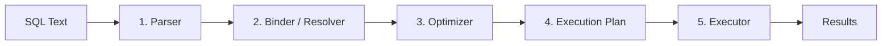
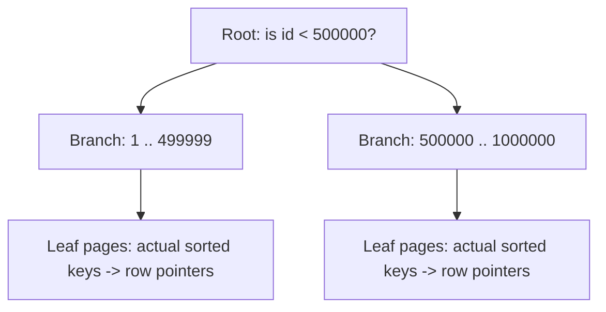
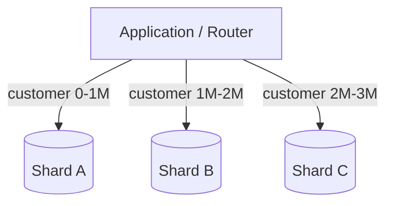
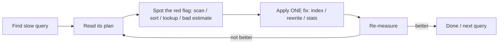
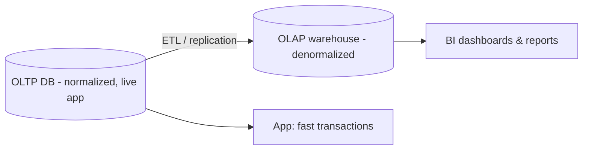

# SQL Query Optimization & Performance Tuning — Complete Beginner Notes

> Goal: Understand SQL optimization end-to-end in **very simple words**. For every concept we cover the **What**, **Why**, and **How**, with easy examples, plus **When to use**, **How to use**, **Why to use**, and the **Impact on performance**.
>
> A running example used throughout: a **Customers** table and an **Orders** table (an online shop). We keep returning to "fetch a customer's orders" so each new idea builds on the last.

---

## Table of Contents

1. [Why SQL Optimization Matters (The Problem)](#1-why-sql-optimization-matters-the-problem)
2. [How a SQL Query Runs Internally (Execution Process)](#2-how-a-sql-query-runs-internally-execution-process)
3. [Indexes — The #1 Optimization Tool](#3-indexes--the-1-optimization-tool)
4. [Primary Keys vs Indexes](#4-primary-keys-vs-indexes)
5. [Joins Optimization (Nested Loops, Hash, Merge)](#5-joins-optimization-nested-loops-hash-merge)
6. [Subqueries vs Joins](#6-subqueries-vs-joins)
7. [Normalization vs Denormalization](#7-normalization-vs-denormalization)
8. [Query Plans — How to Read and Use Them](#8-query-plans--how-to-read-and-use-them)
9. [Statistics — The Brain Behind the Optimizer](#9-statistics--the-brain-behind-the-optimizer)
10. [Partitioning (Horizontal, Vertical, Range, List, Hash)](#10-partitioning-horizontal-vertical-range-list-hash)
11. [Sharding — Splitting Across Machines](#11-sharding--splitting-across-machines)
12. [Caching (Result Caching, Materialized Views)](#12-caching-result-caching-materialized-views)
13. [Stored Procedures — Benefits and Drawbacks](#13-stored-procedures--benefits-and-drawbacks)
14. [Common Mistakes That Kill Performance](#14-common-mistakes-that-kill-performance)
15. [Best Practices (Query Design, Indexing, Monitoring)](#15-best-practices-query-design-indexing-monitoring)
16. [Monitoring Tools (Profiler, EXPLAIN, DMVs, Cloud)](#16-monitoring-tools-profiler-explain-dmvs-cloud)
17. [Real-World Use Cases (OLTP vs OLAP, Reporting)](#17-real-world-use-cases-oltp-vs-olap-reporting)
18. [Glossary (Quick Reference)](#18-glossary-quick-reference)
19. [Cheat Sheet (One-Page Summary)](#19-cheat-sheet-one-page-summary)

---

## Setup: The Example Tables

We will reuse these two tables everywhere. Keep them in mind.

```sql
-- A table of customers
CREATE TABLE Customers (
    customer_id   INT,            -- unique number for each customer
    name          VARCHAR(100),
    email         VARCHAR(100),
    city          VARCHAR(50),
    created_at    DATE
);

-- A table of orders placed by customers
CREATE TABLE Orders (
    order_id      INT,            -- unique number for each order
    customer_id   INT,            -- which customer placed it (links to Customers)
    order_date    DATE,
    amount        DECIMAL(10,2),
    status        VARCHAR(20)     -- 'PAID', 'SHIPPED', 'CANCELLED'
);
```

Imagine **Customers** has 1 million rows and **Orders** has 50 million rows. At that size, slow queries become very obvious — which is exactly when optimization matters.

---

## 1. Why SQL Optimization Matters (The Problem)

### The What (simple words)
**SQL optimization** means writing and structuring your database so that queries return the **correct answer** using the **least time, memory, and disk work** possible.

Think of a library:
- A **slow** query = a librarian reading *every book* to find one sentence.
- A **fast** query = the librarian using the **index card catalog** to jump straight to the right shelf.

Optimization is about giving the database "index cards" and clear instructions so it never reads more than it must.

### The Why (the problem it solves)
A query that returns in 50 milliseconds vs 50 seconds is the difference between:

- ✅ A web page that loads instantly vs ❌ a page that times out.
- ✅ One server handling 10,000 users vs ❌ needing 50 servers.
- ✅ A nightly report finishing by 6 AM vs ❌ still running at noon.
- ✅ A small cloud bill vs ❌ a huge cloud bill (cloud charges for CPU, memory, and I/O).

**The core problems optimization solves:**

| Problem | What it feels like | Optimization fixes it by... |
|---|---|---|
| Slow response | App is laggy, pages spin | Reading fewer rows (indexes) |
| High CPU usage | Server overheats under load | Avoiding sorts/scans |
| Too much disk I/O | Disk is the bottleneck | Reading only needed pages |
| Locking & blocking | Users wait for each other | Shorter, faster transactions |
| High cloud cost | Big monthly bill | Using fewer resources |
| Can't scale | Crashes at peak traffic | Doing less work per query |

### The How (the big picture)
Optimization happens at several layers. We will cover all of them in this guide:

1. **Query level** — write better SQL (Sections 5, 6, 14).
2. **Schema level** — design tables/indexes well (Sections 3, 4, 7, 10).
3. **Engine level** — help the optimizer choose well (Sections 8, 9).
4. **Architecture level** — scale out (Sections 11, 12).
5. **Process level** — measure and monitor (Sections 15, 16).

### Example
```sql
-- ❌ SLOW: database reads all 50 million orders, then filters
SELECT * FROM Orders WHERE customer_id = 12345;
-- Without an index, this is a "full table scan": 50M rows read.

-- ✅ FAST: with an index on customer_id, the DB jumps to the ~20 matching rows
-- Same query, but now it reads ~20 rows instead of 50,000,000.
```
The query text is identical — what changes is whether the database has the right "index card." That single idea is the heart of optimization.

### 📝 Notes to Remember
- Optimization = **same correct answer, less work.**
- The biggest wins usually come from **reading fewer rows**.
- Speed affects **user experience, cost, and scalability** — not just "nice to have."
- **Measure first, then optimize.** Never guess (more in Section 16).

### When / How / Why / Impact
- **When to care:** as soon as data grows past a few thousand rows, or any query feels slow.
- **How to start:** find slow queries (monitoring) → look at the query plan → reduce rows scanned.
- **Why:** saves money, time, and prevents outages.
- **Impact:** can turn a 50-second query into a 50-millisecond query (1000x faster) — routine, not magic.

---

## 2. How a SQL Query Runs Internally (Execution Process)

### The What (simple words)
When you run a query, the database does **not** just "read the text and go." It passes the query through a small **assembly line** of steps that turn your text into an efficient plan and then run it.

### The Why
Understanding these steps tells you **where** your query can go wrong and **what** you can influence. You can't influence everything — but you can influence the optimizer (with indexes and statistics) and the SQL text itself.

### The How — The Assembly Line (step by step)



1. **Parser** — Checks **grammar**. Did you spell `SELECT` right? Are the brackets balanced? If not, you get a syntax error. (Like a spell-checker.)

2. **Binder / Resolver** — Checks **meaning**. Does the `Orders` table exist? Does the `customer_id` column exist? Do you have permission? It connects each name to a real object. (Like checking that the words in a sentence refer to real things.)

3. **Optimizer** — The **brain**. There are usually **many ways** to get the same answer (use this index or that one, join in this order or that one). The optimizer estimates the **cost** of each option (using **statistics**, Section 9) and picks the cheapest. This is a **cost-based optimizer (CBO)** — the standard in modern databases.

4. **Execution Plan** — The **recipe** the optimizer produced: "scan this index, then do a hash join, then sort." This is what you read when you run `EXPLAIN` (Section 8). Plans are often **cached** so the same query doesn't get re-optimized every time.

5. **Executor** — The **worker** that actually follows the recipe: reads pages from disk/memory, joins rows, sorts, and returns results.

### How the database physically reads data (important!)
- Data is stored in fixed-size blocks called **pages** (commonly 8 KB in SQL Server, 16 KB in MySQL InnoDB).
- The database never reads "one row" from disk — it reads the **whole page** that row lives on.
- Reading from **memory (RAM / buffer pool / buffer cache)** is ~1000x faster than reading from **disk**.
- So a key goal is: **touch fewer pages**, and keep hot pages **in memory**.

> This is why "rows read" and "pages read (logical/physical reads)" are the real performance currency — not the number of rows *returned*.

### The logical order SQL is actually evaluated in
You **write** a query in one order, but the database **evaluates** it in another. Knowing this explains many surprises (like "why can't I use a column alias in WHERE?").

| You write | DB evaluates (order) |
|---|---|
| `SELECT` | 5 |
| `FROM` / `JOIN` | 1 |
| `WHERE` | 2 |
| `GROUP BY` | 3 |
| `HAVING` | 4 |
| `SELECT` (and aliases) | 5 |
| `ORDER BY` | 6 |
| `LIMIT` / `TOP` | 7 |

So `FROM` and `WHERE` happen **first** (that's why filtering early is powerful), and `SELECT` aliases are created **late** (that's why you often can't use an alias in `WHERE`).

### Example
```sql
SELECT name
FROM Customers
WHERE city = 'London'
ORDER BY created_at DESC;
```
Internally: (1) read `Customers`, (2) keep only `city = 'London'`, (5) pick the `name` column, (6) sort by `created_at`. If there's an index on `city`, step 2 is cheap; if there's also an index ordered by `created_at`, step 6 can be free.

### 📝 Notes to Remember
- Pipeline: **Parse → Bind → Optimize → Plan → Execute.**
- The **optimizer** is cost-based and relies on **statistics**.
- Databases read **pages**, not rows; **memory ≫ disk** in speed.
- Logical order: **FROM → WHERE → GROUP BY → HAVING → SELECT → ORDER BY → LIMIT.**

### When / How / Why / Impact
- **When:** any time a query is slow, ask "which step is expensive?" — usually the plan/execution step.
- **How:** read the plan (Section 8) to see exactly what the executor is doing.
- **Why:** you can only fix what you understand; the pipeline tells you where to look.
- **Impact:** understanding this is the foundation for every other technique below.

---

## 3. Indexes — The #1 Optimization Tool

### The What (simple words)
An **index** is a separate, sorted "lookup structure" that helps the database **find rows fast** without scanning the whole table — exactly like the **index at the back of a book** lets you jump to a topic instead of reading every page.

### The Why
Without an index, finding `customer_id = 12345` in 50 million rows means reading **all** of them (a **full table scan**). With an index, the database does a quick **seek** straight to the matching rows.

- Full scan of 50M rows: maybe **seconds**.
- Index seek to ~20 rows: maybe **a millisecond**.

### The How — what an index actually is
Most indexes are stored as a **B-Tree** (a balanced tree). Picture a tree of "signposts":



- You start at the **root**, follow signposts down a few levels, and land on the **leaf** that holds your key.
- A B-Tree stays **shallow** (often 3–4 levels even for billions of rows), so a lookup is only a handful of page reads.
- The leaves are **sorted**, which is why indexes also speed up `ORDER BY`, `BETWEEN`, `>`, `<`, and `GROUP BY` on the indexed column.

### The four index types you must know

#### a) Clustered Index
- **What:** defines the **physical order** of the actual table rows on disk. The table *is* the index — the leaf level **is the table data itself**.
- **Rule:** only **one** clustered index per table (a table can only be physically sorted one way).
- **Usually** the **primary key** becomes the clustered index by default (in SQL Server and MySQL/InnoDB).
- **Best for:** range queries and lookups on the clustering key (e.g., `WHERE order_id BETWEEN 100 AND 200`).

```sql
-- In SQL Server, this makes order_id the clustered index automatically
CREATE TABLE Orders (order_id INT PRIMARY KEY, ...);
-- Rows are physically stored sorted by order_id.
```

#### b) Non-Clustered Index (a.k.a. secondary index)
- **What:** a **separate** structure that holds the indexed column(s) **plus a pointer** back to the full row. The table stays in its own order; the index is a side "directory."
- **Rule:** you can have **many** per table.
- **Cost:** a lookup may need an extra hop — find the key in the index, then a **key lookup / bookmark lookup** to fetch the rest of the row from the table.

```sql
-- Helps queries that filter by customer_id
CREATE INDEX idx_orders_customer ON Orders(customer_id);
```

#### c) Composite Index (multi-column)
- **What:** an index on **two or more columns**, in a specific order, e.g., `(customer_id, order_date)`.
- **Key rule — the "leftmost prefix":** the index helps only if your query uses the columns **from left to right** without skipping the first.
  - ✅ `WHERE customer_id = 5` → uses index.
  - ✅ `WHERE customer_id = 5 AND order_date > '2025-01-01'` → uses index fully.
  - ❌ `WHERE order_date > '2025-01-01'` (no `customer_id`) → **can't** use this index efficiently.
- **Think of a phone book** sorted by (last name, first name): great for finding "Smith, John," useless for finding everyone named "John."

```sql
CREATE INDEX idx_orders_cust_date ON Orders(customer_id, order_date);
```

#### d) Covering Index
- **What:** an index that contains **every column the query needs** — so the database answers the query **from the index alone** and never touches the table. This avoids the extra "key lookup" hop.
- The query is then said to be **"covered"** by the index.
- In SQL Server you add extra columns with `INCLUDE`; in MySQL/Postgres you add them as index columns.

```sql
-- Query: SELECT order_date, amount FROM Orders WHERE customer_id = 12345;
-- A covering index that satisfies it entirely:
CREATE INDEX idx_orders_covering
    ON Orders(customer_id)        -- search key
    INCLUDE (order_date, amount); -- carried along so no table lookup is needed
```

### The trade-off (why not index everything?)
Indexes are **not free**:
- ✅ Speed up **reads** (`SELECT`).
- ❌ Slow down **writes** (`INSERT`, `UPDATE`, `DELETE`) — every index must be updated too.
- ❌ Take **disk space** and **memory**.
- ❌ Need maintenance (they can get **fragmented**).

So indexing is a **balance**: enough to make important reads fast, not so many that writes crawl.

### Example — optimizing "fetch a customer's recent orders"
```sql
-- The query our app runs constantly:
SELECT order_id, order_date, amount
FROM Orders
WHERE customer_id = 12345
ORDER BY order_date DESC;

-- Best index for it (composite + covering):
CREATE INDEX idx_orders_cust_date_cov
    ON Orders(customer_id, order_date DESC)
    INCLUDE (amount);
-- Now the DB: seeks to customer_id=12345, reads rows already sorted by date,
-- and has 'amount' right there — no table lookup, no sort. Near-instant.
```

### 📝 Notes to Remember
- Index = **fast lookup structure** (usually a **B-Tree**).
- **Clustered** = the table itself, sorted; **one per table**.
- **Non-clustered** = separate directory with pointers; **many allowed**.
- **Composite** = multi-column; obey the **leftmost-prefix rule**.
- **Covering** = index has all needed columns → **no table lookup**.
- Indexes **speed reads, slow writes, cost space.** Don't over-index.
- Index the columns in **`WHERE`, `JOIN`, `ORDER BY`, `GROUP BY`.**

### When / How / Why / Impact
- **When:** columns used to **filter, join, or sort**, especially on big tables.
- **How:** `CREATE INDEX ...`; put the most **selective / equality** column first in composites.
- **Why:** transforms full scans into seeks (read 20 rows instead of 50M).
- **Impact:** often the single biggest speedup available — **10x to 1000x** on the right query.

---

## 4. Primary Keys vs Indexes

### The What (simple words)
- A **Primary Key (PK)** is a **rule** that says "this column (or set of columns) uniquely identifies each row, and can never be empty (NULL)."
- An **index** is a **performance structure** for fast lookups.

They overlap (a PK is automatically backed by an index), but they are **not the same thing** — one is about **data correctness**, the other about **speed**.

### The Why
- The PK enforces **identity and uniqueness** — no two customers share `customer_id`, and it's never NULL. This protects your data's integrity and gives other tables something reliable to reference (foreign keys).
- The index makes lookups on that key **fast**.

### The How / Key differences

| Aspect | Primary Key | Index |
|---|---|---|
| Purpose | Enforce **uniqueness + not NULL** (correctness) | Speed up **lookups** (performance) |
| How many per table | **One** | **Many** |
| NULLs allowed | **No** | Yes (depends on type) |
| Auto-creates an index? | **Yes** (usually clustered) | It *is* the index |
| Uniqueness | Always unique | Unique **only** if you make it a `UNIQUE` index |
| Used by foreign keys | Yes (it's the reference target) | Not directly |

### How they relate
- Creating a PK **automatically creates a unique index** behind the scenes (clustered by default in SQL Server / InnoDB).
- A **UNIQUE index** is like a PK for uniqueness but **allows NULLs** and you can have several.
- A **plain index** enforces **no** uniqueness — it's purely for speed.

### Example
```sql
-- Primary key: identity + uniqueness + auto clustered index
ALTER TABLE Customers ADD CONSTRAINT pk_customers PRIMARY KEY (customer_id);

-- A unique index: business rule "email must be unique" (but allows one NULL)
CREATE UNIQUE INDEX uq_customers_email ON Customers(email);

-- A plain index: just speed, no uniqueness rule
CREATE INDEX idx_customers_city ON Customers(city);
```

### 📝 Notes to Remember
- **PK = correctness rule** (unique + not NULL), **one** per table, **auto-indexed**.
- **Index = speed tool**, **many** per table, optional uniqueness.
- A PK *gives you* an index for free; an index does **not** give you a PK.
- Choose a **narrow, stable** PK (e.g., an `INT`/`BIGINT` id) — it's copied into every non-clustered index, so a wide PK bloats them all.

### When / How / Why / Impact
- **When PK:** every table should have one — it defines a row's identity.
- **When extra index:** add for other frequently filtered/joined/sorted columns.
- **Why:** PK protects data and enables relationships; indexes protect speed.
- **Impact:** a good narrow PK keeps **all** secondary indexes smaller and faster; a bad wide PK (e.g., a long string) silently slows everything.

---

## 5. Joins Optimization (Nested Loops, Hash, Merge)

### The What (simple words)
A **join** combines rows from two tables based on a matching column (e.g., match each order to its customer via `customer_id`). The database has **three main physical strategies** to do the matching. The optimizer picks one based on table sizes, indexes, and statistics.

### The Why
The **same join** can be fast or slow depending on **which strategy** is chosen. Knowing the three helps you read query plans and understand *why* a join is slow (usually: a bad strategy was chosen because an index or statistics were missing).

### The How — the three join algorithms

#### a) Nested Loops Join
- **How it works:** for **each** row in the small table (the "outer"), look up matching rows in the other table (the "inner"), ideally using an **index**.
- **Analogy:** you have 10 names; for each name you look it up in the phone book index. Great for a **few** names.
- **Best when:** one side is **small** and the inner side has an **index** on the join column.
- **Bad when:** both sides are **large** with no index → it becomes "for each of 1M rows, scan 50M rows" = disaster.

```text
for each row R in Customers (outer, small):
    use index to find matching Orders where Orders.customer_id = R.customer_id
```

#### b) Hash Join
- **How it works:** build a **hash table** (an in-memory lookup keyed by the join column) from the **smaller** table, then **scan** the larger table and probe the hash table for matches.
- **Analogy:** you write every customer's id on sticky notes into labeled boxes (the hash table). Then for each order, you instantly find its box.
- **Best when:** **large, unsorted, unindexed** tables joined on **equality** (`=`).
- **Cost:** needs **memory** for the hash table; if it doesn't fit, it spills to disk (slower).
- Only works for **equality** joins, not `>`/`<` range joins.

#### c) Merge Join (Sort-Merge)
- **How it works:** both inputs are **sorted** on the join column, then walked together like a zipper, matching as you go.
- **Analogy:** two sorted guest lists side by side; you walk down both at once, matching names.
- **Best when:** both inputs are **already sorted** (e.g., from indexes) or large and sorted; great for **range** joins too.
- **Cost:** if inputs aren't already sorted, the DB must sort them first (extra cost).

### Quick comparison

| Strategy | Best for | Needs | Weakness |
|---|---|---|---|
| **Nested Loops** | Small outer + indexed inner | Index on inner join column | Terrible if both big & unindexed |
| **Hash Join** | Large, unindexed, equality join | Memory for hash table | Equality only; memory spills |
| **Merge Join** | Large, pre-sorted inputs | Sorted inputs (indexes) | Sorting cost if not pre-sorted |

### How to make joins fast (your real takeaways)
1. **Index the join columns** — both `Orders.customer_id` and `Customers.customer_id`. This is the #1 fix.
2. **Join on the same data type** — `INT` to `INT`, not `INT` to `VARCHAR` (type mismatch blocks index use).
3. **Filter early** — reduce rows *before* joining (a `WHERE` on each table).
4. **Only join tables you need** — every extra join is extra work.
5. Let the optimizer choose the strategy; if it chose badly, the cause is usually **missing index or stale statistics**.

### Example — optimizing "customer name + their order totals"
```sql
SELECT c.name, SUM(o.amount) AS total_spent
FROM Customers c
JOIN Orders o ON o.customer_id = c.customer_id
WHERE c.city = 'London'          -- filter early!
GROUP BY c.name;

-- Make it fast:
CREATE INDEX idx_customers_city ON Customers(city);        -- shrink the outer side first
CREATE INDEX idx_orders_customer ON Orders(customer_id);   -- enable nested-loops/seek on inner
-- Now: seek London customers (few), then index-seek their orders. Fast.
```

### 📝 Notes to Remember
- Three join types: **Nested Loops** (small+indexed), **Hash** (big+equality+unindexed), **Merge** (big+sorted).
- The optimizer picks; **your job is to give it indexes + good statistics.**
- **Always index join columns** and **match their data types.**
- **Filter before you join**, and join **only** what you need.

### When / How / Why / Impact
- **When:** any query touching more than one table.
- **How:** create indexes on join keys; check the plan to see the chosen strategy.
- **Why:** the wrong strategy on big tables is a top cause of slow queries.
- **Impact:** indexing join columns can turn a multi-minute join into milliseconds.

---

## 6. Subqueries vs Joins

### The What (simple words)
- A **subquery** is a **query inside another query** (a "question within a question").
- A **join** combines tables **side by side**.
- Often you can solve the same problem **either** way — but one is frequently faster.

### The Why
Beginners reach for subqueries because they read naturally ("find customers who have an order"). But some subqueries — especially **correlated** ones — make the database run the inner query **once per outer row**, which can be painfully slow. Rewriting as a join (or using `EXISTS`) often fixes it.

### The How — types of subqueries
1. **Scalar subquery** — returns **one value**: `(SELECT MAX(order_date) FROM Orders ...)`.
2. **Non-correlated subquery** — the inner query is **independent**; it runs **once**. Usually fine.
3. **Correlated subquery** — the inner query **depends on the outer row** (references its columns), so it may run **once per outer row**. This is the classic performance trap.

```sql
-- Correlated subquery: inner query references the outer row (c.customer_id)
SELECT c.name
FROM Customers c
WHERE (SELECT COUNT(*) FROM Orders o WHERE o.customer_id = c.customer_id) > 5;
-- Risk: runs the COUNT once for every customer.
```

### `IN` vs `EXISTS` vs `JOIN`
```sql
-- Goal: customers who have placed at least one order.

-- (a) IN — fine for small lists, can be slow for big ones
SELECT name FROM Customers
WHERE customer_id IN (SELECT customer_id FROM Orders);

-- (b) EXISTS — often fastest: stops at the FIRST match per customer
SELECT name FROM Customers c
WHERE EXISTS (SELECT 1 FROM Orders o WHERE o.customer_id = c.customer_id);

-- (c) JOIN — combine then de-duplicate
SELECT DISTINCT c.name
FROM Customers c
JOIN Orders o ON o.customer_id = c.customer_id;
```
- **`EXISTS`** short-circuits (stops at the first match) → great when you only need "does it exist?"
- **`IN`** materializes the whole list first → can be heavy on large sub-results; also watch out: `NOT IN` behaves strangely with **NULLs** (prefer `NOT EXISTS`).
- **`JOIN`** is great when you need **columns from both** tables, but may need `DISTINCT` to remove duplicates.

> Good news: modern optimizers often **rewrite** `IN`/`EXISTS`/subqueries into joins internally. But not always — so writing the efficient form yourself is safer, especially for correlated subqueries.

### When to prefer each

| Use | Prefer |
|---|---|
| Need columns from **both** tables | **JOIN** |
| Just checking "does a match exist?" | **EXISTS** |
| Checking against a **small, fixed list** | **IN** |
| "Has **no** match" (anti-join) | **NOT EXISTS** (NULL-safe) |
| Need a single aggregate value inline | **Scalar subquery** (kept simple) |

### Example — rewrite a slow correlated subquery as a join
```sql
-- ❌ Slow: correlated subquery may run per-customer
SELECT c.name,
       (SELECT COUNT(*) FROM Orders o WHERE o.customer_id = c.customer_id) AS order_count
FROM Customers c;

-- ✅ Faster: one grouped pass, joined once
SELECT c.name, COALESCE(x.order_count, 0) AS order_count
FROM Customers c
LEFT JOIN (
    SELECT customer_id, COUNT(*) AS order_count
    FROM Orders
    GROUP BY customer_id
) x ON x.customer_id = c.customer_id;
```

### 📝 Notes to Remember
- **Correlated subquery = runs per row = danger.** Rewrite when slow.
- **`EXISTS`** is usually the fastest existence check (short-circuits).
- Prefer **`NOT EXISTS`** over `NOT IN` (NULL-safe and often faster).
- Use **JOIN** when you need data from both tables.
- Modern optimizers may rewrite these for you — but don't rely on it.

### When / How / Why / Impact
- **When:** any time you write a subquery and the query is slow.
- **How:** convert correlated subqueries to joins or `EXISTS`; check the plan before/after.
- **Why:** avoids re-running the inner query thousands of times.
- **Impact:** can change O(N×M) work into O(N+M) — often a dramatic speedup.

---

## 7. Normalization vs Denormalization

### The What (simple words)
- **Normalization** = splitting data into **many small, tidy tables** with no repetition. Each fact is stored **once**.
- **Denormalization** = deliberately **combining tables / duplicating some data** to make reads faster.

It's a **trade-off**: normalization optimizes for **clean writes & integrity**; denormalization optimizes for **fast reads**.

### The Why
- **Normalized** design avoids **redundancy** (storing the same fact in many places), which prevents **update anomalies** (change a customer's city in one place, not 500 places). Perfect for systems with lots of writes (OLTP).
- **Denormalized** design avoids expensive **joins** at read time by pre-combining data. Perfect for read-heavy reporting/analytics (OLAP).

### The How — normalization in plain terms
The "normal forms" are just rules for removing repetition:
- **1NF:** no repeating groups; each cell holds one value (no comma-lists in a column).
- **2NF:** every non-key column depends on the **whole** primary key (no partial dependence).
- **3NF:** non-key columns depend **only** on the key, not on each other (no "column depending on another column").

> Beginner rule of thumb: **"Each fact in exactly one place."** If you find yourself copy-pasting the same value into many rows, you're probably under-normalized.

```sql
-- ❌ Not normalized: customer info repeated in every order row
Orders(order_id, customer_name, customer_email, customer_city, amount)
-- If a customer changes city, you must update MANY rows (error-prone).

-- ✅ Normalized: customer info stored once; orders reference it
Customers(customer_id, name, email, city)
Orders(order_id, customer_id, amount)
-- Change city in ONE place.
```

### Denormalization — and how to do it safely
Denormalization copies/precomputes data to cut joins. But duplicated data can drift out of sync, so you must keep it consistent (via triggers, scheduled jobs, or application logic).

Common safe techniques:
- **Precomputed/derived columns** — e.g., store `order_total` instead of summing line items each time.
- **Summary/rollup tables** — e.g., a `DailySales` table updated nightly.
- **Materialized views** (Section 12) — a managed, refreshable way to denormalize.

```sql
-- Denormalized read model for a fast dashboard
CREATE TABLE CustomerOrderSummary (
    customer_id   INT PRIMARY KEY,
    customer_name VARCHAR(100),   -- duplicated from Customers for speed
    total_orders  INT,
    total_spent   DECIMAL(12,2),
    last_order    DATE
);
-- Reads are a single-row lookup — no joins, no SUM over millions of rows.
```

### Trade-off table

| | Normalization | Denormalization |
|---|---|---|
| Data duplication | Minimal | Intentional |
| Write speed/safety | ✅ Fast, safe, consistent | ❌ Must sync duplicates |
| Read speed | ❌ Needs joins | ✅ Few/no joins |
| Storage | Less | More |
| Best for | **OLTP** (apps, transactions) | **OLAP** (reports, analytics) |
| Risk | Many joins | Data getting out of sync |

### Example
```sql
-- Normalized (OLTP): place an order — touch small tables, stay consistent
INSERT INTO Orders (order_id, customer_id, amount) VALUES (...);

-- Denormalized (OLAP): the nightly job refreshes the summary for instant dashboards
-- SELECT total_spent FROM CustomerOrderSummary WHERE customer_id = 12345; -- 1 row, no joins
```

### 📝 Notes to Remember
- **Normalize for writes/integrity; denormalize for reads/speed.**
- Normalization rule of thumb: **"each fact in exactly one place."**
- Denormalization is a **deliberate** optimization — you accept duplication and must **keep it in sync**.
- Many real systems do **both**: normalized core (OLTP) + denormalized reporting layer (OLAP).

### When / How / Why / Impact
- **When normalize:** transactional systems where data changes often.
- **When denormalize:** read-heavy reporting where joins are the bottleneck.
- **How:** start normalized; denormalize **only** specific hot read paths, backed by measurements.
- **Impact:** denormalization can turn a 10-join report into one indexed lookup — at the cost of extra storage and sync logic.

---

## 8. Query Plans — How to Read and Use Them

### The What (simple words)
A **query plan** (a.k.a. **execution plan** or **explain plan**) is the **step-by-step recipe** the optimizer chose to run your query. It's the single most important tool for understanding *why* a query is slow — it shows you exactly what the database is doing.

### The Why
You should **never guess** why a query is slow. The plan **tells** you: it shows which indexes were used (or not), which join strategy was chosen, where time/rows are spent, and where sorts happen. Reading plans turns optimization from guesswork into evidence.

### The How — getting a plan in each database

```sql
-- PostgreSQL / MySQL 8+: estimated plan
EXPLAIN SELECT ...;

-- PostgreSQL / MySQL 8+: ACTUAL plan (runs the query, shows real numbers)
EXPLAIN ANALYZE SELECT ...;

-- SQL Server: estimated plan (without running)
SET SHOWPLAN_ALL ON;  -- or use the GUI "Display Estimated Execution Plan"
-- SQL Server: actual plan
SET STATISTICS IO, TIME ON;  -- shows logical reads + CPU/elapsed time
-- (or click "Include Actual Execution Plan" in SSMS)

-- Oracle:
EXPLAIN PLAN FOR SELECT ...;
SELECT * FROM TABLE(DBMS_XPLAN.DISPLAY);
```

> **Estimated** plan = what the optimizer *thinks* it'll do (no execution).
> **Actual** plan = what *really* happened, with real row counts and timings. Prefer actual plans for tuning.

### What to look for (the red flags)
Read plans from the **most-indented / right-most** operator (that runs first) outward. Watch for:

| In the plan | Meaning | Good or bad? |
|---|---|---|
| **Index Seek** | Jumped straight to rows | ✅ Great |
| **Index Scan** | Read the whole index | ⚠️ OK-ish |
| **Table Scan / Seq Scan / Full Scan** | Read the **entire table** | ❌ Often bad on big tables |
| **Key Lookup / Bookmark Lookup** | Extra hop to fetch row data | ⚠️ Consider a covering index |
| **Hash / Merge / Nested Loops** | Join strategy chosen | Depends (Section 5) |
| **Sort** | Sorting rows (expensive) | ⚠️ Can an index avoid it? |
| **Spill to disk / tempdb** | Ran out of memory | ❌ Add memory/reduce rows |
| **Estimated rows ≠ Actual rows** | Stats are stale/wrong | ❌ Update statistics |

**The single biggest tell:** a big gap between **estimated** and **actual** row counts means the optimizer was working with **bad statistics** (Section 9) — fix that first.

### Cost numbers
- Plans show a **cost** (a relative number, not seconds) and **estimated rows** per operator.
- The operator with the **highest cost** is your tuning target.
- "Reads" / "logical reads" (pages touched) are a great, machine-independent way to compare two versions of a query.

### Example — reading a plan to add the right index
```sql
EXPLAIN ANALYZE
SELECT order_id, amount
FROM Orders
WHERE customer_id = 12345
ORDER BY order_date DESC;

-- Suppose the plan shows: "Seq Scan on Orders" + "Sort".
--   Seq Scan  -> no index used (reading all 50M rows)  ❌
--   Sort      -> sorting in memory/disk                ❌
-- Fix: a composite, ordered, covering index removes BOTH:
CREATE INDEX idx_orders_cust_date_cov
    ON Orders(customer_id, order_date DESC) INCLUDE (order_id, amount);
-- Re-run EXPLAIN ANALYZE: now "Index Seek", no Sort, far fewer reads. ✅
```

### 📝 Notes to Remember
- The plan is the **recipe** — read it before changing anything.
- Prefer **actual** plans (`EXPLAIN ANALYZE` / "Actual Execution Plan").
- ❌ Red flags: **full table scans**, **key lookups**, **sorts**, **spills**, **estimate ≠ actual**.
- ✅ Aim for **index seeks** and **no avoidable sorts**.
- **Estimated vs actual mismatch → update statistics.**

### When / How / Why / Impact
- **When:** any time a query is slow or before/after every tuning change.
- **How:** `EXPLAIN ANALYZE` (or SSMS plan); find the costliest operator and the red flags.
- **Why:** it's **evidence**, not guesswork — you see exactly what to fix.
- **Impact:** reading plans is what makes every other technique in this guide **targeted** and effective.

---

## 9. Statistics — The Brain Behind the Optimizer

### The What (simple words)
**Statistics** are small summaries the database keeps about your data: how many rows a table has, how many **distinct** values a column has, and how values are **distributed** (via a **histogram**). The optimizer uses these to **estimate** how many rows each step will produce — and therefore which plan is cheapest.

### The Why
The optimizer can't read the whole table before planning — that would defeat the purpose. Instead it **guesses** based on statistics. If the stats are **accurate**, it picks a great plan. If they're **stale or wrong**, it picks a **bad** plan (e.g., a full scan when a seek would do, or the wrong join type). **Bad statistics are one of the most common hidden causes of slow queries.**

### The How
- **Cardinality** = the number of rows the optimizer expects from a step. Statistics drive this estimate.
- A **histogram** buckets a column's values so the optimizer can estimate "how many rows have `city = 'London'`?" without scanning.
- Databases **auto-update** statistics, but updates can **lag** after large data changes (big bulk loads, mass deletes), leaving stats stale.

```sql
-- Update statistics manually after big data changes:

-- SQL Server
UPDATE STATISTICS Orders;
EXEC sp_updatestats;            -- whole database

-- PostgreSQL
ANALYZE Orders;

-- MySQL (InnoDB)
ANALYZE TABLE Orders;

-- Oracle
EXEC DBMS_STATS.GATHER_TABLE_STATS('SCHEMA', 'ORDERS');
```

### How to spot a statistics problem
- In the **query plan**, compare **Estimated rows** vs **Actual rows**.
  - Estimated 10 rows, Actual 2,000,000 rows → the optimizer was badly misled → likely chose a bad plan (e.g., nested loops that became a nightmare).
- Symptoms: a query that was fast "suddenly" got slow after a big data load, or after many inserts/deletes.

### Example
```sql
-- You bulk-loaded 40 million new orders last night.
-- The optimizer still thinks Orders has 10M rows (stale stats),
-- so it picks a plan tuned for a small table -> very slow today.

ANALYZE Orders;   -- (Postgres) refresh the stats
-- Now the optimizer knows the true size/distribution and picks a better plan.
```

### 📝 Notes to Remember
- Statistics = the **data about your data** the optimizer relies on.
- **Stale stats → bad estimates → bad plans → slow queries.**
- Check **estimated vs actual rows** in the plan to detect stale stats.
- **Update statistics** after big bulk loads, deletes, or migrations.
- Keep **auto-update statistics ON** (default in most engines).

### When / How / Why / Impact
- **When:** after large data changes, or when a previously fast query degrades.
- **How:** `ANALYZE` / `UPDATE STATISTICS`; verify with estimated-vs-actual in the plan.
- **Why:** the optimizer is only as smart as its statistics.
- **Impact:** refreshing stats can instantly restore a good plan — sometimes a 100x recovery with zero query changes.

---

## 10. Partitioning (Horizontal, Vertical, Range, List, Hash)

### The What (simple words)
**Partitioning** = splitting **one big table** into **smaller pieces (partitions)** that are easier and faster to manage and query — while it still **looks like one table** to your queries. Think of one giant filing cabinet split into labeled drawers by year.

### The Why
On a 50-million-row table, even good indexes have limits. If most queries only care about **recent** data, why make the database consider all 50M rows? Partitioning lets the database **skip entire chunks** it knows are irrelevant — called **partition pruning**. It also makes **maintenance** (archiving, deleting old data) instant: drop a whole partition instead of deleting millions of rows.

### The How — two directions, then strategies

#### Horizontal vs Vertical (the two directions)
- **Horizontal partitioning** = split by **rows**. Each partition has the **same columns** but **different rows** (e.g., 2024 orders in one partition, 2025 in another). This is what "partitioning" usually means.
- **Vertical partitioning** = split by **columns**. Put rarely used / large columns (e.g., a big `notes` text or a photo blob) in a **separate table**, keep hot columns in the main one. Reads of hot columns touch less data per row.

```text
Horizontal:                          Vertical:
Orders_2024 | Orders_2025            Orders_core(id, customer_id, amount)
(same cols, different rows)          Orders_extra(id, big_notes_blob)
```

#### Horizontal partitioning strategies
- **Range partitioning** — by a value range, usually **dates**. E.g., one partition per month/year. Perfect for time-series and "last 30 days" queries.
  ```sql
  -- Conceptual (syntax varies by DB)
  PARTITION BY RANGE (order_date) (
      PARTITION p2024 VALUES LESS THAN ('2025-01-01'),
      PARTITION p2025 VALUES LESS THAN ('2026-01-01')
  );
  ```
- **List partitioning** — by a fixed set of values, e.g., by **region**: `('US','CA')`, `('UK','FR')`. Good for categorical splits.
- **Hash partitioning** — a hash function spreads rows **evenly** across N partitions. Use when there's no natural range/list but you want **balanced** sizes (avoids hot spots).

### Partition pruning (the payoff)
```sql
-- With RANGE partitioning on order_date, this query only reads the 2025 partition,
-- not 2024 or earlier — the DB "prunes" the rest.
SELECT * FROM Orders WHERE order_date >= '2025-01-01';
```

### Benefits and cautions
- ✅ **Pruning** = scan fewer rows. ✅ **Instant archiving** (drop a partition). ✅ Maintenance (rebuild index per partition).
- ⚠️ Choose the **partition key** to match how you **query** (usually date). The wrong key gives little benefit.
- ⚠️ Queries that **don't** filter on the partition key may have to touch **all** partitions (no pruning).
- ⚠️ Partitioning is **not** a substitute for indexing — you usually still index within partitions.

### Example
```sql
-- Old way to delete last year's orders: slow, logs millions of deletes
DELETE FROM Orders WHERE order_date < '2025-01-01';   -- ❌ huge, slow

-- With range partitions by year: just drop the partition — near-instant
ALTER TABLE Orders DROP PARTITION p2024;              -- ✅ metadata-only
```

### 📝 Notes to Remember
- Partitioning = **one big table → manageable pieces**, still one logical table.
- **Horizontal = by rows; Vertical = by columns.**
- Horizontal strategies: **Range** (dates), **List** (categories), **Hash** (even spread).
- The win is **partition pruning** — skip irrelevant chunks.
- **Pick the partition key to match your `WHERE` filters** (usually date).
- Partitioning **complements** indexes; it doesn't replace them.

### When / How / Why / Impact
- **When:** very large tables (tens of millions+), especially time-series, with clear archiving needs.
- **How:** choose a partition key matching common filters; use range for dates, hash for even spread.
- **Why:** prune irrelevant data and make archiving/maintenance trivial.
- **Impact:** big scans shrink to one partition; mass deletes become instant partition drops.

---

## 11. Sharding — Splitting Across Machines

### The What (simple words)
**Sharding** = splitting your data across **multiple separate database servers (shards)**, where **each server holds only a portion** of the data. Partitioning splits a table **within one server**; sharding splits data **across many servers**. It's **horizontal scaling** for databases.

### The Why
A single server has limits: CPU, memory, disk, and connections. When one machine can't keep up — even after indexing, partitioning, and caching — you must spread the load across **many** machines. Sharding lets you serve more data and more traffic than any single box could.

### The How
- A **shard key** (e.g., `customer_id`) decides **which server** a row lives on.
- Strategies mirror partitioning:
  - **Range sharding** — customers 1–1M on Shard A, 1M–2M on Shard B.
  - **Hash sharding** — `hash(customer_id) % N` picks the shard (even spread, avoids hotspots).
  - **Geographic / directory sharding** — by region, or via a lookup table mapping keys → shards.



### The hard parts (why it's a last resort)
Sharding adds **a lot** of complexity:
- ❌ **Cross-shard queries** are hard — "all orders across all customers" must hit every shard and merge results.
- ❌ **Cross-shard joins / transactions** are very hard (no single server sees everything).
- ❌ **Rebalancing** — adding a shard may require moving lots of data.
- ❌ **Hotspots** — a bad shard key sends most traffic to one shard.
- ❌ More **operational overhead** — many servers to back up, monitor, patch.

> **Golden rule:** shard **only** when you've exhausted cheaper options (indexing, query tuning, partitioning, caching, read replicas, a bigger server). Sharding is powerful but expensive in complexity.

### Choosing a good shard key
- **High cardinality** (many distinct values) → spreads data evenly.
- **Matches access pattern** → most queries can target **one** shard (avoid cross-shard fan-out).
- **Avoids hotspots** → don't shard by something like "country" if 80% of users are in one country.
- `customer_id` (hashed) is a common, solid choice for per-customer workloads.

### Example
```text
Problem: one DB server maxes out at 5,000 orders/second; you need 20,000/sec.

Solution: shard by hash(customer_id) across 4 servers.
- Each shard handles ~5,000/sec → 20,000/sec total.
- "Get customer 12345's orders" → router computes the shard → hits ONE server. ✅
- "Total sales across everyone" → must query all 4 and sum → more complex. ⚠️
```

### 📝 Notes to Remember
- **Partitioning = within one server; Sharding = across many servers.**
- A **shard key** routes each row to a server (range / hash / geo).
- Sharding scales **writes and data size** horizontally — but adds big **complexity**.
- **Cross-shard joins/transactions are the pain point.**
- **Last resort:** try indexing, tuning, partitioning, caching, replicas first.

### When / How / Why / Impact
- **When:** a single server truly can't handle the data size or write throughput.
- **How:** pick a high-cardinality shard key that matches access patterns; use hashing for even spread.
- **Why:** horizontal scale beyond one machine's limits.
- **Impact:** near-linear scaling of capacity — at the cost of major architectural complexity.

---

## 12. Caching (Result Caching, Materialized Views)

### The What (simple words)
**Caching** = saving the **result** of expensive work so you can **reuse** it instead of recomputing it every time. If 10,000 users ask the same question, compute the answer **once** and serve the saved copy.

### The Why
The fastest query is the one you **don't run**. Many workloads ask the **same** expensive questions repeatedly (today's top products, a dashboard's totals). Recomputing each time wastes CPU and I/O. Caching trades a little **staleness** for a huge **speed** and **load** win.

### The How — layers of caching

1. **Database buffer cache / buffer pool** (automatic) — the DB keeps recently used **pages** in RAM. This is why running the same query twice is often faster the second time. You help it by having **enough RAM** and **smaller working sets**.

2. **Query/result cache** (app or DB layer) — store the **final result set** keyed by the query. Often done in the application with **Redis** or **Memcached**.
   ```text
   key:   "top_products_2026-06-13"
   value: [the computed list]
   TTL:   10 minutes  (auto-expire so it refreshes)
   ```

3. **Materialized views** — a **saved, precomputed query result stored as a real table-like object**. Unlike a normal **view** (which is just a saved query that re-runs every time), a **materialized view stores the data** and you **refresh** it on a schedule.
   ```sql
   -- Normal view: re-runs the heavy query EVERY time you select from it
   CREATE VIEW v_customer_totals AS
   SELECT customer_id, COUNT(*) AS orders, SUM(amount) AS spent
   FROM Orders GROUP BY customer_id;

   -- Materialized view: stores the result; reads are instant
   CREATE MATERIALIZED VIEW mv_customer_totals AS
   SELECT customer_id, COUNT(*) AS orders, SUM(amount) AS spent
   FROM Orders GROUP BY customer_id;

   -- Refresh it (e.g., nightly or every hour) to update the stored data
   REFRESH MATERIALIZED VIEW mv_customer_totals;   -- PostgreSQL syntax
   ```

### View vs Materialized View (key difference)

| | Normal View | Materialized View |
|---|---|---|
| Stores data? | ❌ No (just a saved query) | ✅ Yes (precomputed result) |
| Read speed | Same as running the query | ⚡ Very fast (already computed) |
| Freshness | Always live/current | As fresh as the **last refresh** |
| Cost | Paid on every read | Paid at **refresh** time |
| Best for | Simplifying queries | Expensive aggregations read often |

### The catch: cache invalidation
> "There are only two hard things in computer science: cache invalidation and naming things."

Cached data can become **stale** (out of date) when the underlying data changes. You must decide how to keep it fresh:
- **TTL (time to live):** auto-expire after N minutes (simple, slightly stale).
- **Refresh on schedule:** rebuild the materialized view nightly/hourly.
- **Invalidate on write:** delete the cache entry when the source data changes (freshest, more complex).

Choose based on how much **staleness** your use case tolerates. A live bank balance: low tolerance. A "trending products" list: high tolerance.

### Example
```text
Dashboard tile: "Total revenue this month" over 50M orders.
- ❌ Without cache: SUM over millions of rows on every page load (slow, heavy).
- ✅ Materialized view refreshed every 15 min: each load reads ONE precomputed row.
  Users accept data up to 15 minutes old → massive load reduction.
```

### 📝 Notes to Remember
- **The fastest query is one you never run** — reuse results.
- Buffer cache (RAM) is automatic; give the DB **enough memory**.
- **Result cache** (Redis/Memcached) stores final answers with a **TTL**.
- **View** = re-runs every time; **Materialized view** = stores result, needs **refresh**.
- The hard part is **invalidation** — match freshness strategy to staleness tolerance.

### When / How / Why / Impact
- **When:** the same expensive query is read far more often than the data changes.
- **How:** materialized views for heavy aggregates; Redis/Memcached with TTL for app results.
- **Why:** avoid recomputation; cut CPU/I/O and latency dramatically.
- **Impact:** million-row aggregations become single-row lookups — but you accept some staleness.

---

## 13. Stored Procedures — Benefits and Drawbacks

### The What (simple words)
A **stored procedure** is a **named block of SQL (and logic) saved inside the database** that you call by name, optionally passing parameters — like a **function** that lives in the database instead of in your app.

```sql
CREATE PROCEDURE GetCustomerOrders (@customer_id INT)   -- SQL Server syntax
AS
BEGIN
    SELECT order_id, order_date, amount
    FROM Orders
    WHERE customer_id = @customer_id
    ORDER BY order_date DESC;
END;

-- Call it:
EXEC GetCustomerOrders @customer_id = 12345;
```

### The Why (performance benefits)
1. **Plan reuse / caching** — the procedure's execution plan is typically **compiled once and cached**, so repeated calls skip re-optimization. (App ad-hoc SQL can also cache plans, but procedures make it reliable.)
2. **Less network traffic** — you send **one call** (`EXEC GetCustomerOrders 12345`) instead of a long SQL string each time. For multi-statement logic, this is a big saving: one round trip instead of many.
3. **Server-side batching** — multiple steps run **close to the data**, avoiding back-and-forth between app and DB (network latency dominates many workloads).
4. **Security** — you can grant `EXECUTE` on the procedure without granting direct table access, and parameters help prevent **SQL injection**.
5. **Centralized logic** — one place to maintain business rules used by many apps.

### The drawbacks (be honest)
1. **Harder to version-control & test** than application code (though doable).
2. **Business logic split** between app and DB can confuse teams ("where does this rule live?").
3. **Database lock-in** — procedure languages differ (T-SQL vs PL/pgSQL vs PL/SQL); porting is work.
4. **Parameter sniffing** (a real gotcha) — the DB caches a plan based on the **first** parameter value it sees. If that value was unusual, **later** calls with different values may get a **bad** cached plan.
5. **Scaling logic on the DB** can be costlier — the database is often the **hardest tier to scale**, so heavy CPU logic there can bottleneck everything.

### Stored procedure vs view vs function (quick contrast)
- **View** — a saved `SELECT` you query like a table (no parameters, no logic).
- **Function** — returns a value/table, usable **inside** queries; generally no side effects.
- **Stored procedure** — can run many statements, take parameters, modify data, control flow; called with `EXEC`/`CALL`.

### Example
```sql
-- Multi-step business operation as ONE call (one round trip, one cached plan):
CREATE PROCEDURE PlaceOrder (@customer_id INT, @amount DECIMAL(10,2))
AS
BEGIN
    BEGIN TRANSACTION;
        INSERT INTO Orders (customer_id, amount, status)
        VALUES (@customer_id, @amount, 'PAID');

        UPDATE CustomerOrderSummary
        SET total_orders = total_orders + 1,
            total_spent  = total_spent + @amount
        WHERE customer_id = @customer_id;
    COMMIT;
END;
-- App sends ONE call instead of 3 statements across 3 network round trips.
```

### 📝 Notes to Remember
- Stored procedure = **named SQL logic stored in the DB**, called by name.
- ✅ Benefits: **plan reuse**, **less network traffic**, **server-side batching**, **security**, **centralized logic**.
- ❌ Drawbacks: **versioning/testing**, **logic split**, **DB lock-in**, **parameter sniffing**, **DB is hard to scale**.
- Watch for **parameter sniffing** when one proc serves very different parameter values.

### When / How / Why / Impact
- **When:** repeated multi-step operations, hot paths needing fewer round trips, or centralized/secured logic.
- **How:** `CREATE PROCEDURE`, parameterize inputs, wrap multi-step writes in a transaction.
- **Why:** reduce network chatter and re-optimization; keep critical logic consistent and secure.
- **Impact:** fewer round trips + cached plans can noticeably cut latency for chatty workloads — but mind parameter sniffing and where you put heavy CPU.

---

## 14. Common Mistakes That Kill Performance

A checklist of the usual culprits — each with **why it hurts** and the **fix**.

### a) `SELECT *` (selecting all columns)
- **Why it hurts:** reads and transfers columns you don't need; **breaks covering indexes** (forces table lookups); moves more data over the network; breaks if columns change.
- **Fix:** select **only** the columns you actually use.
```sql
SELECT *           FROM Orders WHERE customer_id = 12345;  -- ❌
SELECT order_id, amount FROM Orders WHERE customer_id = 12345;  -- ✅
```

### b) Missing indexes on filter/join/sort columns
- **Why it hurts:** forces full table scans and bad join strategies.
- **Fix:** index columns in `WHERE`, `JOIN`, `ORDER BY`, `GROUP BY` (Section 3).

### c) Functions / calculations on an indexed column (non-SARGable predicates)
- **Why it hurts:** wrapping an indexed column in a function **disables the index** (the DB can't use the sorted structure). "SARGable" = **S**earch **ARG**ument **able** = can use an index.
```sql
-- ❌ Non-SARGable: function on the column disables the index
WHERE YEAR(order_date) = 2025
-- ✅ SARGable: rewrite as a range so the index works
WHERE order_date >= '2025-01-01' AND order_date < '2026-01-01'

-- ❌ Leading wildcard can't use a normal index
WHERE name LIKE '%smith'
-- ✅ Trailing wildcard can
WHERE name LIKE 'smith%'
```

### d) Implicit data-type conversions
- **Why it hurts:** comparing an `INT` column to a string (`WHERE customer_id = '12345'`) can force a conversion that **disables the index**.
- **Fix:** match types exactly; pass parameters with the column's type.

### e) Poor join practices
- **Why it hurts:** joining unindexed big tables, joining on mismatched types, or accidental **cross joins** (missing `ON`) explode row counts.
- **Fix:** index join keys, match types, always specify the join condition, join only needed tables (Section 5).

### f) `OR` conditions and `NOT IN` with NULLs
- **Why it hurts:** `OR` across different columns often prevents clean index use; `NOT IN` with a NULL in the list returns **no rows** unexpectedly.
- **Fix:** sometimes split `OR` into `UNION` of two indexable queries; prefer `NOT EXISTS` over `NOT IN`.

### g) Returning too many rows / no pagination
- **Why it hurts:** fetching 1M rows to show 20 wastes everything.
- **Fix:** paginate with `LIMIT`/`OFFSET` or, better, **keyset pagination** (`WHERE id > :last_id LIMIT 20`) which stays fast on deep pages.

### h) N+1 query problem
- **Why it hurts:** the app runs 1 query to get N customers, then **N more** queries (one per customer) to get their orders → hundreds of round trips.
- **Fix:** fetch in **one** join or one `IN (...)` query.
```text
❌ 1 query for customers, then 1 query per customer for their orders (N+1 total)
✅ 1 query: SELECT ... FROM Customers c JOIN Orders o ON o.customer_id = c.customer_id
```

### i) Too many indexes
- **Why it hurts:** every index slows inserts/updates/deletes and wastes space.
- **Fix:** keep indexes that earn their keep; drop **unused/duplicate** ones (Section 16 shows how to find them).

### j) Long-running transactions / wide locks
- **Why it hurts:** holding locks blocks other users (blocking/deadlocks).
- **Fix:** keep transactions **short**; don't do slow app work while holding a DB transaction open.

### k) `OFFSET` deep pagination
- **Why it hurts:** `LIMIT 20 OFFSET 1000000` still reads and throws away 1,000,000 rows.
- **Fix:** **keyset pagination** using the last seen key.

### 📝 Notes to Remember
- Avoid **`SELECT *`** — name your columns.
- Keep predicates **SARGable** (no functions/wildcards-leading on indexed columns).
- **Match data types**; index and match **join keys**.
- Watch **N+1** queries and **deep OFFSET** pagination.
- Don't over-index; keep transactions **short**.

### When / How / Why / Impact
- **When:** review these on every slow query and during code review.
- **How:** scan your SQL for these patterns; confirm fixes in the query plan.
- **Why:** these few mistakes cause a large share of real-world slowness.
- **Impact:** fixing a non-SARGable filter or an N+1 pattern alone can be a 10–100x win.

---

## 15. Best Practices (Query Design, Indexing, Monitoring)

A practical playbook you can apply daily.

### Query design
1. **Select only needed columns** (never `SELECT *` in production code).
2. **Filter early and filter hard** — push `WHERE` conditions to cut rows ASAP.
3. **Keep predicates SARGable** — no functions on indexed columns; use ranges.
4. **Paginate** large results (keyset pagination for deep pages).
5. **Prefer set-based SQL over row-by-row loops** — let the engine do bulk work.
6. **Use `EXISTS`/`JOIN`** appropriately (Section 6); avoid correlated subqueries in hot paths.
7. **`UNION ALL` instead of `UNION`** when you don't need duplicate removal (avoids a sort).

### Indexing strategy
1. Index the columns used in **`WHERE`, `JOIN`, `ORDER BY`, `GROUP BY`.**
2. For **composite** indexes, put the **most selective / equality** column first; obey the leftmost-prefix rule.
3. Add **covering** indexes for critical, frequent queries.
4. **Don't over-index** — measure usage; drop unused/duplicate indexes.
5. Choose a **narrow, stable** primary key (it propagates into every secondary index).
6. **Maintain** indexes — rebuild/reorganize when fragmented; keep stats fresh.

### Schema & architecture
1. **Normalize for OLTP**; **denormalize/precompute for OLAP** (Section 7).
2. **Partition** very large tables on the column you filter by (usually date) (Section 10).
3. **Cache** expensive, repeated reads; use **materialized views** for heavy aggregates (Section 12).
4. Scale reads with **replicas** before reaching for **sharding** (Section 11).
5. Right-size **data types** (smaller types = more rows per page = fewer reads).

### Process & monitoring
1. **Measure before and after** every change — use the query plan and timing (Section 16).
2. **Find the slowest queries first** (biggest wins) — optimize by impact, not by guess.
3. **Test on production-like data volumes** — a query fast on 1,000 rows can die on 50M.
4. **Keep statistics updated**, especially after bulk loads (Section 9).
5. **One change at a time**, then re-measure — so you know what actually helped.
6. **Establish a baseline** and watch for regressions over time.

### A simple optimization workflow


### 📝 Notes to Remember
- **Measure first, optimize the biggest offender, change one thing, re-measure.**
- **SARGable + selective columns + right indexes** solve most problems.
- **Test at real data volumes.**
- **Normalize for writes, denormalize for reads.**
- **Don't over-index; keep stats fresh.**

### When / How / Why / Impact
- **When:** continuously — make it part of development and code review.
- **How:** follow the workflow above; rely on plans and metrics, not hunches.
- **Why:** disciplined, measured tuning gives durable, predictable performance.
- **Impact:** compounding gains and far fewer production fire-drills.

---

## 16. Monitoring Tools (Profiler, EXPLAIN, DMVs, Cloud)

### The What (simple words)
**Monitoring** = the tools that **show you** what the database is doing: which queries are slow, what they wait on, which indexes are unused, and where resources go. You can't optimize what you can't see.

### The Why
Optimization without measurement is guessing. Monitoring tells you **which** queries to fix (the slow, frequent ones = biggest payoff), **why** they're slow (the plan), and **whether your fix worked** (before/after numbers).

### The How — tools by database

#### `EXPLAIN` / Execution Plans (all databases)
The core tool (Section 8). Shows the chosen plan, indexes used, and estimates vs actuals.
```sql
EXPLAIN ANALYZE SELECT ...;          -- PostgreSQL / MySQL 8+
SET STATISTICS IO, TIME ON;          -- SQL Server: reads + timing
```

#### SQL Server
- **DMVs (Dynamic Management Views)** — live system views exposing internals.
  ```sql
  -- Top expensive queries by total CPU
  SELECT TOP 20 qs.total_worker_time, qs.execution_count, st.text
  FROM sys.dm_exec_query_stats qs
  CROSS APPLY sys.dm_exec_sql_text(qs.sql_handle) st
  ORDER BY qs.total_worker_time DESC;

  -- Missing index suggestions the engine has noticed
  SELECT * FROM sys.dm_db_missing_index_details;

  -- Unused indexes (candidates to drop)
  SELECT * FROM sys.dm_db_index_usage_stats;
  ```
- **SQL Profiler / Extended Events** — capture/trace queries as they run (Extended Events is the modern, lighter replacement for Profiler).
- **Query Store** — records query plans and runtime stats over time; lets you spot regressions and force a good plan.
- **Activity Monitor** in SSMS — quick live view of waits and expensive queries.

#### PostgreSQL
- **`pg_stat_statements`** — aggregated stats per query (total/mean time, calls): find the heaviest queries.
- **`pg_stat_user_tables` / `pg_stat_user_indexes`** — table/index usage, including unused indexes (`idx_scan = 0`).
- **`EXPLAIN (ANALYZE, BUFFERS)`** — actual plan plus buffer (cache/disk) reads.
- **`auto_explain`** — auto-log plans of slow queries.

#### MySQL
- **Slow query log** — logs queries slower than a threshold.
- **`performance_schema`** and **`sys` schema** — e.g., `sys.statements_with_full_table_scans`.
- **`EXPLAIN` / `EXPLAIN ANALYZE`** — the plan.

#### Cloud monitoring
- **AWS:** CloudWatch metrics + **RDS/Aurora Performance Insights** (visual top-SQL and wait analysis).
- **Azure:** **Azure SQL Query Performance Insight** + Azure Monitor; built-in **automatic tuning**.
- **GCP:** Cloud SQL Insights / Cloud Monitoring.
- These show **wait events** (what queries wait on: CPU, I/O, locks), top SQL, and trends — without you installing anything.

### What metrics to watch
| Metric | Why it matters |
|---|---|
| **Query duration** (avg & p95/p99) | User-felt latency; tail matters |
| **Logical reads / buffers** | Pages touched — the real work done |
| **Executions/calls × time** | Frequent + slow = top priority |
| **Wait events** | What the DB is stuck on (CPU/I/O/locks) |
| **Cache hit ratio** | Are pages served from RAM or disk? |
| **Index usage / unused indexes** | Find dead weight to drop |
| **Blocking / deadlocks** | Concurrency problems |

### Example workflow
```text
1. pg_stat_statements / DMVs / Performance Insights → find the top-cost query.
2. EXPLAIN ANALYZE it → see a Seq Scan + Sort.
3. Add a covering, ordered index.
4. Re-run EXPLAIN ANALYZE → Index Seek, no Sort, 100x fewer buffers.
5. Watch the dashboard → that query drops off the "top cost" list. ✅
```

### 📝 Notes to Remember
- **You can't optimize what you can't measure.**
- **`EXPLAIN`/plans** = per-query truth; **DMVs / `pg_stat_statements` / Performance Insights** = system-wide "what's slow."
- Find **frequent + slow** queries first (biggest payoff).
- Track **duration, reads, waits, cache hit ratio, unused indexes**.
- Use monitoring to **find** unused/missing indexes and to **prove** fixes worked.

### When / How / Why / Impact
- **When:** always-on in production; deep-dive when something is slow.
- **How:** identify top-cost queries → plan them → fix → re-measure.
- **Why:** focuses effort where it pays off and confirms results.
- **Impact:** turns optimization into a reliable, evidence-driven loop instead of guesswork.

---

## 17. Real-World Use Cases (OLTP vs OLAP, Reporting)

### The What (simple words)
Databases serve two very different kinds of work, and **how you optimize depends on which one** you're dealing with:
- **OLTP** (Online Transaction Processing) — many **small, fast** reads/writes from an app. "Place an order," "update a profile." Think **lots of quick transactions**.
- **OLAP** (Online Analytical Processing) — **big, complex** read queries over lots of history. "Total sales by region by month for 3 years." Think **heavy analytics/reporting**.

### The Why
Optimizing them the same way fails. OLTP wants **tiny, indexed, concurrent** operations; OLAP wants to **crunch huge volumes** efficiently. Their best designs are almost **opposite**.

### OLTP vs OLAP

| | OLTP (apps) | OLAP (analytics) |
|---|---|---|
| Query type | Small reads/writes | Large aggregations/scans |
| Rows touched | Few per query | Millions per query |
| Users | Many concurrent | Few analysts/dashboards |
| Schema | **Normalized** | **Denormalized** (star schema) |
| Indexes | Many targeted (B-tree) | Fewer; **columnar** storage helps |
| Goal | Low latency, high concurrency | High throughput on big scans |
| Examples | Checkout, login, payments | BI dashboards, monthly reports |
| Optimize with | Indexes, short txns, caching | Partitioning, materialized views, columnar/MPP |

> Tip: row-based storage suits OLTP (fetch whole rows fast). **Columnar** storage (e.g., data warehouses like Redshift, BigQuery, Snowflake, ClickHouse) suits OLAP because it reads only the **few columns** an aggregate needs across many rows.

### A common architecture: don't mix the two
Running heavy reports **directly** on your live OLTP database can **slow down customers** (a giant report locks/loads the server). The standard fix:


Move analytical data into a **separate** analytics database/warehouse (via ETL or replication). The app stays fast; analysts query the warehouse without disturbing production.

### Use case 1 — OLTP: "Fetch a customer's recent orders" (app screen)
- **Need:** sub-100ms, runs constantly, high concurrency.
- **Optimize:** composite + covering index `(customer_id, order_date DESC) INCLUDE (amount, status)`; select only needed columns; paginate; keep transactions short; cache the hot customer pages.
```sql
SELECT order_id, order_date, amount, status
FROM Orders
WHERE customer_id = 12345
ORDER BY order_date DESC
LIMIT 20;   -- indexed seek, pre-sorted, covered → instant
```

### Use case 2 — OLAP: "Monthly revenue by city for 3 years" (report)
- **Need:** scans millions of rows; run a few times a day; can tolerate slight staleness.
- **Optimize:** **partition** `Orders` by month (pruning); **materialized view** with the monthly rollup; columnar warehouse if available; run it off the **replica/warehouse**, not the live OLTP DB.
```sql
-- Precomputed rollup, refreshed nightly → dashboards read it instantly
CREATE MATERIALIZED VIEW mv_monthly_city_revenue AS
SELECT c.city,
       DATE_TRUNC('month', o.order_date) AS month,
       SUM(o.amount) AS revenue
FROM Orders o
JOIN Customers c ON c.customer_id = o.customer_id
GROUP BY c.city, DATE_TRUNC('month', o.order_date);
```

### 📝 Notes to Remember
- **OLTP = many small fast transactions** → normalize, index, short txns, cache.
- **OLAP = big analytical scans** → denormalize, partition, materialized views, columnar.
- **Don't run heavy reports on your live OLTP DB** — use a replica/warehouse.
- **Columnar storage** is built for OLAP; **row storage** for OLTP.
- The right technique depends on the **workload type** — identify it first.

### When / How / Why / Impact
- **When:** classify every workload as OLTP or OLAP before optimizing it.
- **How:** apply the matching toolkit (above); separate analytics from production.
- **Why:** the two have opposite optimal designs; mixing them hurts both.
- **Impact:** keeps the app snappy **and** reports fast, instead of one starving the other.

---

## 18. Glossary (Quick Reference)

| Term | Plain-English meaning |
|---|---|
| **Optimizer** | The "brain" that picks the cheapest plan to run your query. |
| **Execution / Query plan** | The step-by-step recipe the optimizer chose. |
| **Full table scan** | Reading every row in a table (slow on big tables). |
| **Index seek** | Jumping straight to matching rows via an index (fast). |
| **Index scan** | Reading through an entire index. |
| **B-Tree** | The balanced tree structure most indexes use. |
| **Clustered index** | Index that *is* the table, physically sorted; one per table. |
| **Non-clustered index** | Separate index with pointers back to rows; many allowed. |
| **Composite index** | Index on multiple columns (leftmost-prefix rule applies). |
| **Covering index** | Index containing all columns a query needs (no table lookup). |
| **Key/bookmark lookup** | Extra hop from an index to fetch the rest of the row. |
| **SARGable** | A predicate that can use an index (no function on the column). |
| **Cardinality** | How many rows (or distinct values) are expected. |
| **Statistics** | Summaries of data the optimizer uses to estimate cost. |
| **Histogram** | A breakdown of a column's value distribution. |
| **Nested loops join** | For each outer row, look up matches (small + indexed). |
| **Hash join** | Build a hash table, probe it (big, unindexed, equality). |
| **Merge join** | Walk two sorted inputs together like a zipper. |
| **Correlated subquery** | Inner query that re-runs per outer row (often slow). |
| **Normalization** | Splitting data to remove duplication (good for writes). |
| **Denormalization** | Duplicating/precomputing data to speed reads. |
| **Partitioning** | Splitting one table into pieces within a server. |
| **Partition pruning** | Skipping partitions that can't match the query. |
| **Sharding** | Splitting data across multiple servers. |
| **Shard key** | The column that decides which server a row goes to. |
| **Materialized view** | A stored, refreshable precomputed query result. |
| **View** | A saved query that re-runs each time (no stored data). |
| **Buffer pool / cache** | RAM where the DB keeps hot pages. |
| **Stored procedure** | Named SQL logic saved in the DB, called by name. |
| **Parameter sniffing** | A cached plan based on the first parameter value, sometimes bad for others. |
| **DMV** | SQL Server Dynamic Management View exposing internals. |
| **OLTP** | Many small fast transactions (apps). |
| **OLAP** | Big analytical queries (reporting/BI). |
| **Page** | The fixed-size block the DB reads/writes (e.g., 8–16 KB). |
| **Logical reads** | Pages read from cache/disk — the real "work" measure. |
| **N+1 problem** | 1 query plus one extra query per row (should be 1 join). |
| **Keyset pagination** | Paging by "last seen key" instead of large OFFSET. |

---

## 19. Cheat Sheet (One-Page Summary)

**The mindset:** *same correct answer, less work.* The biggest wins come from **reading fewer rows**.

**The loop (always):** Find the slow query → read its **plan** → fix the **red flag** → **re-measure** (change one thing at a time).

**Top 10 high-impact moves:**
1. **Index** the columns in `WHERE`, `JOIN`, `ORDER BY`, `GROUP BY`.
2. Use **composite + covering** indexes for hot queries (leftmost-prefix rule).
3. Stop using **`SELECT *`** — name your columns.
4. Keep predicates **SARGable** (no functions/leading wildcards on indexed columns).
5. **Index and match types on join keys**; filter **before** joining.
6. Replace slow **correlated subqueries** with **joins / `EXISTS`**.
7. Fix **N+1** queries and **deep OFFSET** pagination (use keyset).
8. **Update statistics** after big data changes; watch estimated-vs-actual.
9. **Cache / materialized views** for expensive, repeated reads.
10. **Partition** huge tables on the column you filter by (usually date).

**Scaling ladder (cheapest → most complex):**
Index & tune queries → update stats → partition → cache / materialized views → read replicas → **sharding** (last resort).

**Match the workload:**
- **OLTP** → normalize, targeted indexes, short transactions, caching.
- **OLAP** → denormalize, partitioning, materialized views, columnar warehouse, run off a replica.

**Golden rules:**
- ✅ **Measure, don't guess.** The plan is your evidence.
- ✅ **Reduce rows scanned** above all else.
- ✅ **Indexes speed reads but slow writes** — balance, don't hoard.
- ✅ **Test at real data volumes.**
- ✅ **Normalize for writes, denormalize for reads.**

---

> **You've reached the end.** Re-read the 📝 *Notes to Remember* under each section as a quick revision pass, then practice on the Customers/Orders examples by running `EXPLAIN` before and after adding an index — seeing the plan change is the fastest way to make all of this click.
